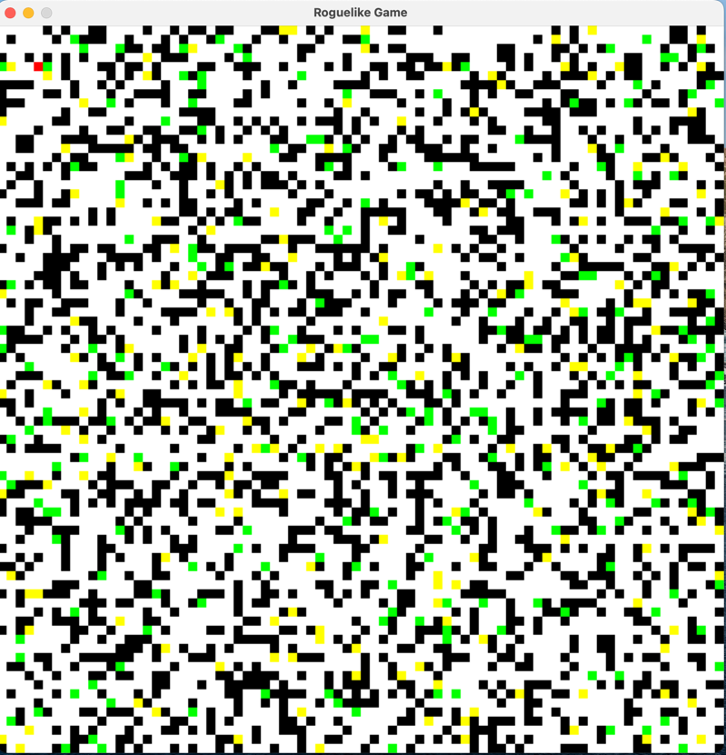

# Community Contribution Software

<table style="width:100%">
<thead>
  <tr>
    <th>Contributor</th>
    <th>Software</th>
    <th>ScreenShot</th>
    <th>Status</th>
    <th>LLM</th>
  </tr>
</thead>
<tbody>
  <tr>
    <td rowspan="4"><a href="https://github.com/qianc62" target="_blank" rel="noopener noreferrer">https://github.com/qianc62</a></td>
    <td><a href="WareHouse/Website_THUNLP_20230725154612" target="_blank" rel="noopener noreferrer">A simple website</a></td>
    <td></td>
    <td>Perfect</td>
    <td>GPT3.5</td>
  </tr>
  <tr>
    <td><a href="WareHouse/FlappyBird_THUNLP_20230726121145" target="_blank" rel="noopener noreferrer">FlappyBirds Game</a></td>
    <td></td>
    <td>Perfect</td>
    <td>GPT3.5</td>
  </tr>
  <tr>
    <td><a href="WareHouse/Gomoku_THUNLP_20230625201030" target="_blank" rel="noopener noreferrer">A Gomoku Game</a></td>
    <td></td>  
    <td>Perfect</td>
    <td>GPT3.5</td>
  </tr>
  <tr>
    <td><a href="WareHouse/Calculator_THUNLP_20230628184918" target="_blank" rel="noopener noreferrer">A calculator with bottom icons generated by Agents</a></td>
    <td></td>
    <td>Perfect</td>
    <td>GPT3.5</td>
  </tr>
  <tr>
    <td rowspan="17"><a href="https://github.com/thinkwee" target="_blank" rel="noopener noreferrer">https://github.com/thinkwee</a></td>
    <td><a href="WareHouse/ArtCanvas_THUNLP_20230825093558" target="_blank" rel="noopener noreferrer">Painter</a></td>
    <td></td>
    <td>Perfect</td>
    <td>GPT3.5</td>
  </tr>
  <tr>
    <td><a href="WareHouse/pingpong_THUNLP_20230817193956" target="_blank" rel="noopener noreferrer">PingPong Game</a></td>
    <td></td>
    <td>Biased</td>
    <td>GPT3.5</td>
  </tr>
  <tr>
    <td><a href="WareHouse/PixelRunner_THUNLP_20230825072339" target="_blank" rel="noopener noreferrer">PixelRunner</a></td>
    <td></td>
    <td>Runnable</td>
    <td>GPT3.5</td>
  </tr>
  <tr>
    <td><a href="WareHouse/MoneyCtrl_THUNLP_20230825093546" target="_blank" rel="noopener noreferrer">BudgetControl</a></td>
    <td></td>
    <td>Biased</td>
    <td>GPT3.5</td>
  </tr>
  <tr>
    <td><a href="WareHouse/PixelCraft_THUNLP_20230825072340" target="_blank" rel="noopener noreferrer">PixelCraft</a></td>
    <td></td>
    <td>Runnable</td>
    <td>GPT3.5</td>
  </tr>
  <tr>
    <td><a href="WareHouse/MazeGenerator_THUNLP_20230825093601" target="_blank" rel="noopener noreferrer">MazeGenerator</a></td>
    <td></td>
    <td>Perfect</td>
    <td>GPT3.5</td>
  </tr>
  <tr>
    <td><a href="WareHouse/Matchy_Match_THUNLP_20230825101854" target="_blank" rel="noopener noreferrer">Matchy_Match</a></td>
    <td></td>
    <td>Perfect</td>
    <td>GPT3.5</td>
  </tr>
  <tr>
    <td><a href="WareHouse/PasswordGenerator_THUNLP_20230825072337" target="_blank" rel="noopener noreferrer">Password Generator</a></td>
    <td></td>
    <td>Perfect</td>
    <td>GPT3.5</td>
  </tr>
  <tr>
    <td><a href="WareHouse/ToDo_THUNLP_20230825072331" target="_blank" rel="noopener noreferrer">Todo</a></td>
    <td></td>
    <td>Perfect</td>
    <td>GPT3.5</td>
  </tr>
  <tr>
    <td><a href="WareHouse/ExpenseEase_THUNLP_20230825093604" target="_blank" rel="noopener noreferrer">Expensechart</a></td>
    <td></td>
    <td>Perfect</td>
    <td>GPT3.5</td>
  </tr>
  <tr>
    <td><a href="WareHouse/2048_THUNLP_20230822144615" target="_blank" rel="noopener noreferrer">2048 Game</a></td>
    <td></td>
    <td>Perfect</td>
    <td>GPT3.5</td>
  </tr>
  <tr>
    <td><a href="WareHouse/WordExpand_THUNLP_20230825093623" target="_blank" rel="noopener noreferrer">WordExpand</a></td>
    <td></td>
    <td>Perfect</td>
    <td>GPT3.5</td>
  </tr>
  <tr>
    <td><a href="WareHouse/Fish_Tycoon_THUNLP_20230825093543" target="_blank" rel="noopener noreferrer">Fish Tycoon</a></td>
    <td></td>
    <td>Biased</td>
    <td>GPT3.5</td>
  </tr>
  <tr>
    <td><a href="WareHouse/DigitalClock_THUNLP_20230825093556" target="_blank" rel="noopener noreferrer">Digital Clock</a></td>
    <td></td>
    <td>Perfect</td>
    <td>GPT3.5</td>
  </tr>
  <tr>
    <td><a href="WareHouse/CurrencyWiz_THUNLP_20230825101851" target="_blank" rel="noopener noreferrer">CurrencyWiz</a></td>
    <td></td>
    <td>Perfect</td>
    <td>GPT3.5</td>
  </tr>
  <tr>
    <td><a href="WareHouse/DesignDream_THUNLP_20230825072340" target="_blank" rel="noopener noreferrer">Design Dream</a></td>
    <td></td>
    <td>Biased</td>
    <td>GPT3.5</td>
  </tr>
  <tr>
    <td><a href="WareHouse/DiceRollingSimulator_THUNLP_20230825072338" target="_blank" rel="noopener noreferrer">DiceRollingSimulator</a></td>
    <td></td>
    <td>Perfect</td>
    <td>GPT3.5</td>
  </tr>
  <tr>
    <td rowspan="6"><a href="https://github.com/NA-Wen" target="_blank" rel="noopener noreferrer">https://github.com/NA-Wen</a></td>
    <td><a href="WareHouse/md2html_THUNLP_md2html" target="_blank" rel="noopener noreferrer">md2html</a></td>
    <td></td>
    <td>Runnable</td>
    <td>GPT3.5</td>
  </tr>
  <tr>
    <td><a href="WareHouse/Gomoku_THUNLP_20230625201030" target="_blank" rel="noopener noreferrer">A Gomoku Game with assets generated by Agent</a></td>
    <td></td>  
    <td>Perfect</td>
    <td>GPT4</td>
  </tr>
  <tr>
    <td><a href="WareHouse/mspaint_THUNLP_20230821204606" target="_blank" rel="noopener noreferrer">MsPaint</a></td>
    <td></td>
    <td>Runnable</td>
    <td>GPT3.5</td>
  </tr>
  <tr>
    <td><a href="WareHouse/ImgEditor_THUNLP_20230824142740" target="_blank" rel="noopener noreferrer">Image Editor</a></td>
    <td></td>
    <td>Perfect</td>
    <td>GPT3.5</td>
  </tr>
  <tr>
    <td><a href="WareHouse/ArtCanvas_THUNLP_20230825093558" target="_blank" rel="noopener noreferrer">ArtCanvas</a></td>
    <td></td>
    <td>Perfect</td>
    <td>GPT3.5</td>
  </tr>
  <tr>
    <td><a href="WareHouse/TicTacToe_THUNLP_20230825093547" target="_blank" rel="noopener noreferrer">TicTacToe</a></td>
    <td></td>
    <td>Runnable</td>
    <td>GPT3.5</td>
  </tr>
  <tr>
    <td rowspan="5"><a href="https://github.com/lijiahao2022" target="_blank" rel="noopener noreferrer">https://github.com/lijiahao2022</a></td>
    <td><a href="WareHouse/musicplayer_THUNLP_20230824113404" target="_blank" rel="noopener noreferrer">Music Player</a></td>
    <td></td>
    <td>Perfect</td>
    <td>GPT4</td>
  </tr>
  <tr>
    <td><a href="WareHouse/Typing_THUNLP_20230824105537" target="_blank" rel="noopener noreferrer">Typing Test</a></td>
    <td></td>
    <td>Perfect</td>
    <td>GPT3.5</td>
  </tr>
  <tr>
    <td><a href="WareHouse/videoplayer_THUNLP_20230824233151" target="_blank" rel="noopener noreferrer">Video Player</a></td>
    <td></td>
    <td>Runnable</td>
    <td>GPT3.5</td>
  </tr>
  <tr>
    <td><a href="WareHouse/timer_THUNLP_20230823091709" target="_blank" rel="noopener noreferrer">Timer</a></td>
    <td></td>
    <td>Perfect</td>
    <td>GPT3.5</td>
  </tr>
  <tr>
    <td><a href="WareHouse/BookBreeze_THUNLP_20230825072339" target="_blank" rel="noopener noreferrer">BookBreeze</a></td>
    <td></td>
    <td>Runnable</td>
    <td>GPT3.5</td>
  </tr>
  <tr>
    <td rowspan="1"><a href="https://github.com/GeekyWizKid" target="_blank" rel="noopener noreferrer">https://github.com/GeekyWizKid</a></td>
    <td><a href="WareHouse/tiny_rogue_like_DefaultOrganization_20230905232453" target="_blank" rel="noopener noreferrer">Tiny Rogue-like Game</a></td>
    <td></td>
    <td>Biased</td>
    <td>GPT3.5</td>
  </tr>
</tbody>
</table>