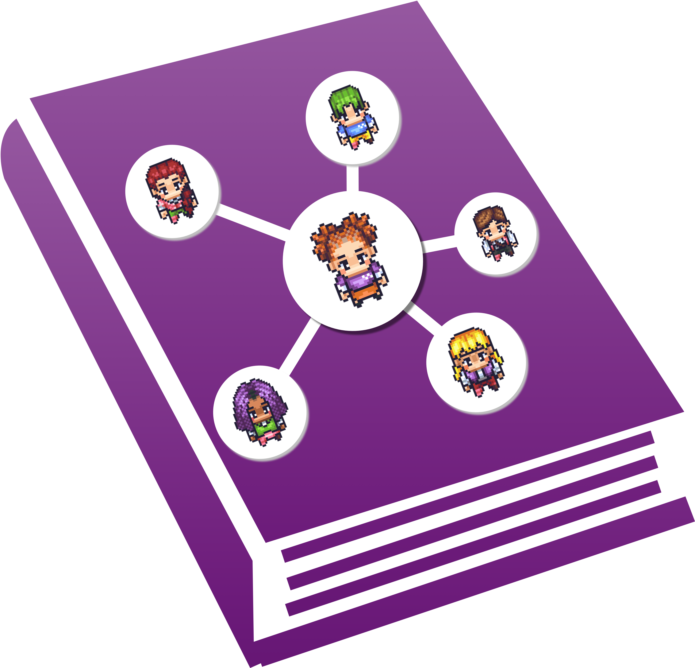

<div align="center">
  <h1>Multi-Agent Ebook</h1>
  
</div>

<p align="center">
    【🏄 <a href="https://thinkwee.top/multiagent_ebook/">Go to the Website</a> | 📚 <a href="https://thinkwee.top/multiagent_ebook/#book">Read the Chapters</a> | 🧐 <a href="https://thinkwee.top/multiagent_ebook/#more-works">Learn More about our Research</a>】
</p>

## Multi-Agent Ebook

- **Multi-Agent Ebook** presents an interactive eBook that compiles an extensive collection of research papers on large language model (LLM)-based multi-agent systems. Organized into multiple chapters and continuously updated with significant research, it strives to provide a comprehensive outline for both researchers and enthusiasts in the field. We welcome ongoing contributions to expand and enhance this resource. We thank the open-source templates for building this website ([sparshcodes/bookmark-landing-page](https://github.com/sparshcodes/bookmark-landing-page) and [fchavonet/web-flip_book](https://github.com/fchavonet/web-flip_book)).  

<p align="center">

</p>

## How to Contribute

- **Multi-Agent Ebook** is fully open-source and we welcome everyone to collaboratively build and enhance this repository. You can add a new page to the Ebook by creating an issue! Please follow the format below to submit an issue for adding a paper related to LLM Multi-Agent to the Ebook, and we will process and merge it as soon as possible!

    ```
    Issue Title: [Ebook New Paper] {Paper Title}

    Title: {Title of the Paper}
    Authors: {All Authors of the Paper, separated by commas}
    Date: {Paper Submission Date for the first version}
    Abstract: {Abstract of the Paper}
    Url: {Url of the Paper}
    Affiliation: {Affiliations of All Authors, separated by commas}
    ```
