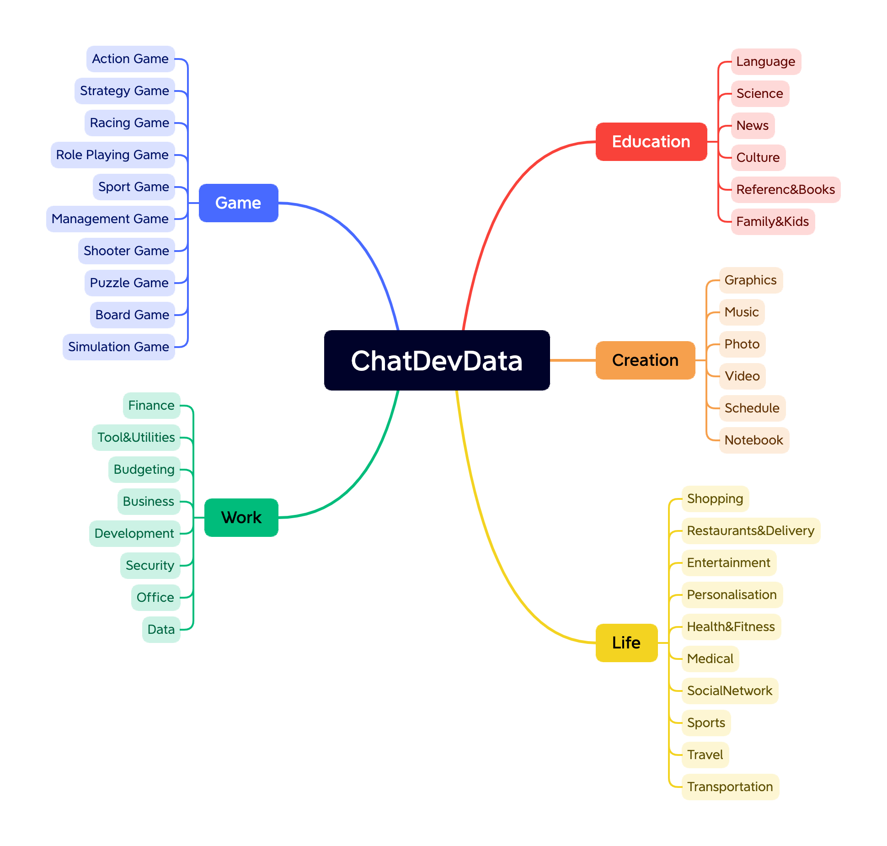

# NLDD (Natural Language Dataset for Dev)

  

Welcome to NLDD (Natural Language Dataset for Dev), a large prompted dataset tailored for Natural Language to Software (NL2Software) research. This repository contains a rich collection of prompts organized into 5 major categories and further subdivided into 40 subcategories. In total, the dataset comprises 1200 high-quality prompt samples extracted from ChatGPT 3.5, specifically curated to facilitate research in NL2Software.

## Structure
- The generated prompt contains three parts:
    -   Name of the software
    -   Description of this software
    -   Category of this software
- Details
	-	check.csv # Check Results
	-	data_ChatDev_format.sh # Data, in the format of executable shell scripts (in ChatDev)
	-	data_attribute_format.csv # Data, in the format of csv, containing three columns, Name/Description/Category
## Category

  

