# ChatDev 2.0 - DevAll

<p align="center">
  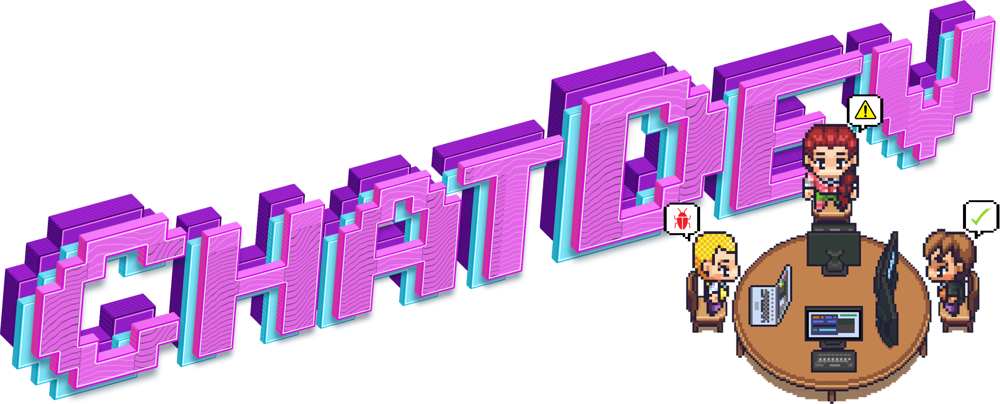
</p>


<p align="center">
  <strong>用于开发一切的零代码多智能体平台</strong>
</p>

<p align="center">
  【<a href="./README.md">English</a> | <a href="./README-zh.md">简体中文</a>】
</p>
<p align="center">
    【📚 <a href="#开发者">开发者</a> | 👥 <a href="#主要贡献者">贡献者</a>｜⭐️ <a href="https://github.com/OpenBMB/ChatDev/tree/chatdev1.0">ChatDev 1.0 (Legacy)</a>】
</p>

## 📖 概览
ChatDev 已从一个专门的软件开发多智能体系统演变为一个全面的多智能体编排平台。

- <a href="https://github.com/OpenBMB/ChatDev/tree/main">**ChatDev 2.0 (DevAll)**</a> 是一个用于“开发一切”的**零代码多智能体平台**。它通过简单的配置，赋能用户快速构建并执行定制化的多智能体系统。无需编写代码，用户即可定义智能体、工作流和任务，以编排如数据可视化、3D 生成和深度调研等复杂场景。
- <a href="https://github.com/OpenBMB/ChatDev/tree/chatdev1.0">**ChatDev 1.0 (经典版)**</a> 以**虚拟软件公司**模式运行。它通过各种智能体（如 CEO、CTO、程序员）参与专门的功能研讨会，实现整个软件开发生命周期的自动化——包括设计、编码、测试和文档编写。它是沟通型智能体协作的基石范式。

## 🎉 新闻
• **2026年1月7日：🚀 我们非常高兴地宣布 ChatDev 2.0 (DevAll) 正式发布！** 该版本引入了全新的零代码多智能体编排平台。经典的 ChatDev (v1.x) 已移至 [`chatdev1.0`](https://github.com/OpenBMB/ChatDev/tree/chatdev1.0) 分支进行维护。

<details>
<summary>历史新闻</summary>

•2025年9月24日：🎉 我们的论文 [Multi-Agent Collaboration via Evolving Orchestration](https://arxiv.org/abs/2505.19591) 已被 NeurIPS 2025 接收。其实现可在本仓库的 `puppeteer` 分支中找到。

•2025年5月26日：🎉 我们提出了一种新型的“木偶戏”式范式，用于大语言模型智能体之间的多智能体协作。通过利用强化学习优化的可学习中央编排器，我们的方法动态地激活并排列智能体，以构建高效、情境感知的推理路径。这种方法不仅提高了推理质量，还降低了计算成本，使多智能体协作在复杂任务中具有可扩展性和适应性。详见论文：[Multi-Agent Collaboration via Evolving Orchestration](https://arxiv.org/abs/2505.19591)。
  <p align="center">
  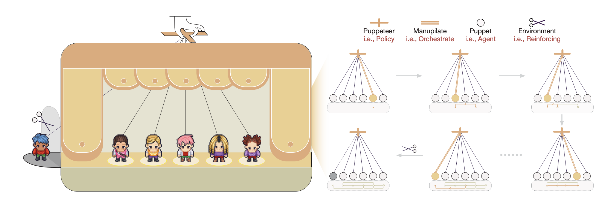
  </p>

•2024年6月25日：🎉 为了促进 LLM 驱动的多智能体协作🤖🤖及相关领域的发展，ChatDev 团队策划了一系列开创性的论文📄，并以[开源](https://github.com/OpenBMB/ChatDev/tree/main/MultiAgentEbook)交互式电子书📚的形式呈现。现在您可以在 [电子书网站](https://thinkwee.top/multiagent_ebook) 探索最新进展，并下载 [论文列表](https://github.com/OpenBMB/ChatDev/blob/main/MultiAgentEbook/papers.csv)。
  <p align="center">
  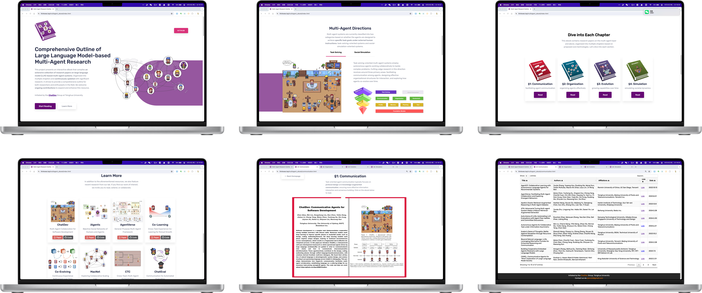
  </p>
  
•2024年6月12日：我们推出了多智能体协作网络 (MacNet) 🎉，它利用有向无环图 (DAG) 通过语言交互促进智能体之间有效的面向任务的协作 🤖🤖。MacNet 支持跨各种拓扑结构以及在超过一千个智能体之间进行协作，且不超出上下文限制。MacNet 更加通用和可扩展，可以被视为 ChatDev 链式拓扑的更高级版本。我们的预印本论文可在 [https://arxiv.org/abs/2406.07155](https://arxiv.org/abs/2406.07155) 获取。该技术已整合到 [macnet](https://github.com/OpenBMB/ChatDev/tree/macnet) 分支，增强了对多样化组织结构的支持，并提供了除软件开发之外的更丰富解决方案（例如，逻辑推理、数据分析、故事生成等）。
  <p align="center">
  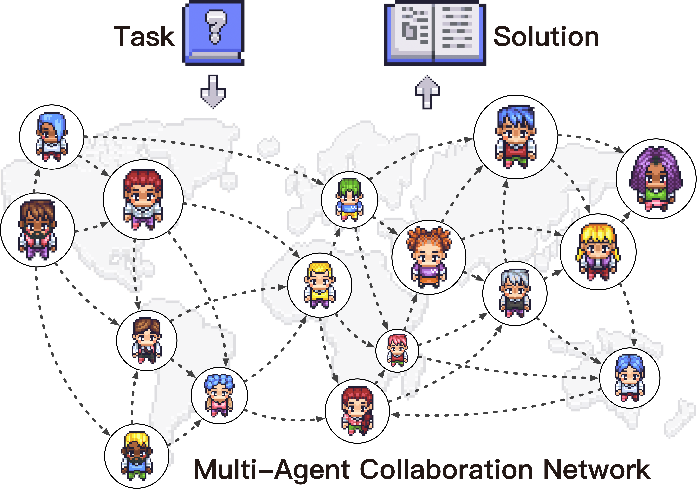
  </p>

• 2024年5月7日，我们推出了“迭代经验提炼”（IER），这是一种新方法，指导者智能体和助手智能体通过增强捷径导向的经验来高效适应新任务。这种方法涵盖了在一系列任务中获取、利用、传播和消除经验的过程，使过程更加简短高效。我们的预印本论文可在 https://arxiv.org/abs/2405.04219 获取，该技术将很快整合到 ChatDev 中。
  <p align="center">
  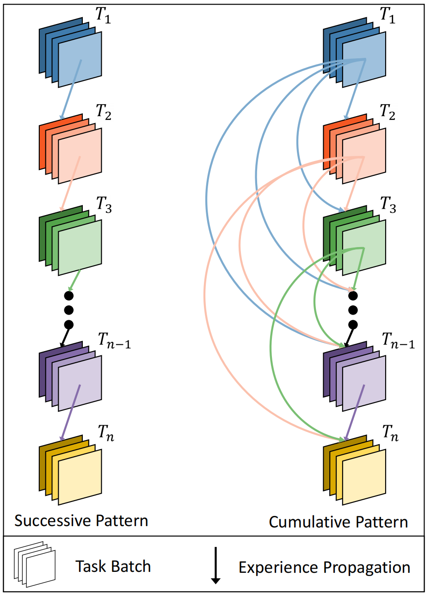
  </p>

• 2024年1月25日：我们已在 ChatDev 中集成了体验式共同学习模块。请参阅 [体验式共同学习指南](wiki.md#co-tracking)。

• 2023年12月28日：我们提出了体验式共同学习，这是一种创新方法，指导者智能体和助手智能体积累捷径导向的经验，以有效地解决新任务，减少重复错误并提高效率。请查看我们的预印本论文 https://arxiv.org/abs/2312.17025，该技术将很快集成到 ChatDev 中。
  <p align="center">
  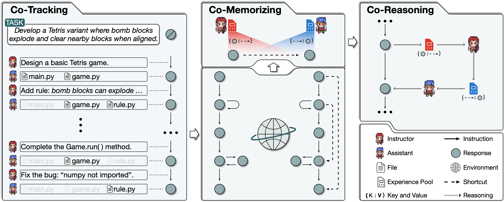
  </p>
• 2023年11月15日：我们推出了 ChatDev SaaS 平台，使软件开发人员和创新创业者能够以极低的成本高效构建软件，并消除准入门槛。请访问 https://chatdev.modelbest.cn/ 试用。
  <p align="center">
  
  </p>

• 2023年11月2日：ChatDev 现在支持一项新功能：增量开发，允许智能体在现有代码基础上进行开发。尝试 ```--config "incremental" --path "[source_code_directory_path]"``` 开始使用。
  <p align="center">
  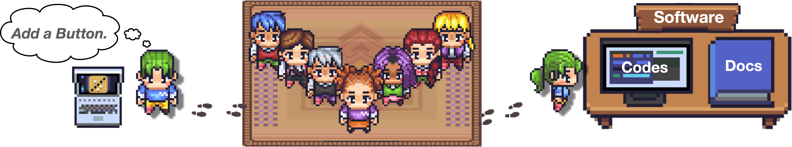
  </p>

• 2023年10月26日：ChatDev 现在支持 Docker 安全运行（感谢 [ManindraDeMel](https://github.com/ManindraDeMel) 的贡献）。请参阅 [Docker 快速开始指南](wiki.md#docker-start)。
  <p align="center">
  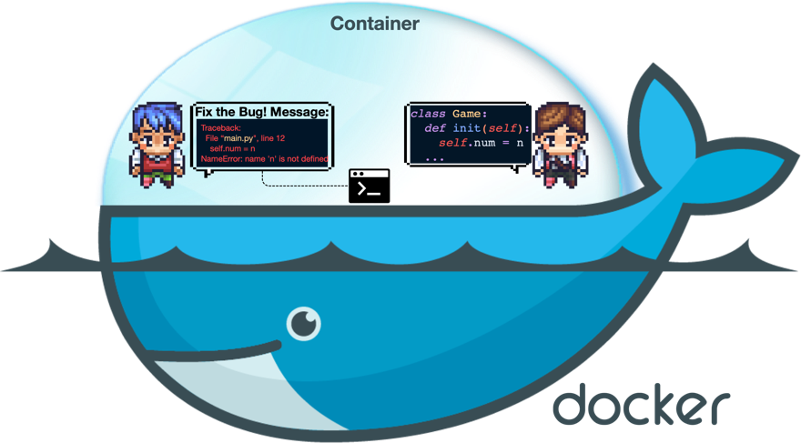
  </p>

• 2023年9月25日：**Git** 模式现已上线，允许程序员  利用 Git 进行版本控制。要启用此功能，只需在 ``ChatChainConfig.json`` 中将 ``"git_management"`` 设置为 ``"True"``。参见 [指南](wiki.md#git-mode)。
  <p align="center">
  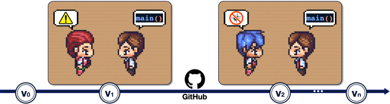
  </p>

• 2023年9月20日：**人机交互**模式现已上线！您可以通过扮演评论员的角色  并向程序员  提出建议来参与到 ChatDev 团队中；
  尝试 ``python3 run.py --task [description_of_your_idea] --config "Human"``。参见 [指南](wiki.md#human-agent-interaction) 和 [示例](WareHouse/Gomoku_HumanAgentInteraction_20230920135038)。
  <p align="center">
  
  </p>

• 2023年9月1日：**艺术**模式现已上线！您可以激活设计师智能体  来生成软件中使用的图像；
  尝试 ``python3 run.py --task [description_of_your_idea] --config "Art"``。参见 [指南](wiki.md#art) 和 [示例](WareHouse/gomokugameArtExample_THUNLP_20230831122822)。

• 2023年8月28日：系统公开发布。

• 2023年8月17日：v1.0.0 版本准备发布。

• 2023年7月30日：用户可以自定义 ChatChain、Phase 和 Role 设置。此外，现在已支持在线日志模式和回放模式。

• 2023年7月16日：该项目相关的 [预印本论文](https://arxiv.org/abs/2307.07924) 发表。

• 2023年6月30日：ChatDev 仓库的初始版本发布。
</details>


## 🚀 快速开始

### 📋 环境要求

*   **操作系统**: macOS / Linux / WSL / Windows
*   **Python**: 3.12+
*   **Node.js**: 18+
*   **包管理器**: [uv](https://docs.astral.sh/uv/)

### 📦 安装

1.  **后端依赖**（由 `uv` 管理 Python）：
    ```bash
    uv sync
    ```

2.  **前端依赖**（Vite + Vue 3）：
    ```bash
    cd frontend && npm install
    ```

### ⚡️ 运行应用（本地）

#### 使用 Makefile（推荐）

**同时启动后端与前端**：
```bash
make dev
```

> 然后访问 Web 控制台：**[http://localhost:5173](http://localhost:5173)**。

#### 手动命令

1.  **启动后端**：
    ```bash
    # 从项目根目录运行
    uv run python server_main.py --port 6400 --reload
    ```
    > `--reload` 仅监听服务端 Python 源代码目录，`WareHouse/` 下的智能体生成文件不会再触发重启。可通过 `--reload-dir` / `--reload-exclude`（可多次指定）自定义。

2.  **启动前端**：
    ```bash
    cd frontend
    VITE_API_BASE_URL=http://localhost:6400 npm run dev
    ```
    > 然后访问 Web 控制台：**[http://localhost:5173](http://localhost:5173)**。

    > **💡 提示**：如果前端无法连接后端，可能是默认端口 `6400` 已被占用。
    > 请将前后端同时切换到一个空闲端口，例如：
    >
    > * **后端**：启动时指定 `--port 6401`
    > * **前端**：设置 `VITE_API_BASE_URL=http://localhost:6401`

#### 常用命令

*   **帮助命令**：
    ```bash
    make help
    ```

*   **同步 YAML 工作流到前端**：
    ```bash
    make sync
    ```
    将 `yaml_instance/` 中的所有工作流文件上传到数据库。

*   **校验所有 YAML 工作流**：
    ```bash
    make validate-yamls
    ```
    检查所有 YAML 文件的语法与 schema 错误。

### 🦞 使用 OpenClaw 运行

OpenClaw 可以与 ChatDev 集成，通过 **调用已有的 agent 团队**，或在 ChatDev 中 **动态创建新的 agent 团队** 来完成任务。

开始使用：

1. 启动 ChatDev 2.0 后端。
2. 为你的 OpenClaw 实例安装所需的技能：

    ```bash
    clawdhub install chatdev
    ```

3. 让 OpenClaw 创建一个 ChatDev 工作流。例如：

  * **自动化信息收集与内容发布**

    ```
    创建一个 ChatDev 工作流，用于自动收集热点信息，生成一篇小红书文案，并发布该内容
    ```

  * **多智能体地缘政治模拟**

    ```
    创建一个 ChatDev 工作流，构建多个 agent，用于模拟中东局势未来可能的发展
    ```


### 🐳 使用 Docker 运行
你也可以通过 Docker Compose 运行整个应用。该方式可简化依赖管理，并提供一致的运行环境。

1.  **前置条件**：
    *   已安装 [Docker](https://docs.docker.com/get-docker/) 和 [Docker Compose](https://docs.docker.com/compose/install/)。
    *   请确保在项目根目录中存在用于配置 API Key 的 `.env` 文件。

2.  **构建并运行**：
    ```bash
    # 在项目根目录执行
    docker compose up --build
    ```

3.  **访问地址**：
    *   **后端**：`http://localhost:6400`
    *   **前端**：`http://localhost:5173`

> 服务在异常退出后会自动重启，本地文件的修改会同步映射到容器中，便于实时开发。

### 🔑 配置

*   **环境变量**：在项目根目录创建一个 `.env` 文件。
*   **模型密钥**：在 `.env` 中设置 `API_KEY` 和 `BASE_URL` 对应您的 LLM 提供商。
*   **YAML 占位符**：在配置文件中使用 `${VAR}`（如 `${API_KEY}`）来引用这些变量。

---

## 💡 如何使用

### 🖥️ Web 控制台

DevAll 界面为构建和执行提供了无缝体验：

*   **教程 (Tutorial)**：平台内置了全面的分步指南和文档，帮助您快速上手。
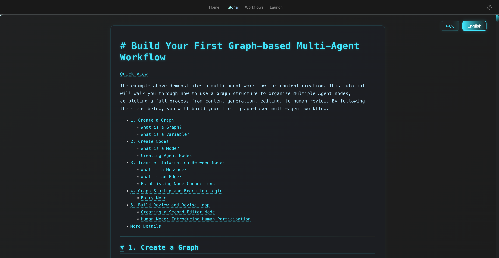 

*   **工作流 (Workflow)**：可视化画布，用于设计您的多智能体系统。通过轻松的拖拽来配置节点参数、定义上下文流并编排复杂的智能体交互。
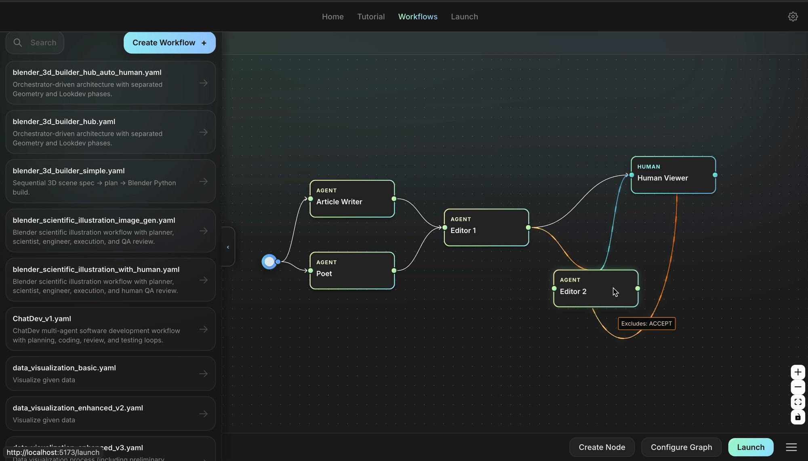

*   **运行 (Launch)**：启动工作流、监控实时日志、检查中间产物，并提供人机协同反馈。


### 🧰 Python SDK
对于自动化和批量处理，使用我们轻量级的 Python SDK 编排任务并直接获取结果。

```python
from runtime.sdk import run_workflow

# 执行工作流并获取最后一条节点消息
result = run_workflow(
    yaml_file="yaml_instance/demo.yaml",
    task_prompt="用一句话总结附件文档。",
    attachments=["/path/to/document.pdf"],
    variables={"API_KEY": "sk-xxxx"} # 如果需要，可覆盖 .env 中的变量
)

if result.final_message:
    print(f"Output: {result.final_message.text_content()}")
```

**我们也发布了 ChatDev Python SDK（PyPI 包 `chatdev`）**，便于在 Python 中直接运行 YAML 工作流编排并执行多智能体任务。安装详情与版本说明见 [PyPI：chatdev 0.1.0](https://pypi.org/project/chatdev/0.1.0/)。

---

<a id="开发者"></a>
## ⚙️ 给开发者

**如果您打算进行二次开发和扩展，请参阅本章节。**

您可以通过扩展节点、Provider 与工具来增强 DevAll。
项目采用模块化结构：
*   **核心系统**：`server/` 承载 FastAPI 后端，`runtime/` 负责智能体抽象与工具执行。
*   **编排层**：`workflow/` 负责多智能体逻辑，配置位于 `entity/`。
*   **前端**：`frontend/` 是 Vue 3 Web 控制台。
*   **可扩展性**：`functions/` 用于自定义 Python 工具。

相关参考文档：
*   **快速开始**：[Start Guide](./docs/user_guide/zh/index.md)
*   **核心模块**：[Workflow Authoring](./docs/user_guide/zh/workflow_authoring.md)、[Memory](./docs/user_guide/zh/modules/memory.md) 和 [Tooling](./docs/user_guide/zh/modules/tooling/index.md)

---

## 🌟 推荐工作流
我们为常见场景提供了开箱即用的强大模板。所有可运行的工作流配置均位于 `yaml_instance/` 目录下。
*   **示例 (Demos)**：以 `demo_*.yaml` 命名的文件展示了特定功能或模块。
*   **实现 (Implementations)**：直接命名的文件（如 `ChatDev_v1.yaml`）是完整的自研或复刻流程。如下所示：

### 📋 工作流合集

| 类别 | 工作流                                                                                                         | 案例 | 
| :--- |:------------------------------------------------------------------------------------------------------------| :--- | 
| **📈 数据可视化** | `data_visualization_basic.yaml`<br>`data_visualization_enhanced.yaml`                                       | <br>提示词：*"Create 4–6 high-quality PNG charts for my large real-estate transactions dataset."* |
| **🛠️ 3D 场景生成**<br>*(需要 [Blender](https://www.blender.org/) 和 [blender-mcp](https://github.com/ahujasid/blender-mcp))* | `blender_3d_builder_simple.yaml`<br>`blender_3d_builder_hub.yaml`<br>`blender_scientific_illustration.yaml` | <br>提示词：*"Please build a Christmas tree."* |
| **🎮 游戏开发** | `GameDev_v1.yaml`<br>`ChatDev_v1.yaml`                                                                      | <br>提示词：*"Please help me design and develop a Tank Battle game."* |
| **📚 深度研究** | `deep_research_v1.yaml`                                                                                     | 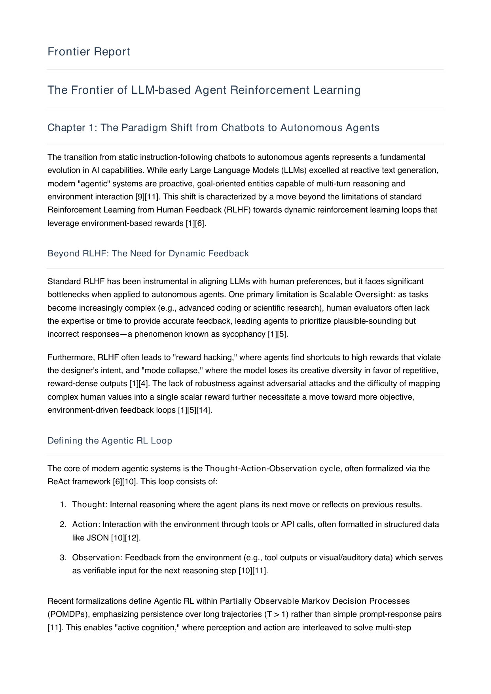<br>提示词：*"Research about recent advances in the field of LLM-based agent RL"* |
| **📘 学习复盘与创新** | `study_report_innovation.yaml`                                                                         | 提示词：*"这是我今天的学习记录，请生成复盘报告，并给出未来 48 小时可执行的创新改进方案。"* |
| **📝 考前复习资料生成** | `physics_revision_ppt_only.yaml`<br>`math_analysis2_revision_ppt_only.yaml`<br>`discrete_math_revision_lecture_only.yaml`<br>`data_structure_revision_ppt_only.yaml` | 提示词：*"请严格基于我上传的 PPT/PDF 生成章节复习资料，并为每条结论附来源标注。"* |
| **🎓 教学视频** | `teach_video.yaml` (请在运行此工作流之前运行 `uv add manim` 命令)                                                         | <br>提示词：*"讲一下什么是凸优化"* |

------

### 💡 使用指南
对于这些实现，您可以使用 **Launch** 标签页来执行它们。
1.  **选择**：在 **Launch** 标签页选择一个工作流。
2.  **上传**：如果需要，上传相关文件（例如用于数据分析的 `.csv`）。
3.  **提示**：输入您的请求（例如*“可视化销售趋势”*或*“设计一个贪吃蛇游戏”*）。

---

## 🤝 参与贡献

我们欢迎社区的任何形式的贡献！无论是修复 Bug、添加新的工作流模板，还是分享由 DevAll 生成的优质案例/产物，您的帮助都至关重要。欢迎通过提交 **Issue** 或 **Pull Request** 来参与。

通过参与贡献，您的名字将被列入下方的 **贡献者** 名单中。请查看 [开发者指南](#开发者) 开始您的贡献之旅！

### 👥 贡献者

#### 主要贡献者

<table>
  <tr>
    <td align="center"><a href="https://github.com/NA-Wen"><br /><sub><b>NA-Wen</b></sub></a></td>
    <td align="center"><a href="https://github.com/zxrys"><br /><sub><b>zxrys</b></sub></a></td>
    <td align="center"><a href="https://github.com/swugi"><br /><sub><b>swugi</b></sub></a></td>
    <td align="center"><a href="https://github.com/huatl98"><br /><sub><b>huatl98</b></sub></a></td>
  </tr>
</table>

#### 贡献者
<table>
  <tr>
    <td align="center"><a href="https://github.com/LaansDole"><br /><sub><b>LaansDole</b></sub></a></td>
    <td align="center"><a href="https://github.com/zivkovicp"><br /><sub><b>zivkovicp</b></sub></a></td>
    <td align="center"><a href="https://github.com/ACE-Prism"><br /><sub><b>ACE-Prism</b></sub></a></td>
    <td align="center"><a href="https://github.com/shiowen"><br /><sub><b>shiowen</b></sub></a></td>
    <td align="center"><a href="https://github.com/kilo2127"><br /><sub><b>kilo2127</b></sub></a></td>
    <td align="center"><a href="https://github.com/AckerlyLau"><br /><sub><b>AckerlyLau</b></sub></a></td>
    <td align="center"><a href="https://github.com/rainoeelmae"><br /><sub><b>rainoeelmae</b></sub></a></td>
    <td align="center"><a href="https://github.com/conprour"><br /><sub><b>conprour</b></sub></a></td>
  </tr>
  <tr>
    <td align="center"><a href="https://github.com/Br1an67"><br /><sub><b>Br1an67</b></sub></a></td>
    <td align="center"><a href="https://github.com/NINE-J"><br /><sub><b>NINE-J</b></sub></a></td>
    <td align="center"><a href="https://github.com/Yanghuabei-design"><br /><sub><b>Yanghuabei</b></sub></a></td>
    <td align="center"><a href="https://github.com/nregret"><br /><sub><b>nregret</b></sub></a></td>
    <td align="center"><a href="https://github.com/kartik-mem0"><br /><sub><b>kartik-mem0</b></sub></a></td>
    <td align="center"><a href="https://github.com/voidborne-d"><br /><sub><b>voidborne-d</b></sub></a></td>
  </tr>
</table>

## 🤝 致谢

<a href="http://nlp.csai.tsinghua.edu.cn/">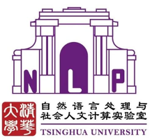</a>&nbsp;&nbsp;
<a href="https://modelbest.cn/"></a>&nbsp;&nbsp;
<a href="https://github.com/OpenBMB/AgentVerse/"></a>&nbsp;&nbsp;
<a href="https://github.com/OpenBMB/RepoAgent">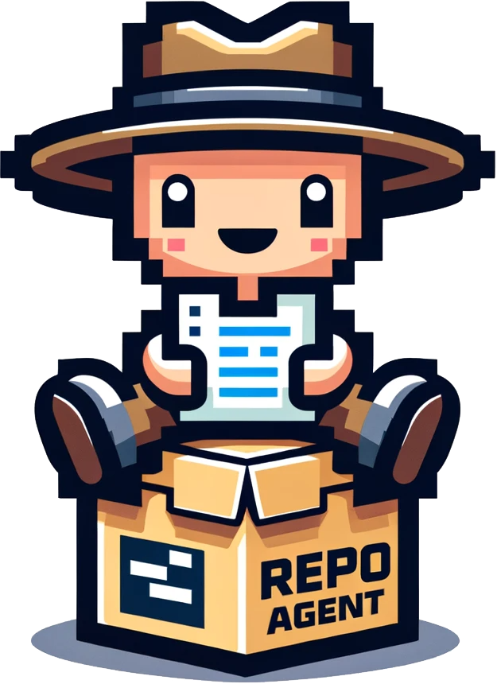</a>
<a href="https://app.commanddash.io/agent?github=https://github.com/OpenBMB/ChatDev">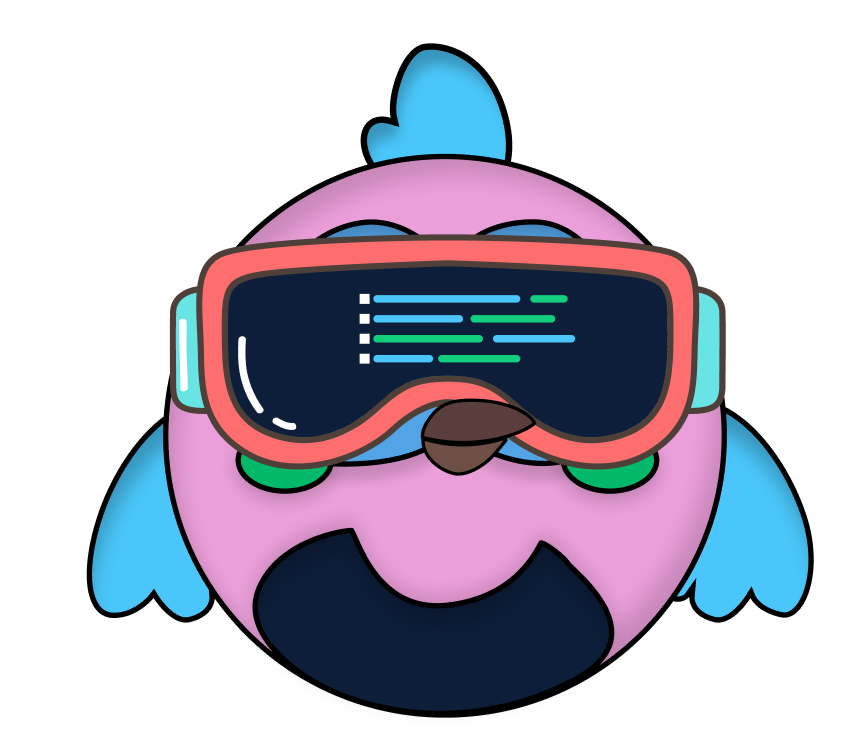</a>
<a href="www.teachmaster.cn">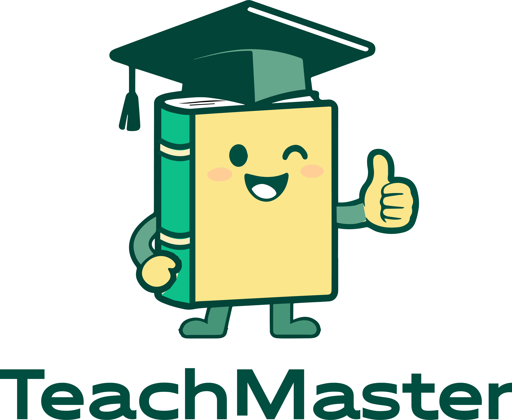</a>
<a href="https://github.com/OpenBMB/AppCopilot"></a>

## 🔎 引用

```
@article{chatdev,
    title = {ChatDev: Communicative Agents for Software Development},
    author = {Chen Qian and Wei Liu and Hongzhang Liu and Nuo Chen and Yufan Dang and Jiahao Li and Cheng Yang and Weize Chen and Yusheng Su and Xin Cong and Juyuan Xu and Dahai Li and Zhiyuan Liu and Maosong Sun},
    journal = {arXiv preprint arXiv:2307.07924},
    url = {https://arxiv.org/abs/2307.07924},
    year = {2023}
}

@article{colearning,
    title = {Experiential Co-Learning of Software-Developing Agents},
    author = {Chen Qian and Yufan Dang and Jiahao Li and Wei Liu and Zihao Xie and Yifei Wang and Weize Chen and Cheng Yang and Xin Cong and Xiaoyin Che and Zhiyuan Liu and Maosong Sun},
    journal = {arXiv preprint arXiv:2312.17025},
    url = {https://arxiv.org/abs/2312.17025},
    year = {2023}
}

@article{macnet,
    title={Scaling Large-Language-Model-based Multi-Agent Collaboration},
    author={Chen Qian and Zihao Xie and Yifei Wang and Wei Liu and Yufan Dang and Zhuoyun Du and Weize Chen and Cheng Yang and Zhiyuan Liu and Maosong Sun}
    journal={arXiv preprint arXiv:2406.07155},
    url = {https://arxiv.org/abs/2406.07155},
    year={2024}
}

@article{iagents,
    title={Autonomous Agents for Collaborative Task under Information Asymmetry},
    author={Wei Liu and Chenxi Wang and Yifei Wang and Zihao Xie and Rennai Qiu and Yufan Dnag and Zhuoyun Du and Weize Chen and Cheng Yang and Chen Qian},
    journal={arXiv preprint arXiv:2406.14928},
    url = {https://arxiv.org/abs/2406.14928},
    year={2024}
}

@article{puppeteer,
      title={Multi-Agent Collaboration via Evolving Orchestration}, 
      author={Yufan Dang and Chen Qian and Xueheng Luo and Jingru Fan and Zihao Xie and Ruijie Shi and Weize Chen and Cheng Yang and Xiaoyin Che and Ye Tian and Xuantang Xiong and Lei Han and Zhiyuan Liu and Maosong Sun},
      journal={arXiv preprint arXiv:2505.19591},
      url={https://arxiv.org/abs/2505.19591},
      year={2025}
}
```

## 📬 联系方式

如果您有任何问题、反馈或希望取得联系，请随时通过电子邮件发送至 [qianc62@gmail.com](mailto:qianc62@gmail.com)
