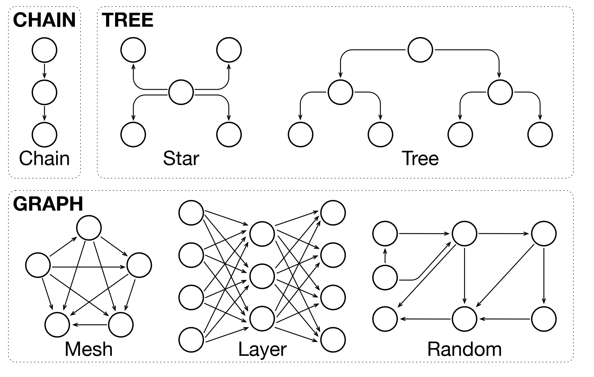
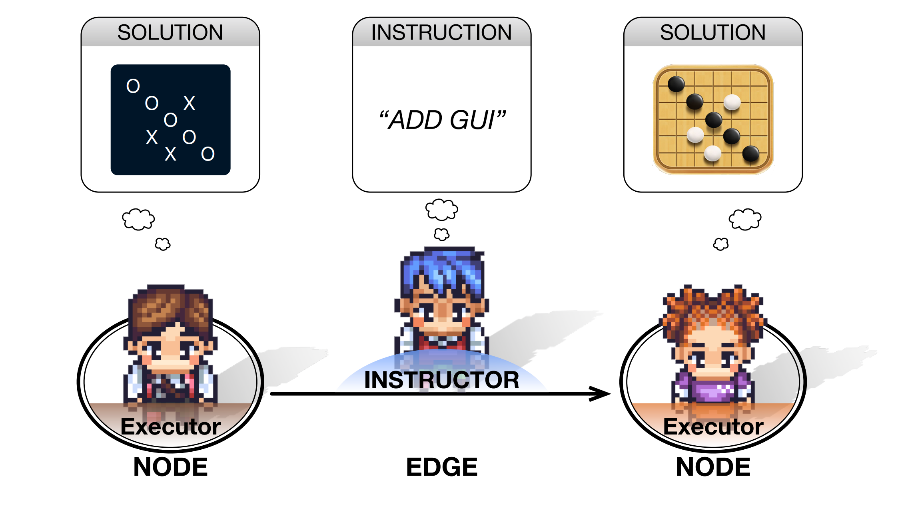
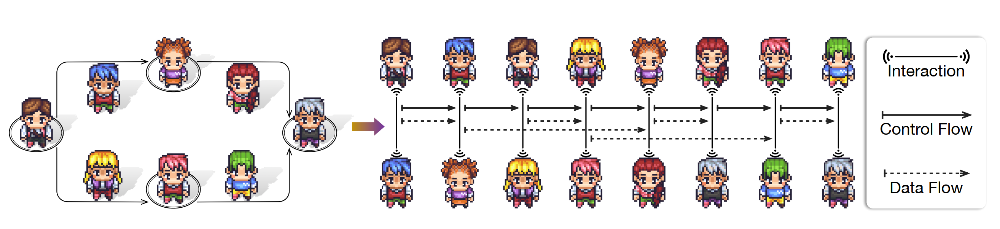
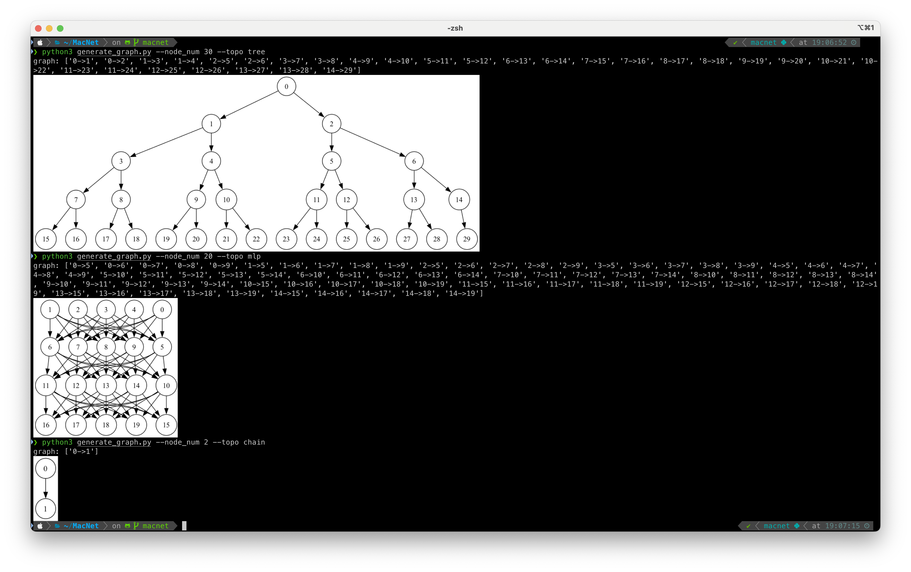
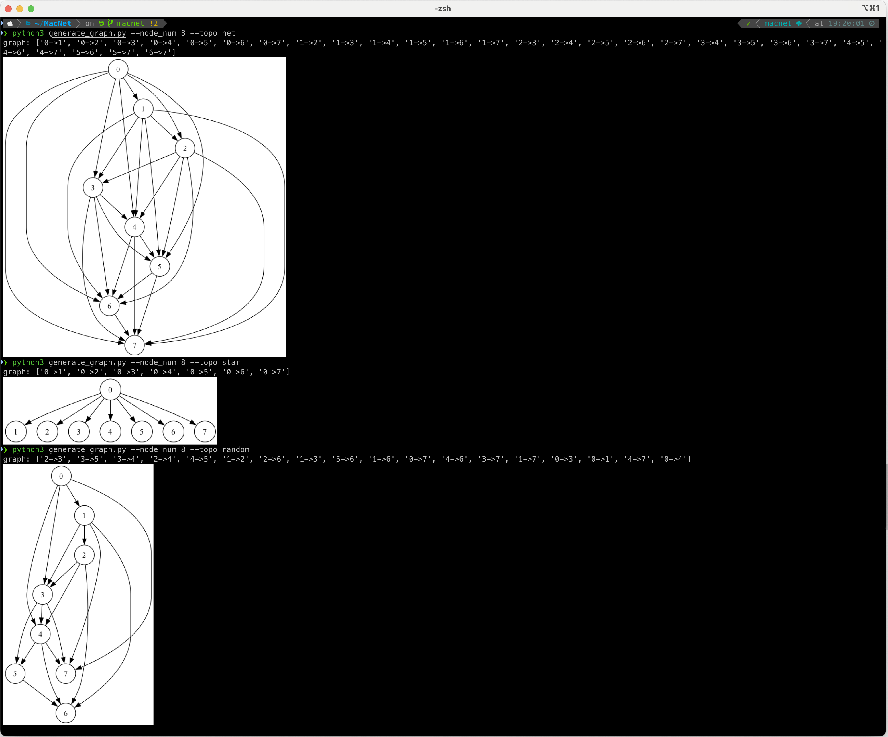
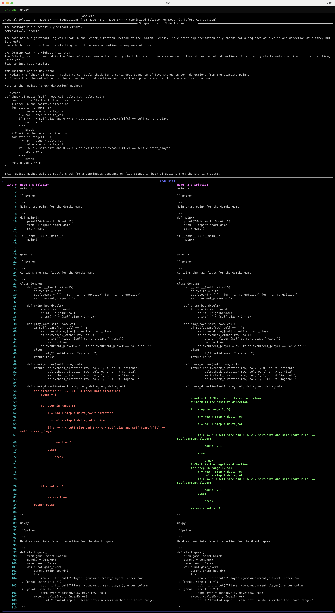
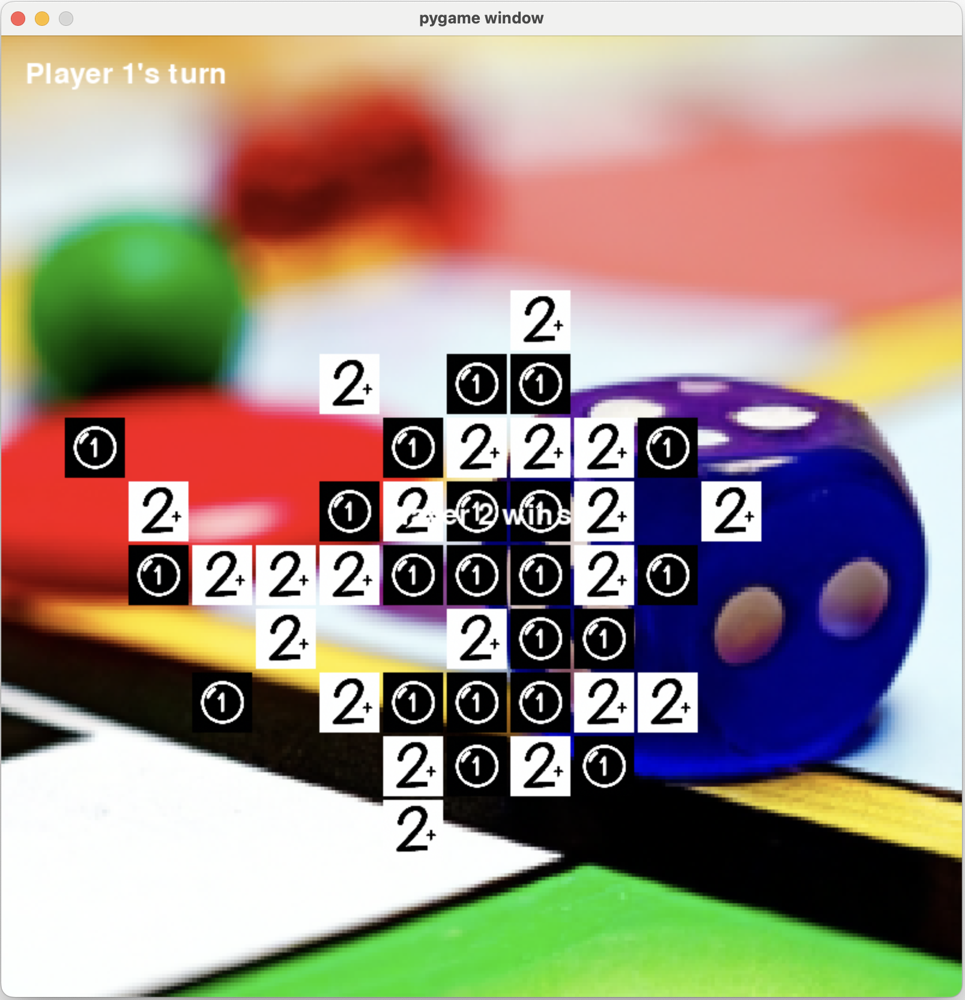
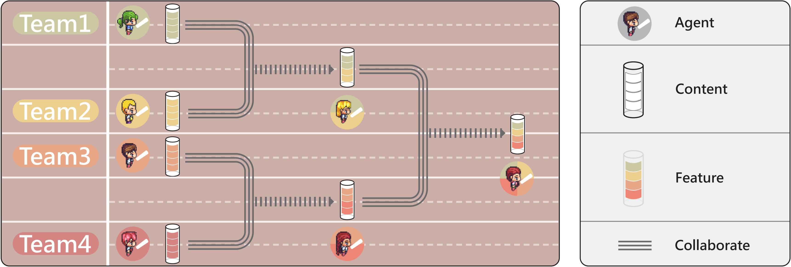

# Scaling Large-Language-Model-based Multi-Agent Collaboration

<p align="center">
  
</p>

## 📖 Overview

MacNet is a specialized branch of [ChatDev](https://github.com/OpenBMB/ChatDev) that focuses on supporting the research of agent scaling on arbitrary topologies using the Multi-Agent Collaboration Networks (MacNet) framework. MacNet utilizes directed acyclic graphs to facilitate effective task-oriented collaboration among agents through linguistic interactions. It supports cooperation across various topologies and among a large number of agents without exceeding context limits.

## ⚡️ Quickstart

To get started with MacNet, follow these steps:

  <p align="center">
    
  </p>

1. **Generate Graph Structure:** Run `generate_graph.py` to generate the desired graph structure for your multi-agent collaboration network. You can customize the number of nodes and the topology of the graph. For example:

   ```
   python generate_graph.py --node_num 10 --topology tree 
   ```

2. **Configure MacNet:** The `generate_graph.py` will automatically update the graph config in the `config.yaml` file. You can check other parameters for deploying agents, including the LLM backend and prompt. Additionally, MacNet supports the **SRDD_Profile** dataset, which is a large-scale agent role prompt dataset. It allows you to randomly select system profile prompts for the deployed agents in the topology based on the software category. To use SRDD_Profile, specify the category using the `--type` parameter when running `run.py`.

  <p align="center">
    
  </p>

3. **Run MacNet:** Execute `run.py` to deploy agents on the specified graph topology and generate software based on the configuration in `config.yaml`. During this process, you can observe the complete graph structure, the code changes occurring from one node to another, and the corresponding agent suggestions. MacNet will run agents on the graph in the topological order. You can observe the code changes in each node transition and agent suggestions on each edge in real-time.


   ```
   python run.py --task "Develop a basic Gomoku game." --name "Gomoku" [--type <software_category>]
   ```

   - `--task`: Specifies the prompt or description of the software to be developed.
   - `--name`: Specifies the name of the software project.
   - `--type` (optional): Specifies the software category for selecting system profile prompts from the SRDD_Profile dataset.

  <p align="center">
    
  </p>
  

4. **Access Generated Software:** After the execution of `run.py`, the generated software can be found in the `WareHouse` directory. Each software project will have its own folder with a timestamp.

5. **View Logs:** The complete logs of the MacNet execution can be found in the `MacNetLog` directory. The logs are organized by timestamp and provide detailed information about the multi-agent collaboration process.

## 🌰 Example
- Example of various generated topologies:

<p align="center">
  
</p>

<p align="center">
  
</p>

- Example of the MacNet running process, including the suggestions and code diffs between agents on adjacent nodes:
<p align="center">
  
</p>

- Example of the generated software:
<p align="center">
  
</p>

# Multi-Agent Collaboration via Cross-Team Orchestration

<p align="center">
  
</p>

## 📖 Overview

Croto is a specialized branch of [ChatDev](https://github.com/OpenBMB/ChatDev) that orchestrates multiple agent teams to jointly propose diverse task-oriented solutions and collaborate through strategic cross-team interactions at key phases. It enables teams to maintain their independence while leveraging collective insights for superior solution generation. The methods used in Croto—including greedy aggregation, hierarchy partitioning, and pruning strategy—are well integrated into MacNet codebase, specifically in `chatdev.waiting` and the aggregation function in `graph.py`.

```python
def aggregate(self, prompt: str, retry_limit: int, unit_num: int, layer_directory: str, graph_depth: int,
               store_dir: str) -> int:
     """Aggregate solutions from predecessors."""
     logging.info(f"Node {self.id} is aggregating with {len(self.pre_solutions)} solutions")

     with open("config.yaml", "r", encoding="utf-8") as f:
         cc_prompt = "\n\n".join(yaml.load(f.read(), Loader=yaml.FullLoader).get("Agent").get("cc_prompt"))
         cc_prompt = self.system_message + cc_prompt

     for file in self.pre_solutions:
         with open(layer_directory + "/solution_{}.txt".format(file), "w") as f:
             for key in self.pre_solutions[file].codebooks.keys():
                 f.write(str(key) + '\n\n' + self.pre_solutions[file].codebooks[key] + '\n\n')

     self.pool = Pool(len(self.pre_solutions), unit_num, layer_directory, self.model)
     for i in range(retry_limit):
         new_codes = self.pool.state_pool_add(layer_directory, cc_prompt, 6000000, prompt,
                                              Codes(),
                                              store_dir,
                                              temperature=1 - self.depth / graph_depth,
                                              )
         if new_codes is None:
             logging.info(f"Retry Aggregation at round {i}!")
         else:
             self.solution = new_codes
             logging.info(f"Node {self.id} has finished aggregation!")
             return 0
     print(f"ERROR: Node {self.id} has reached the retry limit!\n")
     return 1
```

## 🔎 Citation

```
@inproceedings{qian2025scaling,
    title={Scaling Large Language Model-based Multi-Agent Collaboration},
    author={Chen Qian and Zihao Xie and YiFei Wang and Wei Liu and Kunlun Zhu and Hanchen Xia and Yufan Dang and Zhuoyun Du and Weize Chen and Cheng Yang and Zhiyuan Liu and Maosong Sun},
    booktitle={The Thirteenth International Conference on Learning Representations},
    year={2025},
    url={https://openreview.net/forum?id=K3n5jPkrU6}
}

@article{croto,
  title={Multi-Agent Collaboration via Cross-Team Orchestration},
  author={Zhuoyun Du and Chen Qian and Wei Liu and Zihao Xie and YiFei Wang and Rennai Qiu and Yufan Dang and Weize Chen and Cheng Yang and Ye Tian and Xuantang Xiong and Lei Han},
  journal={arXiv preprint arXiv:2406.08979},
  url = {https://arxiv.org/abs/2406.08979},
  year={2024}
}

@article{chatdev,
    title = {ChatDev: Communicative Agents for Software Development},
    author = {Chen Qian and Wei Liu and Hongzhang Liu and Nuo Chen and Yufan Dang and Jiahao Li and Cheng Yang and Weize Chen and Yusheng Su and Xin Cong and Juyuan Xu and Dahai Li and Zhiyuan Liu and Maosong Sun},
    journal = {arXiv preprint arXiv:2307.07924},
    url = {https://arxiv.org/abs/2307.07924},
    year = {2023}
}

@article{colearning,
    title = {Experiential Co-Learning of Software-Developing Agents},
    author = {Chen Qian and Yufan Dang and Jiahao Li and Wei Liu and Zihao Xie and Yifei Wang and Weize Chen and Cheng Yang and Xin Cong and Xiaoyin Che and Zhiyuan Liu and Maosong Sun},
    journal = {arXiv preprint arXiv:2312.17025},
    url = {https://arxiv.org/abs/2312.17025},
    year = {2023}
}

@article{iagents,
    title={Autonomous Agents for Collaborative Task under Information Asymmetry},
    author={Wei Liu and Chenxi Wang and Yifei Wang and Zihao Xie and Rennai Qiu and Yufan Dnag and Zhuoyun Du and Weize Chen and Cheng Yang and Chen Qian},
    journal={arXiv preprint arXiv:2406.14928},
    url = {https://arxiv.org/abs/2406.14928},
    year={2024}
}
```
More research from our lab can be accessed [here](https://thinkwee.top/multiagent_ebook/#more-works).

## 🤝 Acknowledgments

MacNet and Croto are built upon the foundation of [ChatDev](https://github.com/OpenBMB/ChatDev), a project that aims to revolutionize software development through communicative agents.

## 📬 Contact

If you have any questions, feedback, or would like to get in touch, please feel free to reach out to us via email at [qianc62@gmail.com](mailto:qianc62@gmail.com).

