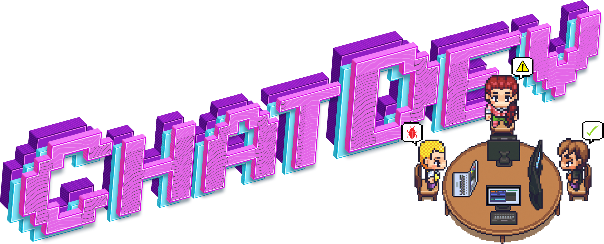
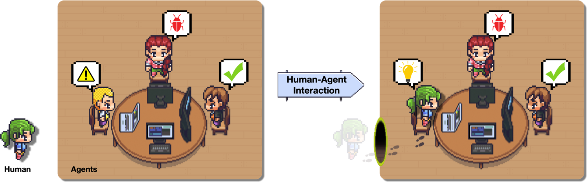
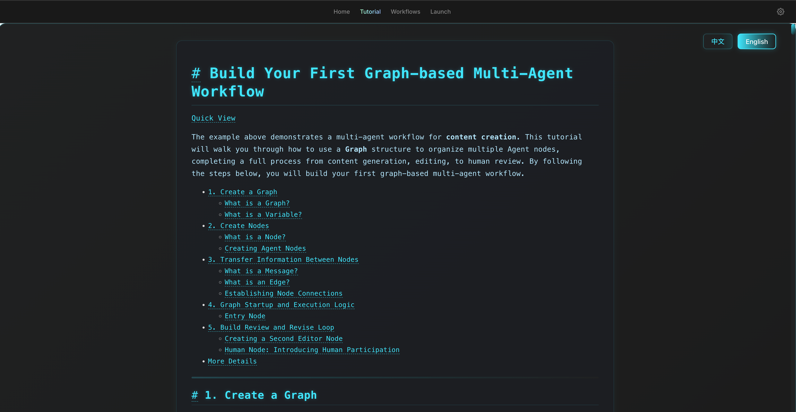
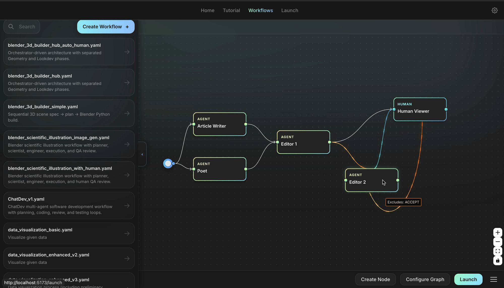
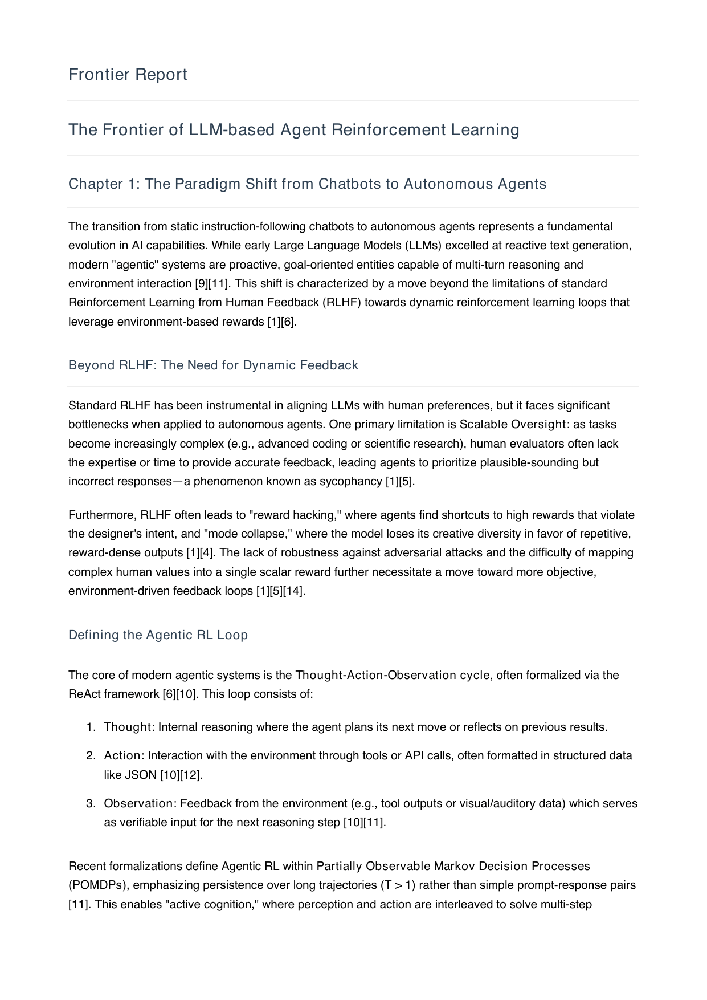
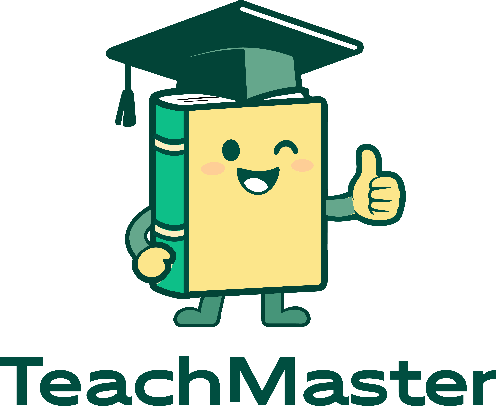

# ChatDev 2.0 - DevAll

<p align="center">
  
</p>


<p align="center">
  <strong>A Zero-Code Multi-Agent Platform for Developing Everything</strong>
</p>

<p align="center">
  【<a href="./README.md">English</a> | <a href="./README-zh.md">简体中文</a>】
</p>
<p align="center">
    【📚 <a href="#developers">Developers</a> | 👥 <a href="#primary-contributors">Contributors</a>｜⭐️ <a href="https://github.com/OpenBMB/ChatDev/tree/chatdev1.0">ChatDev 1.0 (Legacy)</a>】
</p>

## 📖 Overview
ChatDev has evolved from a specialized software development multi-agent system into a comprehensive multi-agent orchestration platform.

- <a href="https://github.com/OpenBMB/ChatDev/tree/main">**ChatDev 2.0 (DevAll)**</a> is a **Zero-Code Multi-Agent Platform** for "Developing Everything". It empowers users to rapidly build and execute customized multi-agent systems through simple configuration. No coding is required—users can define agents, workflows, and tasks to orchestrate complex scenarios such as data visualization, 3D generation, and deep research.
- <a href="https://github.com/OpenBMB/ChatDev/tree/chatdev1.0">**ChatDev 1.0 (Legacy)**</a> operates as a **Virtual Software Company**. It utilizes various intelligent agents (e.g., CEO, CTO, Programmer) participating in specialized functional seminars to automate the entire software development life cycle—including designing, coding, testing, and documenting. It serves as the foundational paradigm for communicative agent collaboration.

## 🎉 News
• **Jan 07, 2026: 🚀 We are excited to announce the official release of ChatDev 2.0 (DevAll)!** This version introduces a zero-code multi-agent orchestration platform. The classic ChatDev (v1.x) has been moved to the [`chatdev1.0`](https://github.com/OpenBMB/ChatDev/tree/chatdev1.0) branch for maintenance. More details about ChatDev 2.0 can be found on [our official post](https://x.com/OpenBMB/status/2008916790399701335).

<details>
<summary>Old News</summary>

•Sep 24, 2025: 🎉 Our paper [Multi-Agent Collaboration via Evolving Orchestration](https://arxiv.org/abs/2505.19591) has been accepted to NeurIPS 2025. The implementation is available in the `puppeteer` branch of this repository.

•May 26, 2025: 🎉 We propose a novel puppeteer-style paradigm for multi-agent collaboration among large language model based agents. By leveraging a learnable central orchestrator optimized with reinforcement learning, our method dynamically activates and sequences agents to construct efficient, context-aware reasoning paths. This approach not only improves reasoning quality but also reduces computational costs, enabling scalable and adaptable multi-agent cooperation in complex tasks.
See our paper in [Multi-Agent Collaboration via Evolving Orchestration](https://arxiv.org/abs/2505.19591).
  <p align="center">
  
  </p>

•June 25, 2024: 🎉To foster development in LLM-powered multi-agent collaboration🤖🤖 and related fields, the ChatDev team has curated a collection of seminal papers📄 presented in a [open-source](https://github.com/OpenBMB/ChatDev/tree/main/MultiAgentEbook) interactive e-book📚 format. Now you can explore the latest advancements on the [Ebook Website](https://thinkwee.top/multiagent_ebook) and download the [paper list](https://github.com/OpenBMB/ChatDev/blob/main/MultiAgentEbook/papers.csv).
  <p align="center">
  
  </p>
  
•June 12, 2024: We introduced Multi-Agent Collaboration Networks (MacNet) 🎉, which utilize directed acyclic graphs to facilitate effective task-oriented collaboration among agents through linguistic interactions 🤖🤖. MacNet supports co-operation across various topologies and among more than a thousand agents without exceeding context limits. More versatile and scalable, MacNet can be considered as a more advanced version of ChatDev's chain-shaped topology. Our preprint paper is available at [https://arxiv.org/abs/2406.07155](https://arxiv.org/abs/2406.07155). This technique has been incorporated into the [macnet](https://github.com/OpenBMB/ChatDev/tree/macnet) branch, enhancing support for diverse organizational structures and offering richer solutions beyond software development (e.g., logical reasoning, data analysis, story generation, and more).
  <p align="center">
  
  </p>

• May 07, 2024, we introduced "Iterative Experience Refinement" (IER), a novel method where instructor and assistant agents enhance shortcut-oriented experiences to efficiently adapt to new tasks. This approach encompasses experience acquisition, utilization, propagation and elimination across a series of tasks and making the pricess shorter and efficient. Our preprint paper is available at https://arxiv.org/abs/2405.04219, and this technique will soon be incorporated into ChatDev.
  <p align="center">
  
  </p>

• January 25, 2024: We have integrated Experiential Co-Learning Module into ChatDev. Please see the [Experiential Co-Learning Guide](wiki.md#co-tracking).

• December 28, 2023: We present Experiential Co-Learning, an innovative approach where instructor and assistant agents accumulate shortcut-oriented experiences to effectively solve new tasks, reducing repetitive errors and enhancing efficiency.  Check out our preprint paper at https://arxiv.org/abs/2312.17025 and this technique will soon be integrated into ChatDev.
  <p align="center">
  
  </p>
• November 15, 2023: We launched ChatDev as a SaaS platform that enables software developers and innovative entrepreneurs to build software efficiently at a very low cost and remove the barrier to entry. Try it out at https://chatdev.modelbest.cn/.
  <p align="center">
  
  </p>

• November 2, 2023: ChatDev is now supported with a new feature: incremental development, which allows agents to develop upon existing codes. Try ```--config "incremental" --path "[source_code_directory_path]"``` to start it.
  <p align="center">
  
  </p>

• October 26, 2023: ChatDev is now supported with Docker for safe execution (thanks to contribution from [ManindraDeMel](https://github.com/ManindraDeMel)). Please see [Docker Start Guide](wiki.md#docker-start).
  <p align="center">
  
  </p>
  
• September 25, 2023: The **Git** mode is now available, enabling the programmer  to utilize Git for version control. To enable this feature, simply set ``"git_management"`` to ``"True"`` in ``ChatChainConfig.json``. See [guide](wiki.md#git-mode).
  <p align="center">
  
  </p>

• September 20, 2023: The **Human-Agent-Interaction** mode is now available! You can get involved with the ChatDev team by playing the role of reviewer  and making suggestions to the programmer ;
  try ``python3 run.py --task [description_of_your_idea] --config "Human"``. See [guide](wiki.md#human-agent-interaction) and [example](WareHouse/Gomoku_HumanAgentInteraction_20230920135038).
  <p align="center">
  
  </p>

• September 1, 2023: The **Art** mode is available now! You can activate the designer agent  to generate images used in the software;
  try ``python3 run.py --task [description_of_your_idea] --config "Art"``. See [guide](wiki.md#art) and [example](WareHouse/gomokugameArtExample_THUNLP_20230831122822).
  
• August 28, 2023: The system is publicly available.

• August 17, 2023: The v1.0.0 version was ready for release.

• July 30, 2023: Users can customize ChatChain, Phasea and Role settings. Additionally, both online Log mode and replay
  mode are now supported.

• July 16, 2023: The [preprint paper](https://arxiv.org/abs/2307.07924) associated with this project was published.

• June 30, 2023: The initial version of the ChatDev repository was released.
</details>


## 🚀 Quick Start

### 📋 Prerequisites

*   **OS**: macOS / Linux / WSL / Windows
*   **Python**: 3.12+
*   **Node.js**: 18+
*   **Package Manager**: [uv](https://docs.astral.sh/uv/)

### 📦 Installation

1.  **Backend Dependencies** (Python managed by `uv`):
    ```bash
    uv sync
    ```

2.  **Frontend Dependencies** (Vite + Vue 3):
    ```bash
    cd frontend && npm install
    ```

### 🔑 Configuration

*   **Environment Variables**:
    ```bash
    cp .env.example .env
    ```
*   **Model Keys**: Set `API_KEY` and `BASE_URL` in `.env` for your LLM provider.
*   **YAML placeholders**: Use `${VAR}`（e.g., `${API_KEY}`）in configuration files to reference these variables.

### ⚡️ Run the Application

#### Using Makefile (Recommended)

**Start both Backend and Frontent**:
```bash
make dev
```

> Then access the Web Console at **[http://localhost:5173](http://localhost:5173)**.

#### Manual Commands

1.  **Start Backend**:
    ```bash
    # Run from the project root
    uv run python server_main.py --port 6400 --reload
    ```
    > Remove `--reload` if output files (e.g., GameDev) trigger restarts, which interrupts tasks and loses progress.

2.  **Start Frontend**:
    ```bash
    cd frontend
    VITE_API_BASE_URL=http://localhost:6400 npm run dev
    ```
    > Then access the Web Console at **[http://localhost:5173](http://localhost:5173)**. 
    
    
    > **💡 Tip**: If the frontend fails to connect to the backend, the default port `6400` may already be occupied.
    > Please switch both services to an available port, for example:
    >
    > * **Backend**: start with `--port 6401`
    > * **Frontend**: set `VITE_API_BASE_URL=http://localhost:6401`

#### Utility Commands

*   **Help command**:
    ```bash
    make help
    ```

*   **Sync YAML workflows to frontend**:
    ```bash
    make sync
    ```
    Uploads all workflow files from `yaml_instance/` to the database.

*   **Validate all YAML workflows**:
    ```bash
    make validate-yamls
    ```
    Checks all YAML files for syntax and schema errors.

### 🐳 Run with Docker
Alternatively, you can run the entire application using Docker Compose. This method simplifies dependency management and provides a consistent environment.

1.  **Prerequisites**:
    *   [Docker](https://docs.docker.com/get-docker/) and [Docker Compose](https://docs.docker.com/compose/install/) installed.
    *   Ensure you have a `.env` file in the project root for your API keys.

2.  **Build and Run**:
    ```bash
    # From the project root
    docker compose up --build
    ```

3.  **Access**:
    *   **Backend**: `http://localhost:6400`
    *   **Frontend**: `http://localhost:5173`

> The services will automatically restart if they crash, and local file changes will be reflected inside the containers for live development.

---

## 💡 How to Use

### 🖥️ Web Console

The DevAll interface provides a seamless experience for both construction and execution

*   **Tutorial**: Comprehensive step-by-step guides and documentation integrated directly into the platform to help you get started quickly.
 

*   **Workflow**: A visual canvas to design your multi-agent systems. Configure node parameters, define context flows, and orchestrate complex agent interactions with drag-and-drop ease.


*   **Launch**: Initiate workflows, monitor real-time logs, inspect intermediate artifacts, and provide human-in-the-loop feedback.


### 🧰 Python SDK
For automation and batch processing, use our lightweight Python SDK to execute workflows programmatically and retrieve results directly.

```python
from runtime.sdk import run_workflow

# Execute a workflow and get the final node message
result = run_workflow(
    yaml_file="yaml_instance/demo.yaml",
    task_prompt="Summarize the attached document in one sentence.",
    attachments=["/path/to/document.pdf"],
    variables={"API_KEY": "sk-xxxx"} # Override .env variables if needed
)

if result.final_message:
    print(f"Output: {result.final_message.text_content()}")
```

---

<a id="developers"></a>
## ⚙️ For Developers

**For secondary development and extensions, please proceed with this section.**

Extend DevAll with new nodes, providers, and tools.
The project is organized into a modular structure:
*   **Core Systems**: `server/` hosts the FastAPI backend, while `runtime/` manages agent abstraction and tool execution.
*   **Orchestration**: `workflow/` handles the multi-agent logic, driven by configurations in `entity/`.
*   **Frontend**: `frontend/` contains the Vue 3 Web Console.
*   **Extensibility**: `functions/` is the place for custom Python tools.

Relevant reference documentation:
*   **Getting Started**: [Start Guide](./docs/user_guide/en/index.md)
*   **Core Modules**: [Workflow Authoring](./docs/user_guide/en/workflow_authoring.md), [Memory](./docs/user_guide/en/modules/memory.md), and [Tooling](./docs/user_guide/en/modules/tooling/index.md)

---

## 🌟 Featured Workflows
We provide robust, out-of-the-box templates for common scenarios. All runnable workflow configs are located in `yaml_instance/`.
*   **Demos**: Files named `demo_*.yaml` showcase specific features or modules.
*   **Implementations**: Files named directly (e.g., `ChatDev_v1.yaml`) are full in-house or recreated workflows. As follows:

### 📋 Workflow Collection

| Category | Workflow                                                                                                    | Case | 
| :--- |:------------------------------------------------------------------------------------------------------------| :--- | 
| **📈 Data Visualization** | `data_visualization_basic.yaml`<br>`data_visualization_enhanced.yaml`                                       | <br>Prompt: *"Create 4–6 high-quality PNG charts for my large real-estate transactions dataset."* |
| **🛠️ 3D Generation**<br>*(Requires [Blender](https://www.blender.org/) & [blender-mcp](https://github.com/ahujasid/blender-mcp))* | `blender_3d_builder_simple.yaml`<br>`blender_3d_builder_hub.yaml`<br>`blender_scientific_illustration.yaml` | <br>Prompt: *"Please build a Christmas tree."* |
| **🎮 Game Dev** | `GameDev_v1.yaml`<br>`ChatDev_v1.yaml`                                                                      | <br>Prompt: *"Please help me design and develop a Tank Battle game."* |
| **📚 Deep Research** | `deep_research_v1.yaml`                                                                                     | <br>Prompt: *"Research about recent advances in the field of LLM-based agent RL"* |
| **🎓 Teach Video** | `teach_video.yaml` (Please run command `uv add manim` before running this workflow)                         | <br>Prompt: *"讲一下什么是凸优化"* |

---

### 💡 Usage Guide
For those implementations, you can use the **Launch** tab to execute them.
1.  **Select**: Choose a workflow in the **Launch** tab.
2.  **Upload**: Upload necessary files (e.g., `.csv` for data analysis) if required.
3.  **Prompt**: Enter your request (e.g., *"Visualize the sales trends"* or *"Design a snake game"*).

---

## 🤝 Contributing

We welcome contributions from the community! Whether you're fixing bugs, adding new workflow templates, or sharing high-quality cases/artifacts produced by DevAll, your help is much appreciated. Feel free to contribute by submitting **Issues** or **Pull Requests**.

By contributing to DevAll, you'll be recognized in our **Contributors** list below. Check out our [Developer Guide](#developers) to get started!

### 👥 Contributors

#### Primary Contributors

<table>
  <tr>
    <td align="center"><a href="https://github.com/NA-Wen"><br /><sub><b>NA-Wen</b></sub></a></td>
    <td align="center"><a href="https://github.com/zxrys"><br /><sub><b>zxrys</b></sub></a></td>
    <td align="center"><a href="https://github.com/swugi"><br /><sub><b>swugi</b></sub></a></td>
    <td align="center"><a href="https://github.com/huatl98"><br /><sub><b>huatl98</b></sub></a></td>
  </tr>
</table>

#### Contributors
<table>
  <tr>
    <td align="center"><a href="https://github.com/shiowen"><br /><sub><b>shiowen</b></sub></a></td>
    <td align="center"><a href="https://github.com/kilo2127"><br /><sub><b>kilo2127</b></sub></a></td>
    <td align="center"><a href="https://github.com/AckerlyLau"><br /><sub><b>AckerlyLau</b></sub></a></td>
    <td align="center"><a href="https://github.com/LaansDole"><br /><sub><b>LaansDole</b></sub></a></td>
    <td align="center"><a href="https://github.com/zivkovicp"><br /><sub><b>zivkovicp</b></sub></a></td>
</table>

## 🤝 Acknowledgments

<a href="http://nlp.csai.tsinghua.edu.cn/"></a>&nbsp;&nbsp;
<a href="https://modelbest.cn/"></a>&nbsp;&nbsp;
<a href="https://github.com/OpenBMB/AgentVerse/"></a>&nbsp;&nbsp;
<a href="https://github.com/OpenBMB/RepoAgent"></a>
<a href="https://app.commanddash.io/agent?github=https://github.com/OpenBMB/ChatDev"></a>
<a href="www.teachmaster.cn"></a>
<a href="https://github.com/OpenBMB/AppCopilot"></a>

## 🔎 Citation

```
@article{chatdev,
    title = {ChatDev: Communicative Agents for Software Development},
    author = {Chen Qian and Wei Liu and Hongzhang Liu and Nuo Chen and Yufan Dang and Jiahao Li and Cheng Yang and Weize Chen and Yusheng Su and Xin Cong and Juyuan Xu and Dahai Li and Zhiyuan Liu and Maosong Sun},
    journal = {arXiv preprint arXiv:2307.07924},
    url = {https://arxiv.org/abs/2307.07924},
    year = {2023}
}

@article{colearning,
    title = {Experiential Co-Learning of Software-Developing Agents},
    author = {Chen Qian and Yufan Dang and Jiahao Li and Wei Liu and Zihao Xie and Yifei Wang and Weize Chen and Cheng Yang and Xin Cong and Xiaoyin Che and Zhiyuan Liu and Maosong Sun},
    journal = {arXiv preprint arXiv:2312.17025},
    url = {https://arxiv.org/abs/2312.17025},
    year = {2023}
}

@article{macnet,
    title={Scaling Large-Language-Model-based Multi-Agent Collaboration},
    author={Chen Qian and Zihao Xie and Yifei Wang and Wei Liu and Yufan Dang and Zhuoyun Du and Weize Chen and Cheng Yang and Zhiyuan Liu and Maosong Sun}
    journal={arXiv preprint arXiv:2406.07155},
    url = {https://arxiv.org/abs/2406.07155},
    year={2024}
}

@article{iagents,
    title={Autonomous Agents for Collaborative Task under Information Asymmetry},
    author={Wei Liu and Chenxi Wang and Yifei Wang and Zihao Xie and Rennai Qiu and Yufan Dnag and Zhuoyun Du and Weize Chen and Cheng Yang and Chen Qian},
    journal={arXiv preprint arXiv:2406.14928},
    url = {https://arxiv.org/abs/2406.14928},
    year={2024}
}

@article{puppeteer,
      title={Multi-Agent Collaboration via Evolving Orchestration}, 
      author={Yufan Dang and Chen Qian and Xueheng Luo and Jingru Fan and Zihao Xie and Ruijie Shi and Weize Chen and Cheng Yang and Xiaoyin Che and Ye Tian and Xuantang Xiong and Lei Han and Zhiyuan Liu and Maosong Sun},
      journal={arXiv preprint arXiv:2505.19591},
      url={https://arxiv.org/abs/2505.19591},
      year={2025}
}
```

## 📬 Contact

If you have any questions, feedback, or would like to get in touch, please feel free to reach out to us via email at [qianc62@gmail.com](mailto:qianc62@gmail.com)
