# Communicative Agents for Software Development

<p align="center">
  
</p>

<p align="center">
    【English | <a href="README-Chinese.md">Chinese</a>】
</p>

## 📖 Overview

- **ChatDev** stands as a **virtual software company** that operates through various **intelligent agents** holding different roles, including Chief Executive Officer, Chief Technology Officer, Programmer, Tester, and more. These agents form a multi-agent organizational structure and are united by a mission to "revolutionize the digital world through programming." The agents within ChatDev **collaborate** by participating in specialized functional seminars, including tasks such as designing, coding, testing, and documenting.
- The primary objective of ChatDev is to offer an **easy-to-use**, **highly customizable** and **extendable** framework, which is based on large language models (LLMs) and serves as an ideal scenario for studying collective intelligence.


## 📰 News

* **September 1, 2023: The Art mode is available now! You can use agent to generate images used in the software, try ``python3 run.py --config "Art"``.** See [example](WareHouse/gomokugameArtExample_THUNLP_20230831122822) here.
* August 28, 2023: The system is publicly available.
* August 17, 2023: The V1.0.0 version was ready for release.
* July 30, 2023: Users can customize ChatChain, Phase, and Role settings. Additionally, both online Log mode and replay mode are now supported.
* July 16, 2023: The [preprint paper](https://arxiv.org/abs/2307.07924) associated with this project was published.
* June 30, 2023: The initial version of the `ChatDev` repository was released.


## ❓ What Can ChatDev Do?


https://github.com/OpenBMB/ChatDev/assets/11889052/80d01d2f-677b-4399-ad8b-f7af9bb62b72


## ⚡️ Quickstart

To get started, follow these steps:

1. **Clone the GitHub Repository:** Begin by cloning the repository using the command:
   ```
   git clone https://github.com/OpenBMB/ChatDev.git
   ```
2. **Set Up Python Environment:** Ensure you have a version 3.9 or higher Python environment. You can create and activate this environment using the following commands, replacing `ChatDev_conda_env` with your preferred environment name:
   ```
   conda create -n ChatDev_conda_env python=3.9 -y
   conda activate ChatDev_conda_env
   ```
3. **Install Dependencies:** Move into the `ChatDev` directory and install the necessary dependencies by running:
   ```
   cd ChatDev
   pip3 install -r requirements.txt
   ```
4. **Set OpenAI API Key:** Export your OpenAI API key as an environment variable. Replace `"your_OpenAI_API_key"` with your actual API key. Remember that this environment variable is session-specific, so you need to set it again if you open a new terminal session.
   On Unix/Linux:
   ```
   export OPENAI_API_KEY="your_OpenAI_API_key"
   ```
   On Windows:
   ```
   $env:OPENAI_API_KEY="your_OpenAI_API_key"
   ```
5. **Build Your Software:** Use the following command to initiate the building of your software, replacing `[description_of_your_idea]` with your idea's description and `[project_name]` with your desired project name:
   ```
   python3 run.py --task "[description_of_your_idea]" --name "[project_name]"
   ```
6. **Run Your Software:** Once generated, you can find your software in the `WareHouse` directory under a specific project folder, such as `project_name_DefaultOrganization_timestamp`. Run your software using the following command within that directory:
   ```
   cd WareHouse/project_name_DefaultOrganization_timestamp
   python3 main.py
   ```

## ✨️ Advanced Skills

For more detailed information, please refer to our [Wiki](wiki.md), where you can find:

- An introduction to all command run parameters.
- A straightforward guide for setting up a local web demo, which includes enhanced visualized logs, a replay demo, and a simple ChatChain Visualizer.
- An overview of the ChatDev framework.
- A comprehensive introduction to all advanced parameters in ChatChain configuration.
- Guides for customizing ChatDev, including:
    - ChatChain: Design your own software development process (or any other process), such as ``DemandAnalysis -> Coding -> Testing -> Manual``.
    - Phase: Design your own phase within ChatChain, like ``DemandAnalysis``.
    - Role: Defining the various agents in your company, such as the ``Chief Executive Officer``.


## 🤗 Share Your Software!

**Code**: We are enthusiastic about your interest in participating in our open-source project. If you come across any problems, don't hesitate to report them. Feel free to create a pull request if you have any inquiries or if you are prepared to share your work with us! Your contributions are highly valued. Please let me know if there's anything else you need assistance!

**Company**: Creating your own customized "ChatDev Company" is a breeze. This personalized setup involves three simple configuration JSON files. Check out the example provided in the ``CompanyConfig/Default`` directory. For detailed instructions on customization, refer to our [Wiki](wiki.md).

**Software**: Whenever you develop software using ChatDev, a corresponding folder is generated containing all the essential information. Sharing your work with us is as simple as making a pull request. Here's an example: execute the command ``python3 run.py --task "design a 2048 game" --name "2048"  --org "THUNLP" --config "Default"``. This will create a software package and generate a folder named ``/WareHouse/2048_THUNLP_timestamp``. Inside, you'll find:
- All the files and documents related to the 2048 game software
- Configuration files of the company responsible for this software, including the three JSON config files from ``CompanyConfig/Default``
- A comprehensive log detailing the software's building process that can be used to replay (``timestamp.log``)
- The initial prompt used to create this software (``2048.prompt``)

Here are some examples created by ChatDev:

<table style="width:100%">
<thead>
  <tr>
    <th>Contributor</th>
    <th>Software</th>
    <th>ScreenShot</th>
    <th>Status</th>
    <th>LLM</th>
  </tr>
</thead>
<tbody>
  <tr>
    <td rowspan="4"><a href="https://github.com/qianc62" target="_blank" rel="noopener noreferrer">https://github.com/qianc62</a></td>
    <td><a href="WareHouse/Website_THUNLP_20230725154612" target="_blank" rel="noopener noreferrer">A simple website</a></td>
    <td>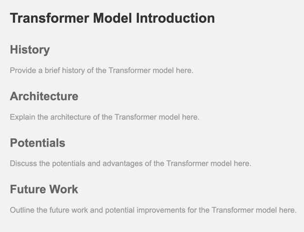</td>
    <td>Perfect</td>
    <td>GPT3.5</td>
  </tr>
  <tr>
    <td><a href="WareHouse/FlappyBird_THUNLP_20230726121145" target="_blank" rel="noopener noreferrer">FlappyBirds Game</a></td>
    <td>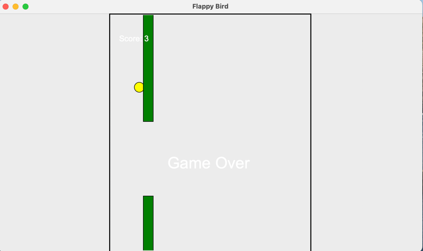</td>
    <td>Perfect</td>
    <td>GPT3.5</td>
  </tr>
  <tr>
    <td><a href="WareHouse/Gomoku_THUNLP_20230625201030" target="_blank" rel="noopener noreferrer">A Gomoku Game</a></td>
    <td>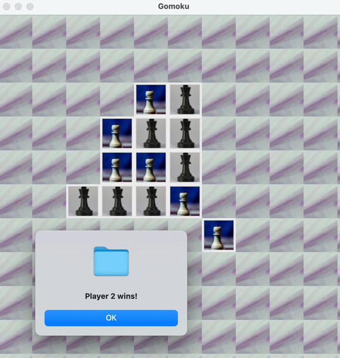</td>  
    <td>Perfect</td>
    <td>GPT3.5</td>
  </tr>
  <tr>
    <td><a href="WareHouse/Calculator_THUNLP_20230628184918" target="_blank" rel="noopener noreferrer">A calculator with bottom icons generated by Agents</a></td>
    <td>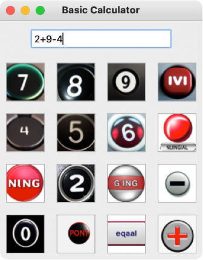</td>
    <td>Perfect</td>
    <td>GPT3.5</td>
  </tr>
  <tr>
    <td rowspan="17"><a href="https://github.com/thinkwee" target="_blank" rel="noopener noreferrer">https://github.com/thinkwee</a></td>
    <td><a href="WareHouse/ArtCanvas_THUNLP_20230825093558" target="_blank" rel="noopener noreferrer">Painter</a></td>
    <td>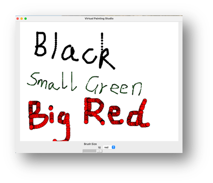</td>
    <td>Perfect</td>
    <td>GPT3.5</td>
  </tr>
  <tr>
    <td><a href="WareHouse/pingpong_THUNLP_20230817193956" target="_blank" rel="noopener noreferrer">PingPong Game</a></td>
    <td>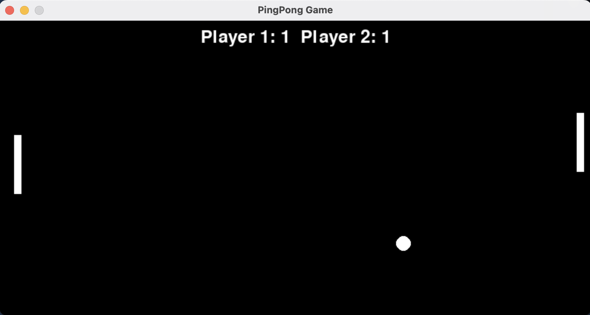</td>
    <td>Biased</td>
    <td>GPT3.5</td>
  </tr>
  <tr>
    <td><a href="WareHouse/PixelRunner_THUNLP_20230825072339" target="_blank" rel="noopener noreferrer">PixelRunner</a></td>
    <td>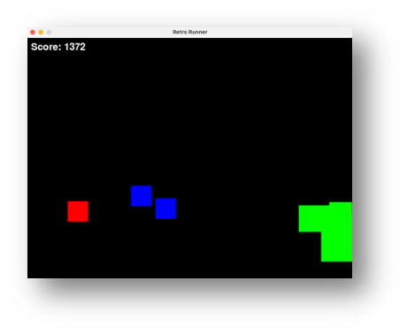</td>
    <td>Runnable</td>
    <td>GPT3.5</td>
  </tr>
  <tr>
    <td><a href="WareHouse/MoneyCtrl_THUNLP_20230825093546" target="_blank" rel="noopener noreferrer">BudgetControl</a></td>
    <td>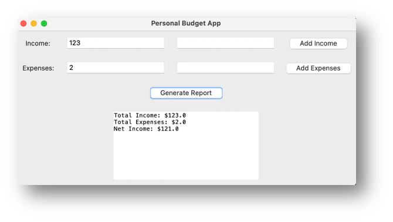</td>
    <td>Biased</td>
    <td>GPT3.5</td>
  </tr>
  <tr>
    <td><a href="WareHouse/PixelCraft_THUNLP_20230825072340" target="_blank" rel="noopener noreferrer">PixelCraft</a></td>
    <td>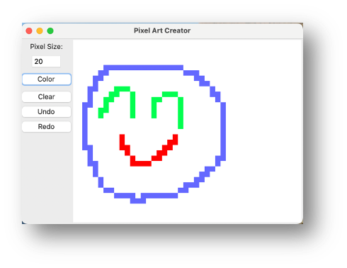</td>
    <td>Runnable</td>
    <td>GPT3.5</td>
  </tr>
  <tr>
    <td><a href="WareHouse/MazeGenerator_THUNLP_20230825093601" target="_blank" rel="noopener noreferrer">MazeGenerator</a></td>
    <td>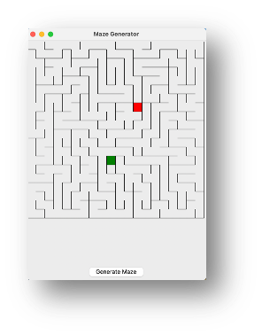</td>
    <td>Perfect</td>
    <td>GPT3.5</td>
  </tr>
  <tr>
    <td><a href="WareHouse/Matchy_Match_THUNLP_20230825101854" target="_blank" rel="noopener noreferrer">Matchy_Match</a></td>
    <td>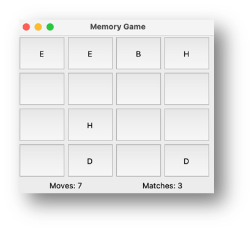</td>
    <td>Perfect</td>
    <td>GPT3.5</td>
  </tr>
  <tr>
    <td><a href="WareHouse/PasswordGenerator_THUNLP_20230825072337" target="_blank" rel="noopener noreferrer">Password Generator</a></td>
    <td>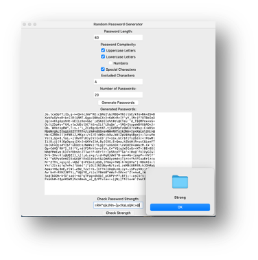</td>
    <td>Perfect</td>
    <td>GPT3.5</td>
  </tr>
  <tr>
    <td><a href="WareHouse/ToDo_THUNLP_20230825072331" target="_blank" rel="noopener noreferrer">Todo</a></td>
    <td>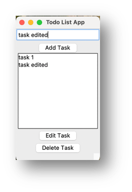</td>
    <td>Perfect</td>
    <td>GPT3.5</td>
  </tr>
  <tr>
    <td><a href="WareHouse/ExpenseEase_THUNLP_20230825093604" target="_blank" rel="noopener noreferrer">Expensechart</a></td>
    <td>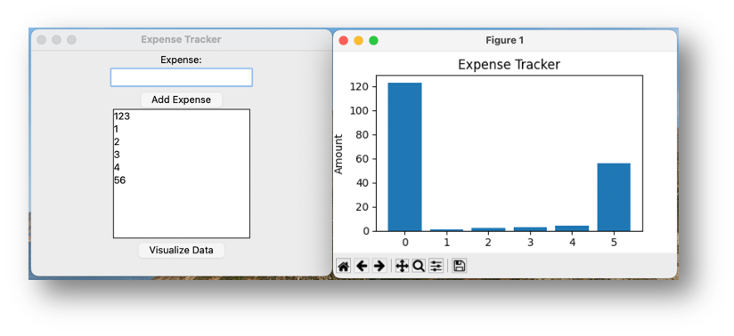</td>
    <td>Perfect</td>
    <td>GPT3.5</td>
  </tr>
  <tr>
    <td><a href="WareHouse/2048_THUNLP_20230822144615" target="_blank" rel="noopener noreferrer">2048 Game</a></td>
    <td>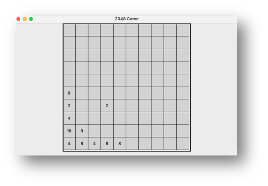</td>
    <td>Perfect</td>
    <td>GPT3.5</td>
  </tr>
  <tr>
    <td><a href="WareHouse/WordExpand_THUNLP_20230825093623" target="_blank" rel="noopener noreferrer">WordExpand</a></td>
    <td>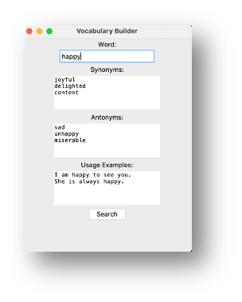</td>
    <td>Perfect</td>
    <td>GPT3.5</td>
  </tr>
  <tr>
    <td><a href="WareHouse/Fish_Tycoon_THUNLP_20230825093543" target="_blank" rel="noopener noreferrer">Fish Tycoon</a></td>
    <td>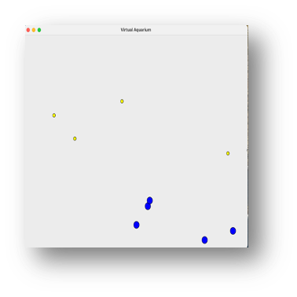</td>
    <td>Biased</td>
    <td>GPT3.5</td>
  </tr>
  <tr>
    <td><a href="WareHouse/DigitalClock_THUNLP_20230825093556" target="_blank" rel="noopener noreferrer">Digital Clock</a></td>
    <td>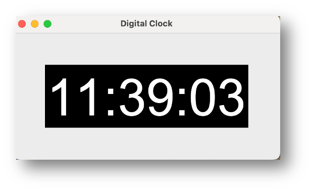</td>
    <td>Perfect</td>
    <td>GPT3.5</td>
  </tr>
  <tr>
    <td><a href="WareHouse/CurrencyWiz_THUNLP_20230825101851" target="_blank" rel="noopener noreferrer">CurrencyWiz</a></td>
    <td>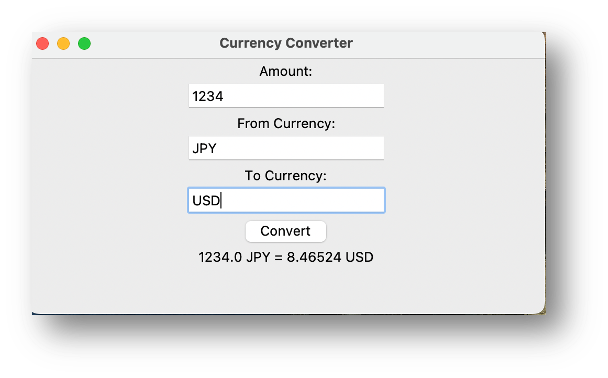</td>
    <td>Perfect</td>
    <td>GPT3.5</td>
  </tr>
  <tr>
    <td><a href="WareHouse/DesignDream_THUNLP_20230825072340" target="_blank" rel="noopener noreferrer">Design Dream</a></td>
    <td>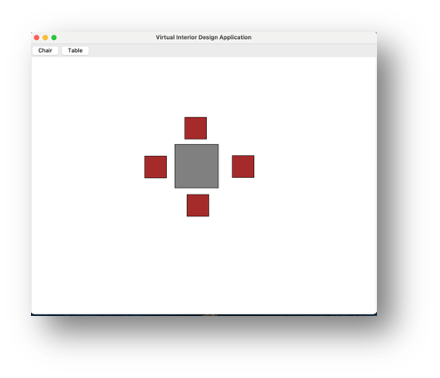</td>
    <td>Biased</td>
    <td>GPT3.5</td>
  </tr>
  <tr>
    <td><a href="WareHouse/DiceRollingSimulator_THUNLP_20230825072338" target="_blank" rel="noopener noreferrer">DiceRollingSimulator</a></td>
    <td>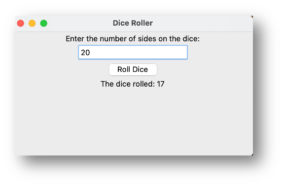</td>
    <td>Perfect</td>
    <td>GPT3.5</td>
  </tr>
  <tr>
    <td rowspan="6"><a href="https://github.com/NA-Wen" target="_blank" rel="noopener noreferrer">https://github.com/NA-Wen</a></td>
    <td><a href="WareHouse/md2html_THUNLP_md2html" target="_blank" rel="noopener noreferrer">md2html</a></td>
    <td>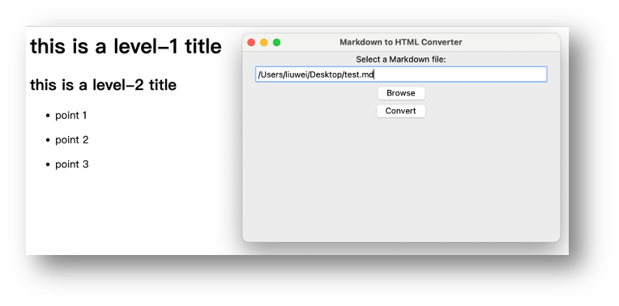</td>
    <td>Runnable</td>
    <td>GPT3.5</td>
  </tr>
  <tr>
    <td><a href="WareHouse/Gomoku_THUNLP_20230625201030" target="_blank" rel="noopener noreferrer">A Gomoku Game with assets generated by Agent</a></td>
    <td>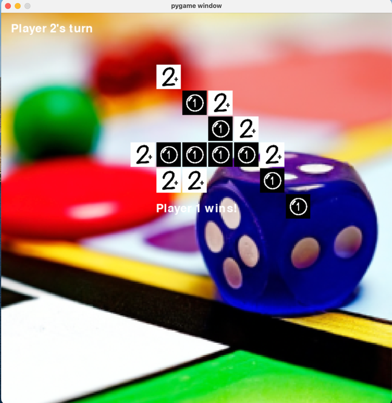</td>  
    <td>Perfect</td>
    <td>GPT4</td>
  </tr>
  <tr>
    <td><a href="WareHouse/mspaint_THUNLP_20230821204606" target="_blank" rel="noopener noreferrer">MsPaint</a></td>
    <td>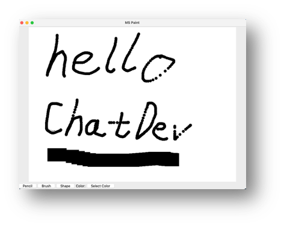</td>
    <td>Runnable</td>
    <td>GPT3.5</td>
  </tr>
  <tr>
    <td><a href="WareHouse/ImgEditor_THUNLP_20230824142740" target="_blank" rel="noopener noreferrer">Image Editor</a></td>
    <td>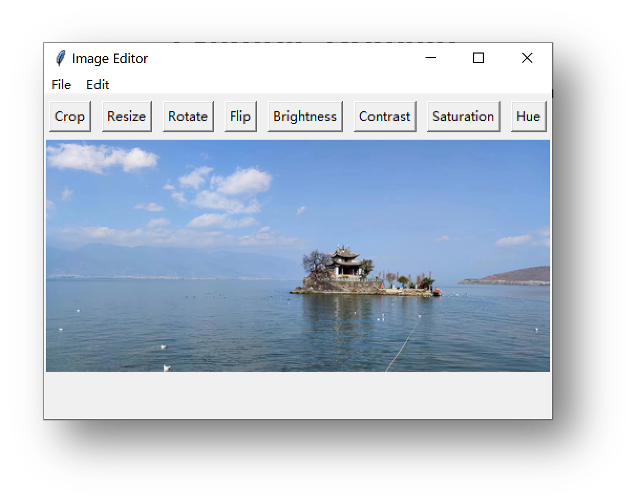</td>
    <td>Perfect</td>
    <td>GPT3.5</td>
  </tr>
  <tr>
    <td><a href="WareHouse/ArtCanvas_THUNLP_20230825093558" target="_blank" rel="noopener noreferrer">ArtCanvas</a></td>
    <td></td>
    <td>Perfect</td>
    <td>GPT3.5</td>
  </tr>
  <tr>
    <td><a href="WareHouse/TicTacToe_THUNLP_20230825093547" target="_blank" rel="noopener noreferrer">TicTacToe</a></td>
    <td>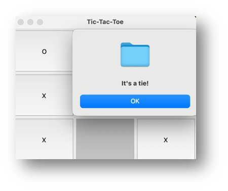</td>
    <td>Runnable</td>
    <td>GPT3.5</td>
  </tr>
  <tr>
    <td rowspan="5"><a href="https://github.com/lijiahao2022" target="_blank" rel="noopener noreferrer">https://github.com/lijiahao2022</a></td>
    <td><a href="WareHouse/musicplayer_THUNLP_20230824113404" target="_blank" rel="noopener noreferrer">Music Player</a></td>
    <td>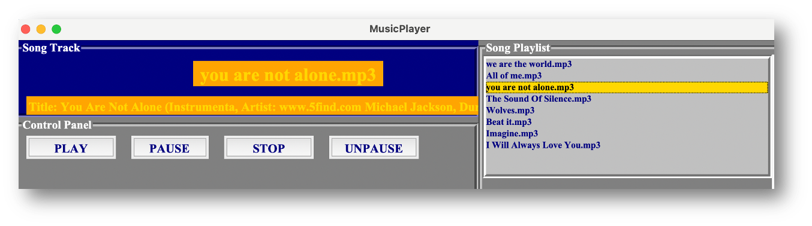</td>
    <td>Perfect</td>
    <td>GPT4</td>
  </tr>
  <tr>
    <td><a href="WareHouse/Typing_THUNLP_20230824105537" target="_blank" rel="noopener noreferrer">Typing Test</a></td>
    <td>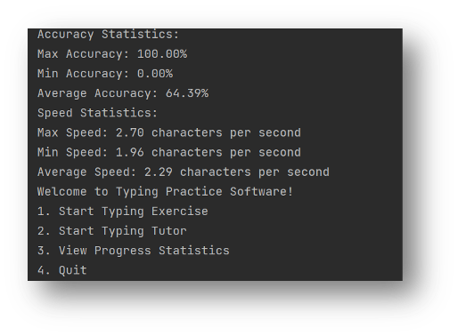</td>
    <td>Perfect</td>
    <td>GPT3.5</td>
  </tr>
  <tr>
    <td><a href="WareHouse/videoplayer_THUNLP_20230824233151" target="_blank" rel="noopener noreferrer">Video Player</a></td>
    <td>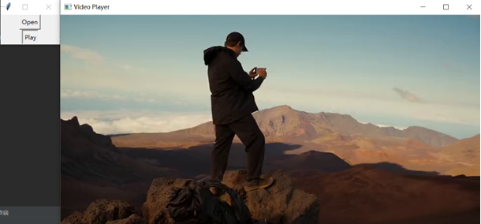</td>
    <td>Runnable</td>
    <td>GPT3.5</td>
  </tr>
  <tr>
    <td><a href="WareHouse/timer_THUNLP_20230823091709" target="_blank" rel="noopener noreferrer">Timer</a></td>
    <td>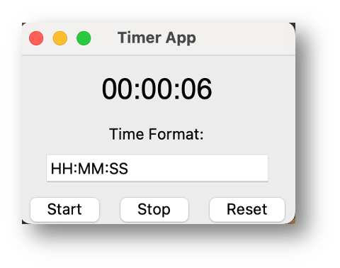</td>
    <td>Perfect</td>
    <td>GPT3.5</td>
  </tr>
  <tr>
    <td><a href="WareHouse/BookBreeze_THUNLP_20230825072339" target="_blank" rel="noopener noreferrer">BookBreeze</a></td>
    <td>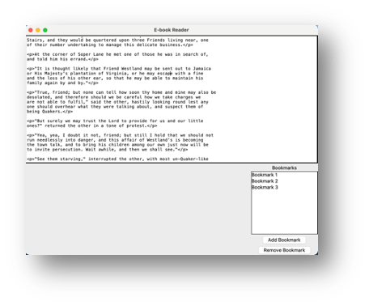</td>
    <td>Runnable</td>
    <td>GPT3.5</td>
  </tr>
</tbody>
</table>

## 📑 Citation

```
@misc{qian2023communicative,
      title={Communicative Agents for Software Development}, 
      author={Chen Qian and Xin Cong and Wei Liu and Cheng Yang and Weize Chen and Yusheng Su and Yufan Dang and Jiahao Li and Juyuan Xu and Dahai Li and Zhiyuan Liu and Maosong Sun},
      year={2023},
      eprint={2307.07924},
      archivePrefix={arXiv},
      primaryClass={cs.SE}
}
```

## ⚖️ License

- The purpose of ChatDev is exclusively for research purposes.
- The source code is licensed under Apache 2.0.
- The datasets are licensed under CC BY NC 4.0, which allows for non-commercial use only. It is important to note that any models trained using these datasets should not be employed for purposes other than research.
