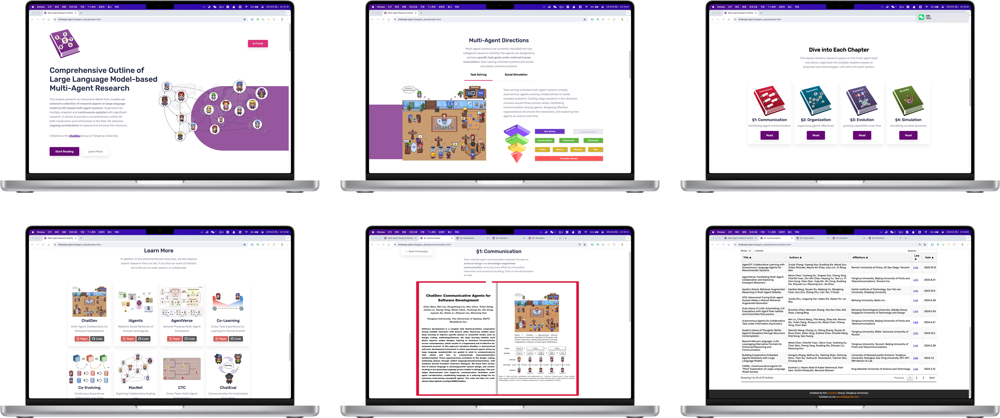
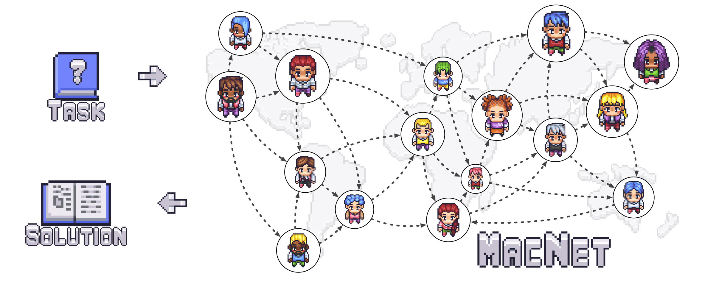
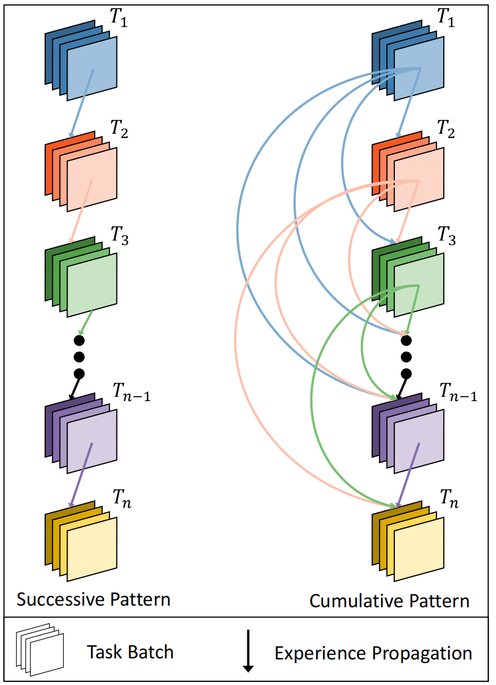
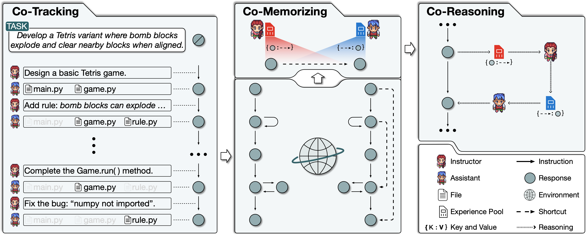
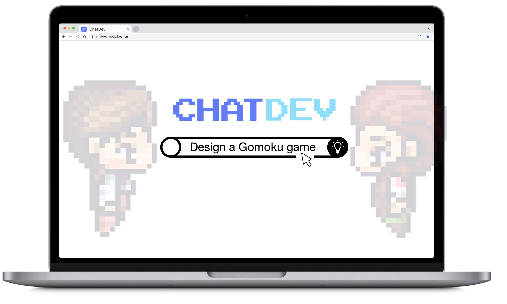
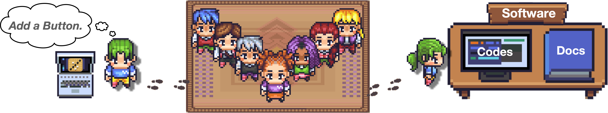
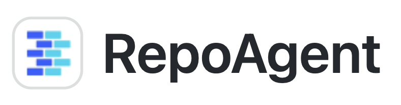
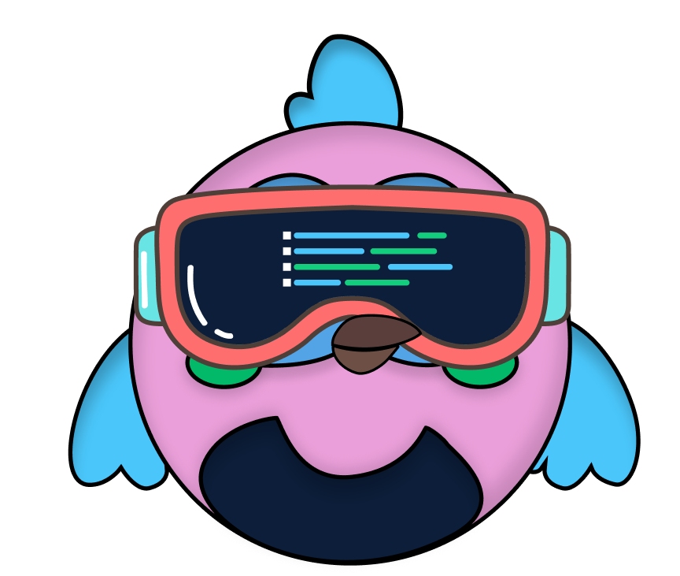

# Communicative Agents for Software Development

<p align="center">
  
</p>

<p align="center">
    【English   | <a href="readme/README-Chinese.md">Chinese</a> | <a href="readme/README-Japanese.md">Japanese</a> | <a href="readme/README-Korean.md">Korean</a> | <a href="readme/README-Filipino.md">Filipino</a> | <a href="readme/README-French.md">French</a> | <a href="readme/README-Slovak.md">Slovak</a> | <a href="readme/README-Portuguese.md">Portuguese</a> | <a href="readme/README-Spanish.md">Spanish</a> | <a href="readme/README-Dutch.md">Dutch</a> | <a href="readme/README-Turkish.md">Turkish</a> | <a href="readme/README-Hindi.md">Hindi</a> | <a href="readme/README-Bahasa-Indonesia.md">Bahasa Indonesia</a> | <a href="readme/README-Russian.md">Russian</a> | <a href="readme/README-Urdu.md">Urdu</a>】
</p>
<p align="center">
    【📚 <a href="wiki.md">Wiki</a> | 🚀 <a href="wiki.md#visualizer">Visualizer</a> | 👥 <a href="Contribution.md">Community Built Software</a> | 🔧 <a href="wiki.md#customization">Customization</a> | 👾 <a href="https://discord.gg/bn4t2Jy6TT")>Discord</a>】

</p>

## 📖 Overview

- **ChatDev** stands as a **virtual software company** that operates through various **intelligent agents** holding
  different roles, including Chief Executive Officer , Chief Product Officer , Chief Technology Officer , programmer , reviewer , tester , art designer . These
  agents form a multi-agent organizational structure and are united by a mission to "revolutionize the digital world
  through programming." The agents within ChatDev **collaborate** by participating in specialized functional seminars,
  including tasks such as designing, coding, testing, and documenting.
- The primary objective of ChatDev is to offer an **easy-to-use**, **highly customizable** and **extendable** framework,
  which is based on large language models (LLMs) and serves as an ideal scenario for studying collective intelligence.

<p align="center">
  
</p>

## 🎉 News
* **June 25, 2024: 🎉To foster development in LLM-powered multi-agent collaboration🤖🤖 and related fields, the ChatDev team has curated a collection of seminal papers📄 presented in a [open-source](https://github.com/OpenBMB/ChatDev/tree/main/MultiAgentEbook) interactive e-book📚 format. Now you can explore the latest advancements on the [Ebook Website](https://thinkwee.top/multiagent_ebook) and download the [paper list](https://github.com/OpenBMB/ChatDev/blob/main/MultiAgentEbook/papers.csv).**
  <p align="center">
  
  </p>
* June 12, 2024: We introduce Multi-Agent Collaboration Networks (MacNet) 🎉, which utilize directed acyclic graphs to facilitate effective task-oriented collaboration among agents through linguistic interactions 🤖🤖. MacNet supports cooperation across various topologies and among more than a thousand agents without exceeding context limits. More versatile and scalable, MacNet can be considered a more advanced version of ChatDev's chain-shaped topology. Our preprint paper is available at [https://arxiv.org/abs/2406.07155](https://arxiv.org/abs/2406.07155). This technique will soon be incorporated into this repository, enhancing support for diverse organizational structures and offering richer solutions beyond software development (e.g., logical reasoning, data analysis, story generation, and more).
  <p align="center">
  
  </p>

<details>
<summary>Old News</summary>

* May 07, 2024, we introduced "Iterative Experience Refinement" (IER), a novel method where instructor and assistant agents enhance shortcut-oriented experiences to efficiently adapt to new tasks. This approach encompasses experience acquisition, utilization, propagation, and elimination across a series of tasks. Our preprint paper is available at https://arxiv.org/abs/2405.04219, and this technique will soon be incorporated into ChatDev.
  <p align="center">
  
  </p>

* January 25, 2024: We have integrated Experiential Co-Learning Module into ChatDev. Please see the [Experiential Co-Learning Guide](wiki.md#co-tracking).

* December 28, 2023: We present Experiential Co-Learning, an innovative approach where instructor and assistant agents accumulate shortcut-oriented experiences to effectively solve new tasks, reducing repetitive errors and enhancing efficiency.  Check out our preprint paper at https://arxiv.org/abs/2312.17025 and this technique will soon be integrated into ChatDev.
  <p align="center">
  
  </p>

* November 15, 2023: We launched ChatDev as a SaaS platform that enables software developers and innovative entrepreneurs to build software efficiently at a very low cost and barrier to entry. Try it out at https://chatdev.modelbest.cn/.
  <p align="center">
  
  </p>

* November 2, 2023: ChatDev is now supported with a new feature: incremental development, which allows agents to develop upon existing codes. Try `--config "incremental" --path "[source_code_directory_path]"` to start it.
  <p align="center">
  
  </p>

* October 26, 2023: ChatDev is now supported with Docker for safe execution (thanks to contribution from [ManindraDeMel](https://github.com/ManindraDeMel)). Please see [Docker Start Guide](wiki.md#docker-start).
  <p align="center">
  
  </p>
* September 25, 2023: The **Git** mode is now available, enabling the programmer  to utilize Git for version control. To enable this feature, simply set ``"git_management"`` to ``"True"`` in ``ChatChainConfig.json``. See [guide](wiki.md#git-mode).
  <p align="center">
  
  </p>
- September 20, 2023: The **Human-Agent-Interaction** mode is now available! You can get involved with the ChatDev team by playing the role of reviewer  and making suggestions to the programmer ;
  try ``python3 run.py --task [description_of_your_idea] --config "Human"``. See [guide](wiki.md#human-agent-interaction) and [example](WareHouse/Gomoku_HumanAgentInteraction_20230920135038).
  <p align="center">
  
  </p>
- September 1, 2023: The **Art** mode is available now! You can activate the designer agent  to generate images used in the software;
  try ``python3 run.py --task [description_of_your_idea] --config "Art"``. See [guide](wiki.md#art) and [example](WareHouse/gomokugameArtExample_THUNLP_20230831122822).
- August 28, 2023: The system is publicly available.
- August 17, 2023: The v1.0.0 version was ready for release.
- July 30, 2023: Users can customize ChatChain, Phase, and Role settings. Additionally, both online Log mode and replay
  mode are now supported.
- July 16, 2023: The [preprint paper](https://arxiv.org/abs/2307.07924) associated with this project was published.
- June 30, 2023: The initial version of the ChatDev repository was released.
</details>

## ❓ What Can ChatDev Do?


<https://github.com/OpenBMB/ChatDev/assets/11889052/80d01d2f-677b-4399-ad8b-f7af9bb62b72>

## ⚡️ Quickstart

### 💻️ Quickstart with Web

Access the web page for visualization and configuration use: https://chatdev.modelbest.cn/

### 🖥️ Quickstart with terminal

To get started, follow these steps:

1. **Clone the GitHub Repository:** Begin by cloning the repository using the command:

   ```
   git clone https://github.com/OpenBMB/ChatDev.git
   ```

2. **Set Up Python Environment:** Ensure you have a version 3.9 or higher Python environment. You can create and
   activate this environment using the following commands, replacing `ChatDev_conda_env` with your preferred environment
   name:

   ```
   conda create -n ChatDev_conda_env python=3.9 -y
   conda activate ChatDev_conda_env
   ```

3. **Install Dependencies:** Move into the `ChatDev` directory and install the necessary dependencies by running:

   ```
   cd ChatDev
   pip3 install -r requirements.txt
   ```

4. **Set OpenAI API Key:** Export your OpenAI API key as an environment variable. Replace `"your_OpenAI_API_key"` with
   your actual API key. Remember that this environment variable is session-specific, so you need to set it again if you
   open a new terminal session.

   On Unix/Linux:

   ```
   export OPENAI_API_KEY="your_OpenAI_API_key"
   ```

   On Windows:

   ```
   $env:OPENAI_API_KEY="your_OpenAI_API_key"
   ```

5. **Use Ollama API:** If you want to use ollama(local model), export your ollama model as an environment variable. Replace `"[model]"` with your ollama model.

    On Unix/Linux:

    ```
    export MODEL_NAME="[model]"
    ```

    On Windows:

    ```
    $env:MODEL_NAME="[model]"
    ```

6. **Use Huggingface API:** If you want to use huggingface model, export your huggingface model id as an environment variable. Replace `"[hf_model_id]"` with huggingface model id.

    On Unix/Linux:

    ```
    export HF_MODEL_ID="[hf_model_id]"
    ```

    On Windows:

    ```
    $env:HF_MODEL_ID="[hf_model_id]"
    ```

7. **Build Your Software:** Use the following command to initiate the building of your software,
   replacing `[description_of_your_idea]` with your idea's description and `[project_name]` with your desired project
   name:
   On Unix/Linux:

   ```
   python3 run.py --task "[description_of_your_idea]" --name "[project_name]"
   ```

   On Windows:

   ```
   python run.py --task "[description_of_your_idea]" --name "[project_name]"
   ```

   if you using ollama, `--model OLLAMA` is required
   
   if you using huggingface, `--model HUGGINGFACE` is required

8. **Run Your Software:** Once generated, you can find your software in the `WareHouse` directory under a specific
   project folder, such as `project_name_DefaultOrganization_timestamp`. Run your software using the following command
   within that directory:
   On Unix/Linux:

   ```
   cd WareHouse/project_name_DefaultOrganization_timestamp
   python3 main.py
   ```

   On Windows:

   ```
   cd WareHouse/project_name_DefaultOrganization_timestamp
   python main.py
   ```

### 🐳 Quickstart with Docker

- We thank [ManindraDeMel](https://github.com/ManindraDeMel) for providing Docker support. Please see [Docker Start Guide](wiki.md#docker-start).

## ✨️ Advanced Skills

For more detailed information, please refer to our [Wiki](wiki.md), where you can find:

- An introduction to all command run parameters.
- A straightforward guide for setting up a local web visualizer demo, which can visualize real-time logs, replayed logs, and ChatChain.
- An overview of the ChatDev framework.
- A comprehensive introduction to all advanced parameters in ChatChain configuration.
- Guides for customizing ChatDev, including:
  - ChatChain: Design your own software development process (or any other process), such
      as ``DemandAnalysis -> Coding -> Testing -> Manual``.
  - Phase: Design your own phase within ChatChain, like ``DemandAnalysis``.
  - Role: Defining the various agents in your company, such as the ``Chief Executive Officer``.

## 🤗 Share Your Software

**Code**: We are enthusiastic about your interest in participating in our open-source project. If you come across any
problems, don't hesitate to report them. Feel free to create a pull request if you have any inquiries or if you are
prepared to share your work with us! Your contributions are highly valued. Please let me know if there's anything else
you need assistance!

**Company**: Creating your own customized "ChatDev Company" is a breeze. This personalized setup involves three simple
configuration JSON files. Check out the example provided in the ``CompanyConfig/Default`` directory. For detailed
instructions on customization, refer to our [Wiki](wiki.md).

**Software**: Whenever you develop software using ChatDev, a corresponding folder is generated containing all the
essential information. Sharing your work with us is as simple as making a pull request. Here's an example: execute the
command ``python3 run.py --task "design a 2048 game" --name "2048"  --org "THUNLP" --config "Default"``. This will
create a software package and generate a folder named ``/WareHouse/2048_THUNLP_timestamp``. Inside, you'll find:

- All the files and documents related to the 2048 game software
- Configuration files of the company responsible for this software, including the three JSON config files
  from ``CompanyConfig/Default``
- A comprehensive log detailing the software's building process that can be used to replay (``timestamp.log``)
- The initial prompt used to create this software (``2048.prompt``)

**See community contributed software [here](Contribution.md)!**

## 👨‍💻‍ Contributors

<a href="https://github.com/OpenBMB/ChatDev/graphs/contributors">
  
</a>

Made with [contrib.rocks](https://contrib.rocks).

## 🔎 Citation

```
@article{chatdev,
      title = {ChatDev: Communicative Agents for Software Development},
      author = {Chen Qian and Wei Liu and Hongzhang Liu and Nuo Chen and Yufan Dang and Jiahao Li and Cheng Yang and Weize Chen and Yusheng Su and Xin Cong and Juyuan Xu and Dahai Li and Zhiyuan Liu and Maosong Sun},
      journal = {arXiv preprint arXiv:2307.07924},
      url = {https://arxiv.org/abs/2307.07924},
      year = {2023}
}
```

## ⚖️ License

- Source Code Licensing: Our project's source code is licensed under the Apache 2.0 License. This license permits the use, modification, and distribution of the code, subject to certain conditions outlined in the Apache 2.0 License.
- Data Licensing: The related data utilized in our project is licensed under CC BY-NC 4.0. This license explicitly permits non-commercial use of the data. We would like to emphasize that any models trained using these datasets should strictly adhere to the non-commercial usage restriction and should be employed exclusively for research purposes.


## 🤝 Acknowledgments

<a href="http://nlp.csai.tsinghua.edu.cn/"></a>&nbsp;&nbsp;
<a href="https://modelbest.cn/"></a>&nbsp;&nbsp;
<a href="https://github.com/OpenBMB/AgentVerse/"></a>&nbsp;&nbsp;
<a href="https://github.com/OpenBMB/RepoAgent"></a>
<a href="https://app.commanddash.io/agent?github=https://github.com/OpenBMB/ChatDev"></a>

## 📬 Contact

If you have any questions, feedback, or would like to get in touch, please feel free to reach out to us via email at [qianc62@gmail.com](mailto:qianc62@gmail.com)
