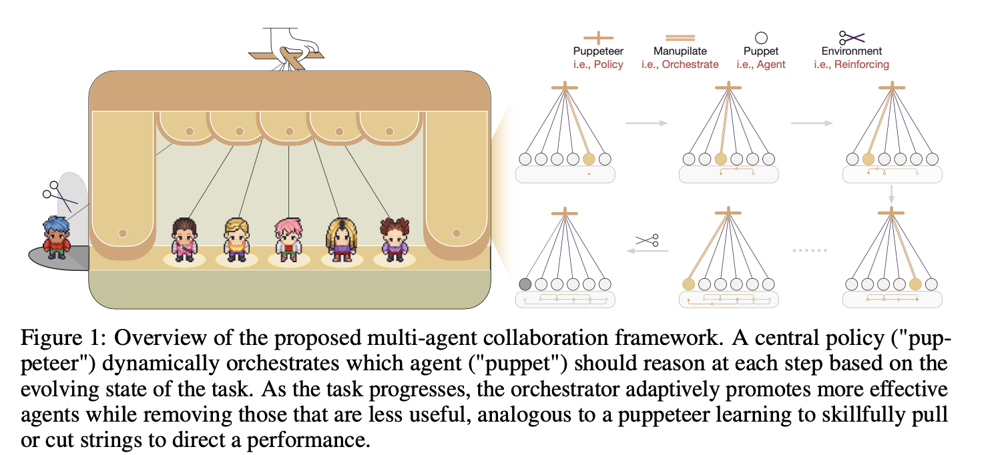

# Multi-Agent Collaboration via Evolving Orchestration
**Puppeteer** introduces a new way for large language models (LLMs) to collaborate efficiently on complex tasks.

Instead of static structures, our framework uses a centralized orchestrator (“puppeteer”) that dynamically directs multiple agents (“puppets”) based on evolving task states. The orchestrator is trained with reinforcement learning to sequence and prioritize agents, enabling flexible and adaptive collective reasoning.



# Quick Start

## Prerequisites

- Python 3.11 or higher
- CUDA-compatible GPU (optional, for policy training)
- API keys for desired LLM providers

## Installation

1. **Clone the repository**
   ```bash
    git clone -b puppeteer https://github.com/OpenBMB/ChatDev
    cd ChatDev
    cd puppeteer
   ```

2. **Set up environment and install dependencies**
   ```bash
   # Create conda environment
   conda create -n puppeteer_env python=3.11
   conda activate puppeteer_env
   
   # Install dependencies
   pip install -r requirements.txt
   ```
3. **Download the pre-trained puppeteer model base**

    We use a 70B reward model as the untrained Puppeteer base, so we first need to download this model. The Hugging Face repository is `nvidia/Llama-3.1-Nemotron-70B-Reward`.

4. **Configure the system**
   ```bash
   # Edit configurations with your settings
   vim config/global.yaml  # Add your API keys
   ```
    - Global Configuration (`config/global.yaml`): configure API access, file paths, and system behavior:
        ```yaml
        # API Configuration
        logging:
            level: INFO               # Logging level, options: DEBUG, INFO, WARNING, ERROR
            logpath: ./logs           # Folder path to store log files

        # Path to the folder containing model weights of the Puppeteer base model
        # (downloaded in step 3, or directly loading)
        model_weight_path: nvidia/Llama-3.1-Nemotron-70B-Reward

        api_keys:
            openai_api_key: ""        # Your OpenAI API key
            openai_base_url: "https://api.openai.com/v1/"  # OpenAI base URL
            bing_api_key: ""          # Bing API key for web search (optional)

        # System retry settings
        max_retry_times: 10           # Maximum number of times to retry API calls
        max_json_reformat_turns: 10   # Maximum retries for JSON parsing/reformatting

        # Enable external tools (like web search, file read, etc.)
        external_tools_enabled: True

        # File paths that agents may need
        file_path:
            root_file_path: ./data    # Root folder containing all necessary files for agents

        # Graph exploration parameters for multi-agent reasoning
        graph:
            max_parallel_paths: 4     # Maximum number of parallel paths to explore (recommended 2-6)
            max_step_num: 5           # Maximum number of steps (nodes) in each path (recommended 4-6)
        ```
    ⚠️ **Note:** Replace placeholders with your actual API keys and url, all the places are needed.

5. **Quick start with the predefined settings**

    The agents are initialized from `puppeteer/personas/personas.jsonl`, which includes all currently supported reasoning patterns and tool modes. The default model backbone is GPT-4o.
    ```bash
    cd puppeteer 
    python main.py <task> <mode> [--level LEVEL] [--index INDEX] [--data_limit LIMIT] [--personas PATH]
    ```
    Example:
    ```bash
    # Run MMLU-Pro validation set with a data limit of 10
    python main.py MMLU-Pro validation --data_limit 10
    ```
If the run is successful, you will see output similar to [EXAMPLE](puppeteer/logs/example).
# Customization 

Puppeteer provides multiple ways to tailor the system to your needs

## Agents
### 🔎 Agent Categories

In this framework, agents are divided into two main categories based on whether they have access to external tools:

1. Agents with Tools
    - Description: These agents can interact with external systems to gather data, execute code, or access files.
    - Supported Actions: `TOOL_ACTION_LIST`
        - search_arxiv – Search for academic papers on arXiv
        - search_bing – Query the Bing search engine
        - access_website – Access websites and extract information
        - run_python – Execute Python code
        - read_file – Read and extract content from files

2. Agents without Tools
    - Description: These agents focus on internal reasoning, critique, reflection, and summarization. They do not interact with external systems.
    - Supported Actions: `REASONING_ACTION_LIST`
        - reasoning – Logical reasoning
        - critique – Evaluate and critique reasoning
        - question – Generate clarifying sub-questions
        - reflect – Provide reflective analysis
        - conclude – Generate final conclusions
        - summarize – Summarize information concisely
        - planning – Create structured plans
        - modify – Correct errors and refine results

3. Termination Agent
    - Description: A special agent responsible for determining when the reasoning process should stop.
    - Supported Actions: `TERMINATION_ACTION_LIST`
        - terminate – End the reasoning process and deliver the final output

### ⚙️ Customize  

You can extend this framework by creating new agents, adding actions, or integrating new base models.  

#### 1. Multiple Actions per Agent  
- Currently, each agent is designed to perform **a single action** (see [`reasoning_agent.py`](puppeteer/agent/reasoning_agent.py)).  
- To create an agent that supports **multiple actions**, implement your own custom agent by inheriting from [`agent.py`](puppeteer/agent/agent.py).  

#### 2. Adding New Actions  
- To introduce a **new action**, you need to:  
  1. Define the corresponding **prompt or tool**.  
  2. Modify [`reasoning_agent.py`](puppeteer/agent/reasoning_agent.py) to integrate the new action into the reasoning workflow.  

#### 3. Supporting New Base Models  
- If you want to use a **new base model** for agents:  
  - Extend the configuration in [`model_config.py`](puppeteer/model/model_config.py).  
  - Ensure that the new model is properly registered and compatible with the agent framework.  

## 🎭 Puppeteer Training  

The training parameters are defined in [`policy.json`](puppeteer/config/policy.json). Key parameters include:  
### 🔹 Optimization  
- `learning_rate`: `0.0001`  
  Controls the learning speed of the policy network.  
- `sample_size`: `1`  
  Number of samples used per training step.  

### 🔹 Agent Scale Control  
- `max_num_agents`: `3`  
  Maximum number of agents allowed in the system.  
- `next_num_agents`: `3`  
  Number of agents spawned in the next step.  
- `max_path`: `6`  
  Maximum trajectory length for agent exploration.  

### 🔹 Reward Configuration  
- `gamma`: `0.99`  
  Discount factor for future rewards.  
- `reward_factors`: Shaping factors for different actions:  
  - `default`: `-1.0` → Penalty for invalid/neutral actions.  
  - `terminator`: `0.5` → Reward for correct termination.  
  - `web_search`: `-1.5` → Penalty for costly web-search actions.  

### 🔹 Cost Control  
- `scale`: `0.1`  
  Base cost scaling factor.  
- `growth_rate`: `1.0`  
  Linear growth rate of cost per step.  
- `inverse`: `false`  
  If set to `true`, applies inverse cost scaling.  

### 🔹 Training Paradigm  
The current training paradigm uses the hidden state of the last token from the Reward Model. This hidden state is passed through an MLP-based policy network to generate action probabilities.  
You can switch the Reward Model or design a new training paradigm by modifying the policy network input/output structure.  


# Citation
If you use Puppeteer in your work, please cite our NeurIPS 2025 paper:
```bibtex
@inproceedings{dang2025multiagentcollaboration,
  title={Multi-Agent Collaboration via Evolving Orchestration},
  author={Yufan Dang and Chen Qian and Xueheng Luo and Jingru Fan and Zihao Xie and Ruijie Shi and Weize Chen and Cheng Yang and Xiaoyin Che and Ye Tian and Xuantang Xiong and Lei Han and Zhiyuan Liu and Maosong Sun},
  booktitle={The Thirty-ninth Annual Conference on Neural Information Processing Systems (NeurIPS)},
  year={2025},
  url={https://arxiv.org/abs/2505.19591}
}
```