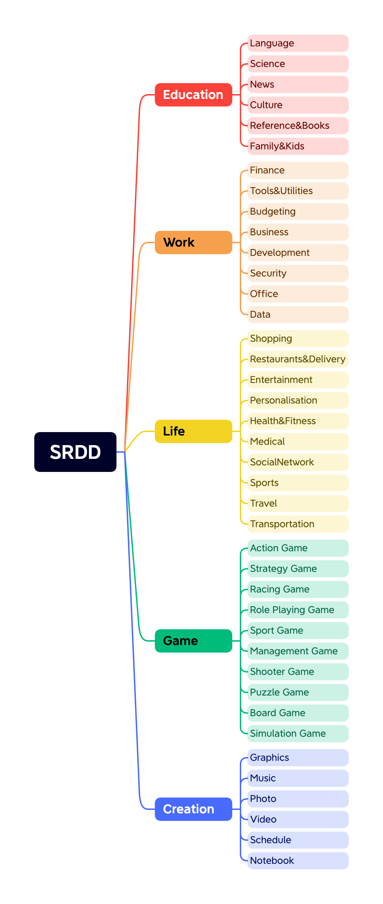

# SRDD (Software Requirement Description Dataset)

  

Welcome to SRDD (Software Requirement Description Dataset), a large prompted dataset tailored for Natural Language to Software (NL2Software) research. This repository contains a rich collection of prompts organized into 5 major categories and further subdivided into 40 subcategories. In total, the dataset comprises 1200 high-quality prompt samples extracted from ChatGPT 3.5, specifically curated to facilitate research in NL2Software.

## Structure
- The generated prompt contains three parts:
    -   Name of the software
    -   Description of this software
    -   Category of this software
- Details
	-	check.csv # Check Results
 		- The check csv file contains 14 columns, which are:
   			- SoftwareCategory
      		- SoftwareName
      		- SoftwareDescription
      		- Whether Obey Rule 1/2/3/4/5
      		- Reason For Obeying(or not Obeying) Rule 1/2/3/4/5
      		- Count of Rules Obeyed		
  		- The 5 rules are designed to make sure the generated software descriptions are clear to follow and easy to evaluate. Specifically, the 5 rules are:
  			- Describe the primary function of this software, emphasizing its simplicity, commonality, and feasibility in implementation.
  			- Craft a clear and comprehensive description that encapsulates all the essential information required to define the software's fundamental functionality.
  			- Specify that the software does not require internet access, highlighting its self-contained nature.
  			- This software can be realized without relying on real-world data sources.
  			- Highlight the software's user-friendliness, emphasizing that it can be operated by a single individual and does not necessitate multiple users for testing, in contrast to online chat software.
	-	data_ChatDev_format.sh # Data, in the format of executable shell scripts (in ChatDev)
	-	data_attribute_format.csv # Data, in the format of csv, containing three columns, Name/Description/Category
## Category

  

# License
The SRDD dataset is licensed under **CC BY-NC 4.0**. This license explicitly permits non-commercial use of the data. We would like to emphasize that any models trained using these datasets should strictly adhere to the non-commercial usage restriction and should be employed exclusively for research purposes.
