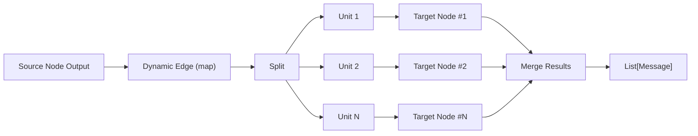
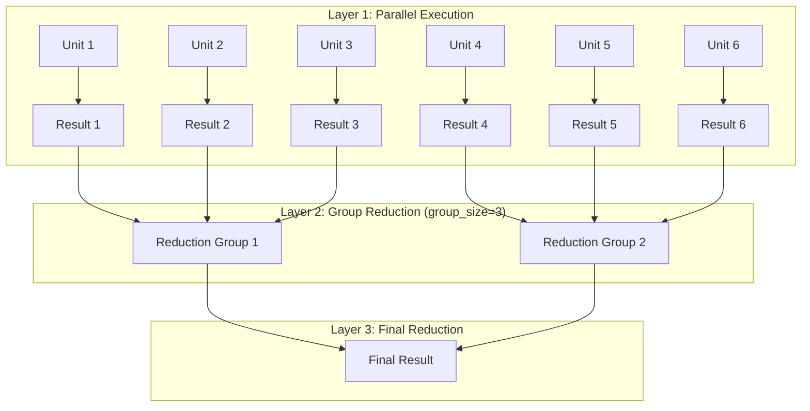

# Dynamic Execution Mode Guide

Dynamic execution mode enables parallel processing behavior defined at the edge level, supporting Map (fan-out) and Tree (fan-out + reduce) modes. When messages pass through edges configured with `dynamic`, the target node dynamically expands into multiple parallel instances based on split results.

## 1. Overview

| Mode | Description | Output | Use Cases |
|------|-------------|--------|-----------|
| **Map** | Fan-out execution, splits messages into multiple units for parallel processing | `List[Message]` (flattened results) | Batch processing, parallel queries |
| **Tree** | Fan-out + reduce, parallel processing followed by recursive group merging | Single `Message` | Long text summarization, hierarchical aggregation |

## 2. Configuration Structure

Dynamic configuration is defined on **edges**, not nodes:

```yaml
edges:
  - from: Source Node
    to: Target Node
    trigger: true
    carry_data: true
    dynamic:                    # Edge-level dynamic execution config
      type: map                 # map or tree
      split:                    # Message splitting strategy
        type: message           # message | regex | json_path
        # pattern: "..."        # Required for regex mode
        # json_path: "..."      # Required for json_path mode
      config:                   # Mode-specific config
        max_parallel: 5         # Maximum concurrency
```

### 2.1 Core Concepts

- **Dynamic edge**: An edge with `dynamic` configured; messages passing through trigger dynamic expansion of the target node
- **Static edge**: An edge without `dynamic` configured; messages are **replicated** to all dynamic expansion instances
- **Target node expansion**: The target node is "virtually" expanded into multiple parallel instances based on split results

### 2.2 Multi-Edge Consistency Rule

> [!IMPORTANT]
> When a node has multiple incoming edges with `dynamic` configured, all dynamic edge configurations **must be identical** (type, split, config). Otherwise, execution will fail with an error.

## 3. Split Strategies

Split defines how messages passing through the edge are partitioned into parallel execution units.

### 3.1 message Mode (Default)

Each message passing through the edge becomes an independent execution unit. This is the most common mode.

```yaml
split:
  type: message
```

**Execution behavior**:
- Source node outputs 4 messages through the dynamic edge
- Splits into 4 parallel units, target node executes 4 times

### 3.2 regex Mode

Uses regular expressions to extract matches from text content.

```yaml
split:
  type: regex
  pattern: "(?s).{1,2000}(?:\\s|$)"  # Split every ~2000 characters
```

**Typical uses**:
- Split by paragraph: `pattern: "\\n\\n"`
- Split by line: `pattern: ".+"`
- Fixed-length chunks: `pattern: "(?s).{1,N}"`

### 3.3 json_path Mode

Extracts array elements from JSON-formatted output using JSONPath expressions.

```yaml
split:
  type: json_path
  json_path: "$.items[*]"  # JSONPath expression
```

## 4. Map Mode Details

Map mode splits messages and executes the target node in parallel, flattening outputs into `List[Message]`.

### 4.1 Configuration

| Field | Type | Default | Description |
|-------|------|---------|-------------|
| `max_parallel` | int | 10 | Maximum concurrent executions |

### 4.2 Execution Flow



## 5. Tree Mode Details

Tree mode adds reduction layers on top of Map, recursively merging parallel results by group until a single output remains.

### 5.1 Configuration

| Field | Type | Default | Description |
|-------|------|---------|-------------|
| `group_size` | int | 3 | Number of elements per reduction group, minimum 2 |
| `max_parallel` | int | 10 | Maximum concurrent executions per layer |

### 5.2 Execution Flow



## 6. Static Edge Message Replication

When a target node has both dynamic and static incoming edges:

- **Dynamic edge messages**: Split according to strategy, each unit executes the target node once
- **Static edge messages**: **Replicated** to every dynamic expansion instance

```yaml
nodes:
  - id: Task Generator
    type: passthrough
    config: ...
  - id: Extra Requirement
    type: literal
    config:
      content: "Please use concise language"
  - id: Processor
    type: agent
    config:
      name: gpt-4o
      role: Process task

edges:
  - from: Task Generator
    to: Processor
    dynamic:                    # Dynamic edge: 4 tasks → 4 parallel units
      type: map
      split:
        type: message
      config:
        max_parallel: 10
  - from: Extra Requirement
    to: Processor              # Static edge: replicated to all 4 instances
    trigger: true
    carry_data: true
```

**Execution result**: Processor executes 4 times, each receiving 1 task + "Please use concise language"

## 7. Complete Examples

### 7.1 Travel Planning (Map + Tree Combination)

```yaml
graph:
  nodes:
    - id: Eat Planner
      type: literal
      config:
        content: Plan what to eat in Shanghai
        role: user
    - id: Play Planner
      type: literal
      config:
        content: Plan what to do in Shanghai
        role: user
    - id: Stay Planner
      type: literal
      config:
        content: Plan where to stay in Shanghai
        role: user
    - id: Collector
      type: passthrough
      config:
        only_last_message: false
    - id: Travel Executor
      type: agent
      config:
        name: gpt-4o
        role: You are a travel planner. Please plan according to user requests.
    - id: Final Aggregator
      type: agent
      config:
        name: gpt-4o
        role: Please integrate the inputs into a complete travel plan.

  edges:
    - from: Eat Planner
      to: Collector
    - from: Play Planner
      to: Collector
    - from: Stay Planner
      to: Collector
    - from: Collector
      to: Travel Executor
      dynamic:                  # Map fan-out: 3 planning requests → 3 parallel executions
        type: map
        split:
          type: message
        config:
          max_parallel: 10
    - from: Travel Executor
      to: Final Aggregator
      dynamic:                  # Tree reduce: 3 results → 1 final plan
        type: tree
        split:
          type: message
        config:
          group_size: 2
          max_parallel: 10
```

### 7.2 Long Document Summarization (Tree Mode)

```yaml
edges:
  - from: Document Source
    to: Summarizer
    dynamic:
      type: tree
      split:
        type: regex
        pattern: "(?s).{1,2000}(?:\\s|$)"  # 2000-character chunks
      config:
        group_size: 3
        max_parallel: 10
```

## 8. Performance Tips

- **Control concurrency**: Set reasonable `max_parallel` to avoid API rate limiting
- **Optimize split granularity**: Too fine increases overhead, too coarse limits parallelism
- **Tree group size**: `group_size=2-4` is usually optimal
- **Monitor costs**: Dynamic mode significantly increases API calls

## 9. Related Documentation

- [Edge Configuration Guide](../edges.md)
- [Workflow Authoring Guide](../workflow_authoring.md)
- [Agent Node Configuration](../nodes/agent.md)
