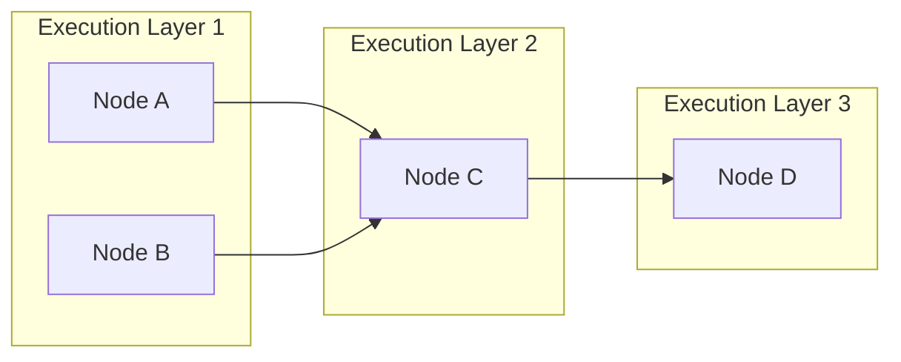
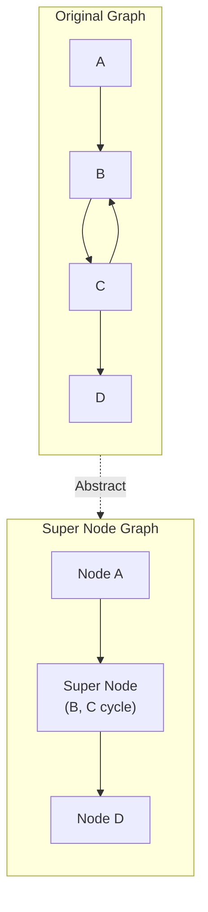
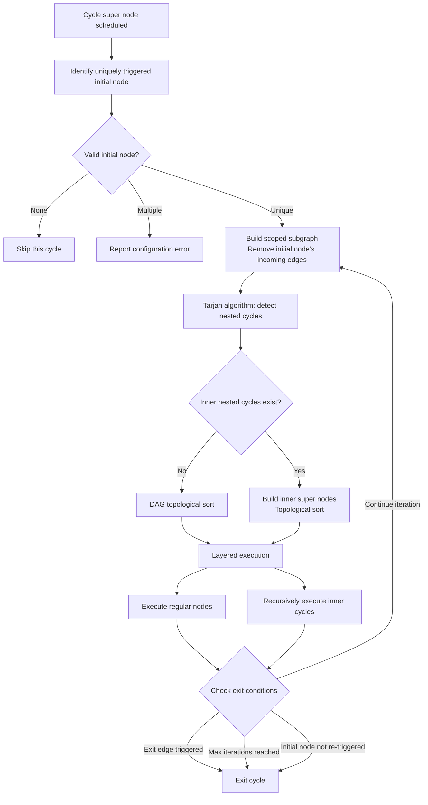

# Graph Execution Logic

> Version: 2025-12-16

This document explains how the DevAll backend parses and executes workflow graphs, with particular focus on handling complex graphs containing cyclic structures.

## 1. Execution Engine Overview

The DevAll workflow execution engine supports two types of graph structures:

| Graph Type | Characteristics | Execution Strategy |
|------------|-----------------|-------------------|
| **DAG (Directed Acyclic Graph)** | No cyclic dependencies between nodes | Topological sort + parallel layer execution |
| **Cyclic Directed Graph** | Contains one or more loop structures | Recursive super-node scheduling |

The execution engine automatically detects the graph structure and selects the appropriate execution strategy.

## 2. DAG Execution Flow

For workflow graphs without cycles, the engine uses standard DAG scheduling:

1. **Build predecessor/successor relationships**: Parse edge definitions to establish `predecessors` and `successors` lists for each node
2. **Calculate in-degrees**: Count the number of predecessors for each node
3. **Topological sort**: Place nodes with in-degree 0 in the first layer; after execution, decrement successor in-degrees; new zero in-degree nodes enter the next layer
4. **Parallel layer execution**: Nodes within the same layer have no dependencies and can execute concurrently



## 3. Cyclic Graph Execution Flow

### 3.1 Tarjan's Strongly Connected Components Detection

When cyclic structures exist in the graph, the execution engine first uses **Tarjan's algorithm** to detect all Strongly Connected Components (SCCs). Tarjan's algorithm identifies all cycles in the graph in O(|V|+|E|) time complexity through depth-first search.

An SCC containing more than one node constitutes a cycle structure.

### 3.2 Super Node Construction

After detecting cycles, the execution engine abstracts each cycle into a "Super Node":

- All nodes within the cycle are encapsulated in the super node
- Dependencies between super nodes derive from cross-cycle edges between original nodes
- The resulting super node graph is guaranteed to be a DAG, enabling topological sorting



### 3.3 Recursive Cycle Execution Strategy

For cycle super nodes, the system employs a recursive execution strategy:

#### Step 1: Unique Initial Node Identification

Analyze the cycle boundary to identify the uniquely triggered entry node as the "initial node". This node must satisfy:
- Triggered by a predecessor node outside the cycle via a condition-satisfying edge
- Exactly one node meets this criterion

#### Step 2: Build Scoped Subgraph

Using all nodes in the current cycle as the scope, **logically remove all incoming edges to the initial node**. This operation breaks the outer cycle boundary, ensuring subsequent cycle detection only targets nested structures within.

#### Step 3: Nested Cycle Detection

Apply Tarjan's algorithm again to the subgraph to detect nested cycles within the scope. Since the initial node's incoming edges are removed, detected SCCs represent only true inner nested cycles.

#### Step 4: Inner Super Node Construction and Topological Sort

If nested cycles are detected:
- Abstract each inner cycle as a super node
- Build a super node dependency graph within the scope
- Perform topological sort on this super node graph

If no nested cycles are detected, perform direct DAG topological sort.

#### Step 5: Layered Execution

Execute according to the topological order:
- **Regular nodes**: Execute after checking trigger state; initial node executes unconditionally in the first iteration
- **Inner cycle super nodes**: **Recursively invoke Steps 1-6**, forming a nested execution structure

#### Step 6: Exit Condition Check

After completing each round of in-cycle execution, the system checks these exit conditions:
- **Exit edge triggered**: If any in-cycle node triggers an edge to an out-of-cycle node, exit the loop
- **Maximum iterations reached**: If the configured maximum (default 100) is reached, force termination
- **Initial node not re-triggered**: If the initial node isn't re-triggered by in-cycle predecessors, the loop naturally terminates

If none of the conditions are met, return to Step 2 for the next iteration.

### 3.4 Cycle Execution Flowchart



## 4. Edge Conditions and Trigger Mechanism

### 4.1 Edge Trigger

Each edge has a `trigger` attribute that determines whether it participates in execution order calculation:

| trigger value | Behavior |
|---------------|----------|
| `true` (default) | Edge participates in topological sort; target node waits for source completion |
| `false` | Edge doesn't participate in topological sort; used only for data transfer |

### 4.2 Edge Condition

Edge conditions determine whether data flows along the edge:

- `true` (default): Always transfer
- `keyword`: Check if upstream output contains/excludes specific keywords
- `function`: Invoke custom function for evaluation
- Other custom condition types

The target node is triggered for execution only when the condition is satisfied.

## 5. Typical Cycle Scenario Examples

### 5.1 Human Review Loop

```yaml
nodes:
  - id: Writer
    type: agent
    config:
      name: gpt-4o
      role: You are a professional technical writer
  - id: Reviewer
    type: human
    config:
      description: Please review the article, enter ACCEPT if satisfied

edges:
  - from: Writer
    to: Reviewer
  - from: Reviewer
    to: Writer
    condition:
      type: keyword
      config:
        none: [ACCEPT]  # Continue loop when ACCEPT is not present
```

Execution flow:
1. Writer generates article
2. Reviewer performs human review
3. If input doesn't contain "ACCEPT", return to Writer for revision
4. If input contains "ACCEPT", exit the loop

### 5.2 Nested Loops

The system supports arbitrarily deep nested loops. For example, an outer "review-revise" loop can contain an inner "generate-validate" loop:

```
Outer Loop (Writer -> Reviewer -> Writer)
  └── Inner Loop (Generator -> Validator -> Generator)
```

The recursive execution strategy automatically handles such nested structures.

## 6. Key Code Modules

| Module | Function |
|--------|----------|
| `workflow/cycle_manager.py` | Tarjan algorithm implementation, cycle info management |
| `workflow/topology_builder.py` | Super node graph construction, topological sorting |
| `workflow/executor/cycle_executor.py` | Recursive cycle executor |
| `workflow/graph.py` | Main graph execution entry point |

## 7. Changelog

- **2025-12-16**: Added graph execution logic documentation, detailing DAG and cyclic graph execution strategies.
