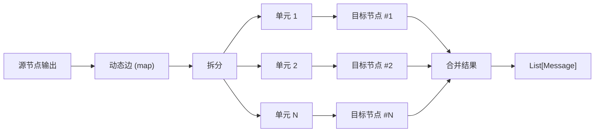
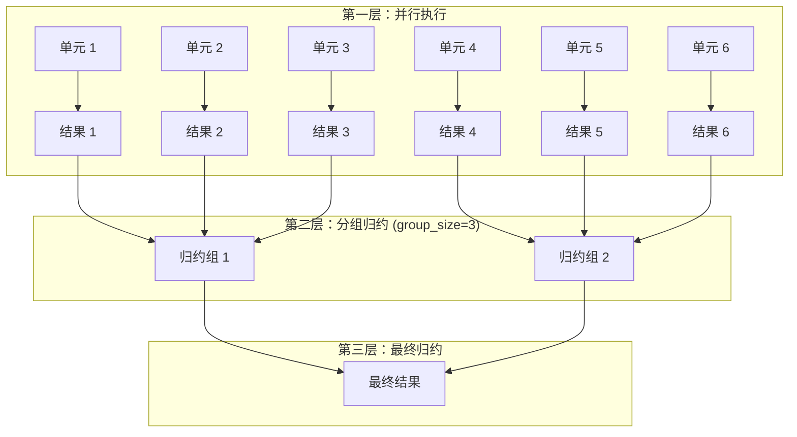

# Dynamic 执行模式指南

Dynamic 执行模式允许在边级别定义并行处理行为，支持 Map（扇出）和 Tree（扇出+归约）两种模式。当消息通过配置了 `dynamic` 的边传递时，目标节点会根据拆分结果动态扩展为多个并行实例。

## 1. 概述

| 模式 | 描述 | 输出 | 适用场景 |
|------|------|------|----------|
| **Map** | 扇出执行，将消息拆分为多个单元并行处理 | `List[Message]`（打平结果） | 批量处理、并行查询 |
| **Tree** | 扇出+归约，并行处理后按组递归合并 | 单个 `Message` | 长文本摘要、层级聚合 |

## 2. 配置结构

Dynamic 配置定义在**边**上，而非节点：

```yaml
edges:
  - from: Source Node
    to: Target Node
    trigger: true
    carry_data: true
    dynamic:                    # 边级动态执行配置
      type: map                 # map 或 tree
      split:                    # 消息拆分策略
        type: message           # message | regex | json_path
        # pattern: "..."        # regex 模式必填
        # json_path: "..."      # json_path 模式必填
      config:                   # 模式特定配置
        max_parallel: 5         # 最大并发数
```

### 2.1 核心概念

- **动态边**：配置了 `dynamic` 的边，其传递的消息会触发目标节点的动态扩展
- **静态边**：未配置 `dynamic` 的边，其传递的消息会**复制**到所有动态扩展实例
- **目标节点扩展**：目标节点根据 split 结果被"虚拟"扩展为多个并行实例

### 2.2 多入边一致性规则

> [!IMPORTANT]
> 当一个节点有多条入边配置了 `dynamic` 时，所有动态边的配置**必须完全一致**（type、split、config），否则执行时会报错。

## 3. Split 拆分策略

Split 定义如何将通过边的消息拆分为并行执行单元。

### 3.1 message 模式（默认）

每条通过边的消息作为独立执行单元。这是最常用的模式。

```yaml
split:
  type: message
```

**执行行为**：
- 源节点输出 4 条消息通过动态边
- 拆分为 4 个并行单元，目标节点执行 4 次

### 3.2 regex 模式

使用正则表达式从文本内容中提取匹配项。

```yaml
split:
  type: regex
  pattern: "(?s).{1,2000}(?:\\s|$)"  # 每 2000 字符切分
```

**典型用例**：
- 按段落拆分：`pattern: "\\n\\n"`
- 按行拆分：`pattern: ".+"`
- 按固定长度：`pattern: "(?s).{1,N}"`

### 3.3 json_path 模式

从 JSON 格式输出中按路径提取数组元素。

```yaml
split:
  type: json_path
  json_path: "$.items[*]"  # JSONPath 表达式
```

## 4. Map 模式详解

Map 模式将消息拆分后并行执行目标节点，输出结果打平为 `List[Message]`。

### 4.1 配置项

| 字段 | 类型 | 默认值 | 说明 |
|------|------|--------|------|
| `max_parallel` | int | 10 | 最大并发执行数 |

### 4.2 执行流程



## 5. Tree 模式详解

Tree 模式在 Map 基础上增加归约层，将并行结果按组递归合并，最终输出单个结果。

### 5.1 配置项

| 字段 | 类型 | 默认值 | 说明 |
|------|------|--------|------|
| `group_size` | int | 3 | 每组归约的元素数量，最小为 2 |
| `max_parallel` | int | 10 | 每层最大并发执行数 |

### 5.2 执行流程



## 6. 静态边消息复制

当目标节点同时有动态入边和静态入边时：

- **动态边消息**：按 split 策略拆分，每个单元执行一次目标节点
- **静态边消息**：**复制**到每个动态扩展实例

```yaml
nodes:
  - id: Task Generator
    type: passthrough
    config: ...
  - id: Extra Requirement
    type: literal
    config:
      content: "请使用简洁的语言"
  - id: Processor
    type: agent
    config:
      name: gpt-4o
      role: 处理任务

edges:
  - from: Task Generator
    to: Processor
    dynamic:                    # 动态边：4 条任务 → 4 个并行单元
      type: map
      split:
        type: message
      config:
        max_parallel: 10
  - from: Extra Requirement
    to: Processor              # 静态边：复制到所有 4 个实例
    trigger: true
    carry_data: true
```

**执行结果**：Processor 执行 4 次，每次收到 1 条任务 + "请使用简洁的语言"

## 7. 完整示例

### 7.1 旅行规划（Map + Tree 组合）

```yaml
graph:
  nodes:
    - id: Eat Planner
      type: literal
      config:
        content: 请规划在上海吃什么
        role: user
    - id: Play Planner
      type: literal
      config:
        content: 请规划在上海玩什么
        role: user
    - id: Stay Planner
      type: literal
      config:
        content: 请规划在上海住哪里
        role: user
    - id: Collector
      type: passthrough
      config:
        only_last_message: false
    - id: Travel Executor
      type: agent
      config:
        name: gpt-4o
        role: 你是旅行规划师，请按照用户请求进行规划
    - id: Final Aggregator
      type: agent
      config:
        name: gpt-4o
        role: 请将输入的内容整合成一份完整的旅行计划

  edges:
    - from: Eat Planner
      to: Collector
    - from: Play Planner
      to: Collector
    - from: Stay Planner
      to: Collector
    - from: Collector
      to: Travel Executor
      dynamic:                  # Map 扇出：3 个规划请求 → 3 个并行执行
        type: map
        split:
          type: message
        config:
          max_parallel: 10
    - from: Travel Executor
      to: Final Aggregator
      dynamic:                  # Tree 归约：3 个结果 → 1 个最终计划
        type: tree
        split:
          type: message
        config:
          group_size: 2
          max_parallel: 10
```

### 7.2 长文档摘要（Tree 模式）

```yaml
edges:
  - from: Document Source
    to: Summarizer
    dynamic:
      type: tree
      split:
        type: regex
        pattern: "(?s).{1,2000}(?:\\s|$)"  # 2000 字符切分
      config:
        group_size: 3
        max_parallel: 10
```

## 8. 性能建议

- **控制并发**：设置合理的 `max_parallel` 避免触发 API 限流
- **优化拆分粒度**：过细的拆分增加开销，过粗则无法充分并行
- **Tree 组大小**：`group_size=2-4` 通常是较好的选择
- **监控成本**：Dynamic 模式会显著增加 API 调用次数

## 9. 相关文档

- [边配置指南](../edges.md)
- [工作流编排指南](../workflow_authoring.md)
- [Agent 节点配置](../nodes/agent.md)
