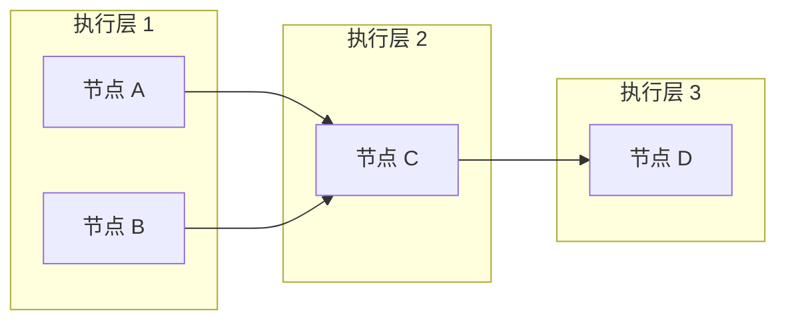
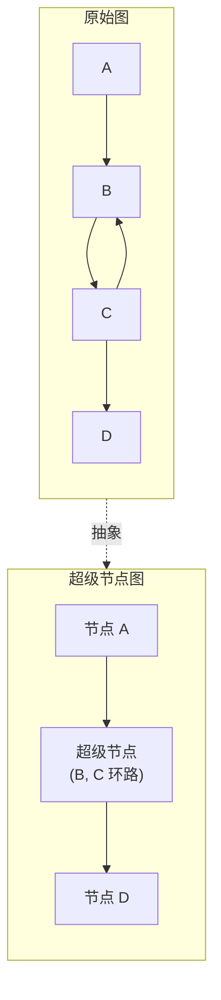
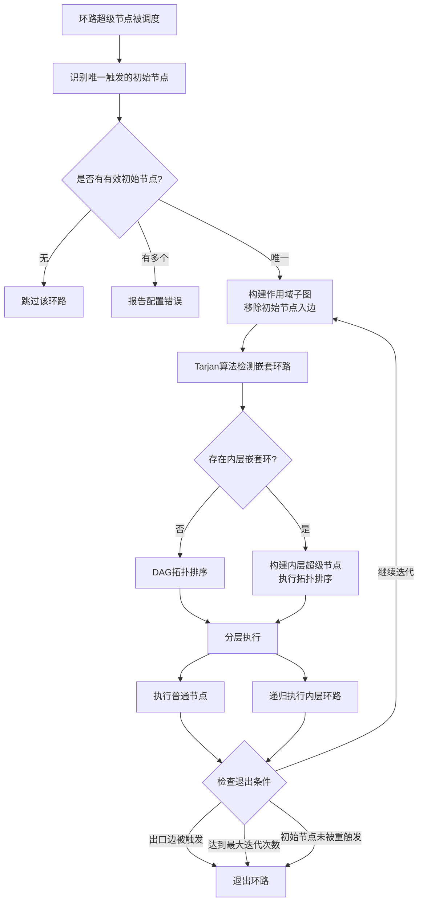

# 图执行逻辑

> 版本：2025-12-16

本文档详细说明 DevAll 后端如何解析和执行工作流图，特别是对于包含循环结构的复杂图的处理机制。

## 1. 执行引擎概述

DevAll 工作流执行引擎支持两类图结构：

| 图类型 | 特征 | 执行策略 |
|--------|------|----------|
| **DAG（有向无环图）** | 节点间无循环依赖 | 拓扑排序 + 同层并发执行 |
| **含环有向图** | 存在一个或多个循环结构 | 递归式超级节点调度 |

执行引擎会自动检测图结构，选择合适的执行策略。

## 2. DAG 执行流程

对于不包含循环的工作流图，执行引擎采用标准的 DAG 调度策略：

1. **构建前驱/后继关系**：解析边定义，为每个节点建立 `predecessors` 和 `successors` 列表
2. **计算入度**：统计每个节点的前驱数量
3. **拓扑排序**：将入度为 0 的节点放入第一层，执行后将后继节点入度减 1，新的入度为 0 节点进入下一层
4. **同层并发**：同一层内的节点无依赖关系，可以并行执行



## 3. 循环图执行流程

### 3.1 Tarjan 强连通分量检测

当图中存在循环结构时，执行引擎首先使用 **Tarjan 算法** 检测所有强连通分量（Strongly Connected Components, SCC）。Tarjan 算法通过深度优先搜索，在 O(|V|+|E|) 时间复杂度内识别图中的所有环路。

包含多于一个节点的 SCC 即为环路结构。

### 3.2 超级节点构建

检测到环路后，执行引擎将每个环路抽象为一个"超级节点"（Super Node）：

- 环路内部的所有节点被封装在超级节点中
- 超级节点之间的依赖关系来源于原始节点间的跨环边
- 封装后的超级节点图一定是 DAG，可以进行拓扑排序



### 3.3 递归式环路执行策略

对于环路超级节点，系统采用递归式执行策略：

#### 步骤 1：唯一初始节点识别

分析环路边界，识别当前被唯一触发的入口节点作为"初始节点"。该节点必须满足：
- 被环路外部的前驱节点通过满足条件的边触发
- 有且仅有一个节点满足此条件

#### 步骤 2：构建作用域子图

以当前环路的所有节点为作用域，**逻辑上移除初始节点的所有入边**。这一操作打破外层环的边界，使后续的环路检测仅针对环内部的嵌套结构进行。

#### 步骤 3：嵌套环路检测

对构建的子图再次应用 Tarjan 算法，检测作用域内的嵌套环路。由于初始节点的入边已被移除，检测到的强连通分量仅为真正的内层嵌套环。

#### 步骤 4：内层超级节点构建与拓扑排序

若检测到嵌套环路：
- 将每个内层环路抽象为超级节点
- 构建作用域内的超级节点依赖图
- 对该超级节点图执行拓扑排序

若未检测到嵌套环路，则直接进行 DAG 拓扑排序。

#### 步骤 5：分层执行

按拓扑排序得到的执行层次依次执行：
- **普通节点**：检查触发状态后执行，首轮迭代时初始节点强制执行
- **内层环路超级节点**：**递归调用步骤 1-6**，形成嵌套执行结构

#### 步骤 6：退出条件检查

每完成一轮环内执行后，系统检查以下退出条件：
- **出口边触发**：若任一环内节点触发了环外节点的边，则退出环路
- **最大迭代次数**：若达到配置的最大迭代次数（默认 100），强制终止
- **初始节点未被重触发**：若初始节点未被环内前驱节点重新触发，环路自然终止

若条件均不满足，则返回步骤 2 开始下一轮迭代。

### 3.4 环路执行流程图



## 4. 边条件与触发机制

### 4.1 边触发（trigger）

每条边有一个 `trigger` 属性，决定该边是否参与执行顺序计算：

| trigger 值 | 行为 |
|------------|------|
| `true`（默认） | 该边参与拓扑排序，目标节点等待源节点完成 |
| `false` | 该边不参与拓扑排序，仅用于数据传递 |

### 4.2 边条件（condition）

边条件决定数据是否沿该边流动：

- `true`（默认）：总是传递
- `keyword`：检查上游输出是否包含/不包含特定关键词
- `function`：调用自定义函数判断
- 其他自定义条件类型

只有当条件满足时，目标节点才会被触发执行。

## 5. 典型循环场景示例

### 5.1 人工审阅循环

```yaml
nodes:
  - id: Writer
    type: agent
    config:
      name: gpt-4o
      role: 你是一位专业的技术作家
  - id: Reviewer
    type: human
    config:
      description: 请审阅文章，满意请输入 ACCEPT

edges:
  - from: Writer
    to: Reviewer
  - from: Reviewer
    to: Writer
    condition:
      type: keyword
      config:
        none: [ACCEPT]  # 不包含 ACCEPT 时继续循环
```

执行流程：
1. Writer 生成文章
2. Reviewer 人工审阅
3. 若输入不包含 "ACCEPT"，返回 Writer 修改
4. 若输入包含 "ACCEPT"，退出循环

### 5.2 嵌套循环

系统支持任意深度的嵌套循环。例如，一个外层"审阅-修订"循环内部可以包含一个"生成-验证"循环：

```
外层循环 (Writer -> Reviewer -> Writer)
  └── 内层循环 (Generator -> Validator -> Generator)
```

递归式执行策略会自动处理这种嵌套结构。

## 6. 关键代码模块

| 模块 | 功能 |
|------|------|
| `workflow/cycle_manager.py` | Tarjan 算法实现、环路信息管理 |
| `workflow/topology_builder.py` | 超级节点图构建、拓扑排序 |
| `workflow/executor/cycle_executor.py` | 递归式环路执行器 |
| `workflow/graph.py` | 图执行主入口 |

## 7. 变更记录

- **2025-12-16**：新增图执行逻辑文档，详细说明 DAG 与循环图的执行策略。
