# Build Your First Graph-based Multi-Agent Workflow

[Quick View](http://localhost:5173/workflows/net_example)

上述示例展示了一个用于**多智能体内容创作**的工作流。
以该工作流为例，本文将逐步介绍如何使用 **Graph** 结构组织多个 Agent 节点，完成从内容生成、编辑到人工审核的完整流程。根据下述步骤，你将完成你的第一个Graph-based多智能体工作流的搭建。
- [1. 创建 Graph](#1-create-a-graph)
  - [什么是 Graph？](#什么是-graph)
  - [什么是 Variable？](#什么是-variable)
- [2. 创建节点](#2-create-nodes)
  - [什么是 Node？](#什么是-node)
  - [创建 Agent 节点](#创建-agent-节点)
- [3. 节点间信息传递](#3-transfer-information-between-nodes)
  - [什么是 Message？](#什么是-message)
  - [什么是边（Edge）？](#什么是边edge)
  - [建立节点连接](#建立节点连接)
- [4. Graph 的启动与执行逻辑](#4-graph-的启动与执行逻辑)
  - [初始节点](#初始节点)
- [5. 审核与二次编辑流程](#5-build-review-and-revise-loop)
  - [创建二次编辑节点](#创建二次编辑节点)
  - [设置 Context Window](#设置-context-window)
  - [Human Node：引入人工参与](#human-node引入人工参与)
- [更多细节](#更多细节)

## 1. Create a Graph

### 什么是 Graph？

**Graph** 是多智能体系统的执行载体与调度结构，用于刻画各个节点（Agent）之间的依赖关系与执行顺序，本质上描述的是一个**完整的工作流**。

Graph 本身不承担具体任务的执行，而是负责对各节点的运行逻辑进行统一的组织、编排与调度。

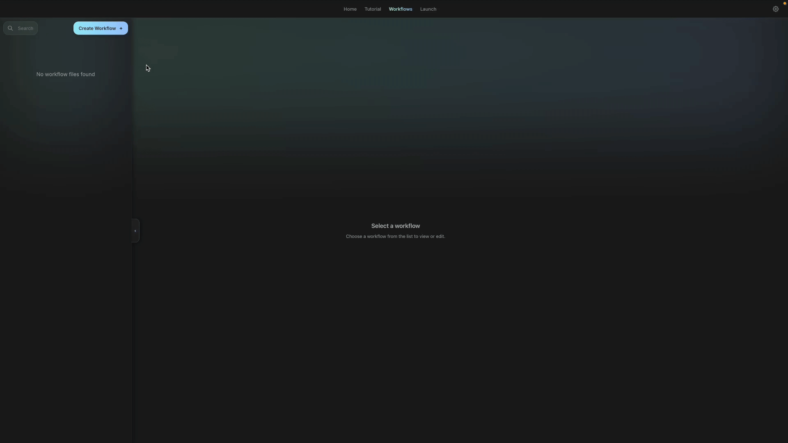

---

### 什么是 Variable？

**Variable** 用于为 Graph 提供可配置的全局或局部参数。在完成定义后，节点（Agent）内部可以直接引用这些变量，从而实现参数共享与配置解耦。

建议在此处对 API Key 等通用或敏感配置项进行统一的全局管理。

需要注意的是：如果你已经在外层的 `.env` 文件中配置了相关环境变量，并且希望直接使用它们，则无需在此处重复配置。
一旦在此处进行了配置，将会**优先使用这里的配置**，而不是外层 `.env` 文件中的环境变量。


---

## 2. Create Nodes

### 什么是 Node？

**Node** 是 Graph 中的最小执行单元，通常对应一个 Agent。
每个节点都应具备相对独立的能力，并承担明确的职责。

---

### 创建 Agent 节点

在该示例 Graph 中，我们创建以下三个节点：

* **Poet**：负责诗歌或创意性内容生成
* **Article Writer**：负责结构化文章生成
* **Editor 1**：负责初步编辑与内容整合

上述节点均属于 **Agent Node**。下面以 *Poet* 节点为例，展示创建一个 Agent 节点的完整流程。

#### Prompts（可复制配置）

以下内容用于各 Agent 节点的 `role` 字段。

**Poet**

```
你是一位诗人，擅长根据用户输入的一个词句生成一首古体诗。
用户会输入一个词语或一个短句，你需要据此生成一首古体诗，每句五字还是七字由你决定。
```

**Article Writer**

```
你是一位作家，擅长根据用户输入的一个词句生成一整篇文章。
用户会输入一个词语或一个短句，你需要据此生成一篇不少于 2000 字的文章，要求含有多个段落。
```

**Editor 1**

```
你是一位编辑，请你根据输入的文章与诗词，进行结合，文章最后应当附上诗词。
```

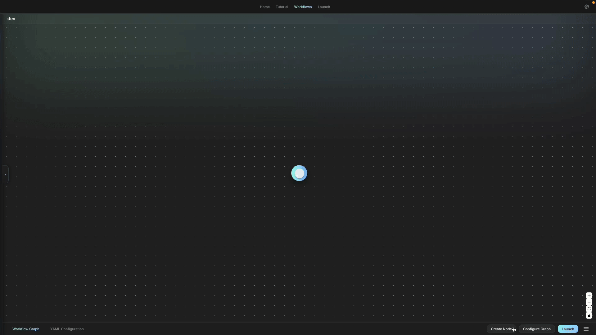

---

## 3. Transfer Information Between Nodes

### 什么是 Message？

**Message** 是信息传递和储存的基本单元，是上下文控制的基本单元，也是边进行处理和控制的基本单元。

* 其可以传递文本和多模态信息。
* 一个节点的输入和输出都可能是多条信息（Message）。
* 用户的初始输入是一条信息。
* 在未配置边的 **[Dynamic 执行模式](#dynamic-执行模式)**（此处可暂时忽略）时，除了 **[Passthrough Node](#passthrough-node)** 和 **[Subgraph Node](#subgraph-node)**（当其以 Passthrough Node 结束时）外的其他节点类型的输出都是一条信息。本教程中的所有配置，均只会产生单条 Message 输出。

### 什么是边（Edge）？

**边（Edge）** 用于连接节点，其核心作用包括：

1. **信息传递**：将上游节点的输出作为下游节点的输入
2. **执行控制**：定义节点之间的执行依赖与触发关系

> **注意**：如果上游节点输出了多条信息，边会对每一条信息进行**单独**判定、处理和传递。

---

### 建立节点连接

在已创建的三个节点基础上，建立如下连接关系：

* `Poet → Editor 1`
* `Article Writer → Editor 1`

此时，Graph 形成了一个典型的「并行生成 → 汇总编辑」结构。

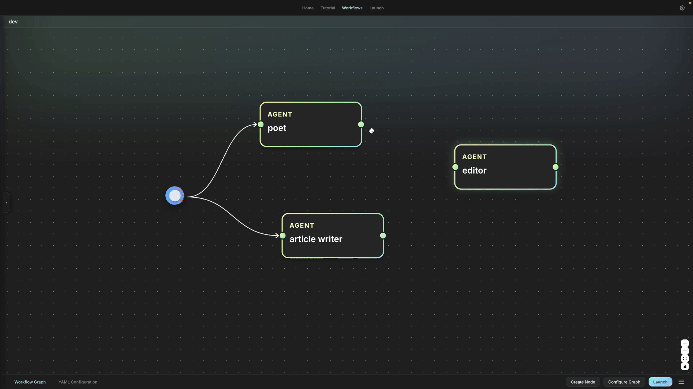

---

## 4. Graph 的启动与执行逻辑

### 初始节点

当 Graph 启动时：

* 所有与 start 节点相连的 Node 都会被视为工作流的初始节点（Entry node）
* 这些节点会在启动时**同时接收用户输入，并实现并行执行**
* 一个工作流可以拥有多个初始节点（Entry node），只需通过拖拽创建与 start 节点的连边即可

因此，在当前结构下，**Poet** 和 **Article Writer** 会并行运行，效果如下所示。


> 至此，你已经搭建了一个最基础的多智能体工作流。

---

## 5. Build Review and Revise Loop
### 创建二次编辑节点

接下来，我们创建一个新的 Agent 节点 **Editor 2**：根据人工反馈对内容进行修改与润色

并建立如下连接关系：
* `Editor 1 → Editor 2`（`trigger = false`）

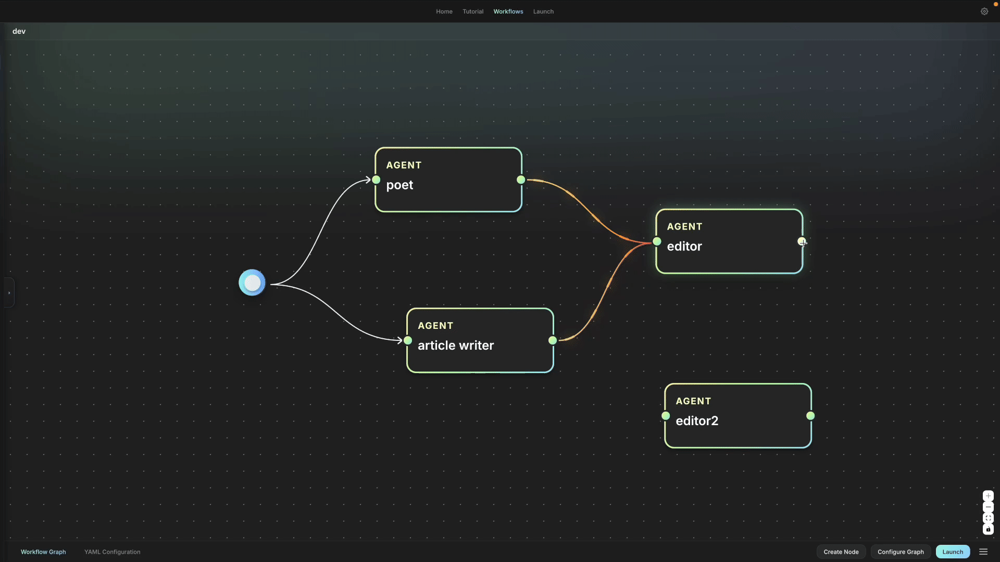

在上述配置中，涉及一个重要的边属性： `trigger`
   * `trigger` 用于控制是否触发目标节点执行
   * 当边生效且 `trigger = true` 时，目标节点会被标记为触发，并在执行层推进到该节点所在层后执行

**Editor 2 Prompt（可复制配置）**

```
你是一位编辑，擅长对文章进行整合和润色。
请根据输入的文章与修改建议，对文章进行润色和修改，直接输出修改后的文章。
```

---
### 设置 Context Window

为了让 Agent 具备上下文记忆，请在 **Editor 2** 节点上设置：

* `Context Window Size = 7`

这表示 Editor 2 执行后会保留最近 7 条消息（包括节点输入和输出消息）。

#### 什么是 Context Window（上下文窗口）？

在 DevAll 中，**Context Window** 是**节点级别的上下文保留策略**。节点每次执行结束后，会尝试对自身输入队列中的 Messages 进行清理，仅保留满足保留规则的消息，以控制上下文规模。这不会影响本次执行，仅影响后续执行可见的输入。

**规则**（对应节点配置里的 `Context Window Size`）：
* `0`：清空全部上下文，仅保留通过边设置了 `Keep Message Input` 为 `True` 的消息。
* `-1`：不清理，保留全部消息。
* `> 0`：保留最新的 N 条消息（保留消息也会占用配额）。
* 当 `Context Window Size != 0` 时，系统会自动把节点的输出消息写入该节点的上下文，供后续执行使用。

**建议**：
* 需要长期保留的关键上下文，搭配边上的 `Keep Message Input` 或 Memory 模块管理。

---
### Human Node：引入人工参与

**Human Node** 是一种特殊的节点类型，用于在 Graph 的执行过程中引入人类参与。
它本身不负责内容生成，而是作为**流程控制节点**，用于接收并处理来自人类的输入与反馈，从而影响后续执行路径。

其常见使用场景包括：

* **内容审核**：由人工对生成结果进行审阅与把关
* **决策与确认**：在关键节点引入人工决策
* **执行路径控制**：根据人工反馈决定流程走向


**Human Node 提示语（可复制配置）**

以下内容用于 Human 节点的 `config.description`。

```
请对文章给出修改建议，或输入 ACCEPT 跳出循环。
```

在本示例中，我们希望根据 Human Node 接收到的输入来决定是否需要后续的二次编辑流程：

* 当 Human Node 接收到 `ACCEPT` 时，表示当前结果已被确认，无需再经过 `editor2` 节点进行修改；
* 否则，需要进入 `editor2` 节点执行二次调整。

为实现这一逻辑，需要在节点之间配置**带条件的边（Conditional Edge）**


在上述配置中，涉及一个关键的边属性：`condition`，用于控制该边是否生效：
* 当 `condition` 计算结果为 `true` 时，该边处于激活状态，流程可以沿该边继续执行
* 当 `condition` 为 `false` 时，该边被视为断开，对目标节点不产生任何影响
---
通过上述几步，我们就完成了一个更复杂的审阅修改流程的添加，执行起来如下所示


---
## 更多细节

我们提供了一些示例：命名以 `demo_*.yaml` 开头的是功能/模块使用示例，直接使用名称的是我们实现或复刻的流程。

- [节点类型详解](#节点类型详解)
  - [Agent 节点](#agent-节点)
  - [Human 节点](#human-节点)
  - [Python 节点](#python-节点)
  - [Passthrough 节点](#passthrough-节点)
  - [Literal 节点](#literal-节点)
  - [Loop Counter 节点](#loop-counter-节点)
  - [Subgraph 节点](#subgraph-节点)
- [边（Edge）配置](#边edge配置)
- [图的执行逻辑](#图的执行逻辑)
  - [DAG 执行流程](#dag-执行流程)
  - [循环图执行流程](#循环图执行流程)
- [Workspace 工作区](#workspace-工作区)
- [Dynamic 执行模式](#dynamic-执行模式)

# 节点类型详解

DevAll 提供多种节点类型，每种都有特定的用途和配置选项。

## Agent 节点

Agent 节点是最核心的节点类型，用于调用大语言模型 (LLM) 完成文本生成、对话、推理等任务。它支持多种模型提供商（OpenAI、Gemini 等），并可配置工具调用、记忆等高级功能。

### 基础配置示例

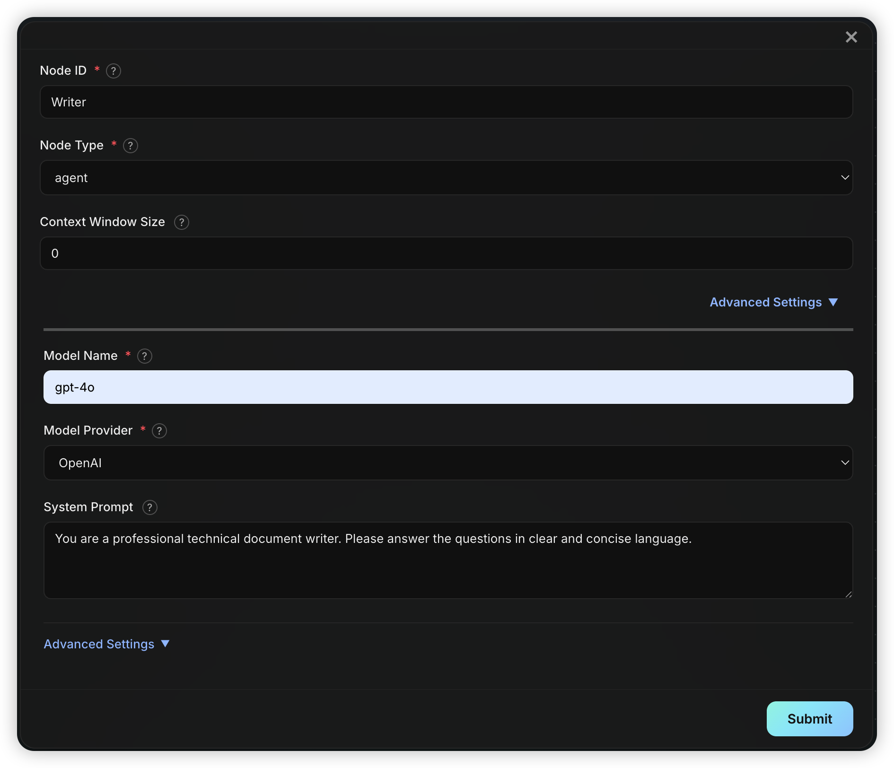

### Tooling（工具调用）

Agent 节点可以配置工具，让模型调用外部 API 或执行函数。请点击展开 Advanced Settings，即可看到配置项。Tooling 可配置多项，例如可同时配置 MCP 和 Function 工具；可配置多个 MCP 工具等。
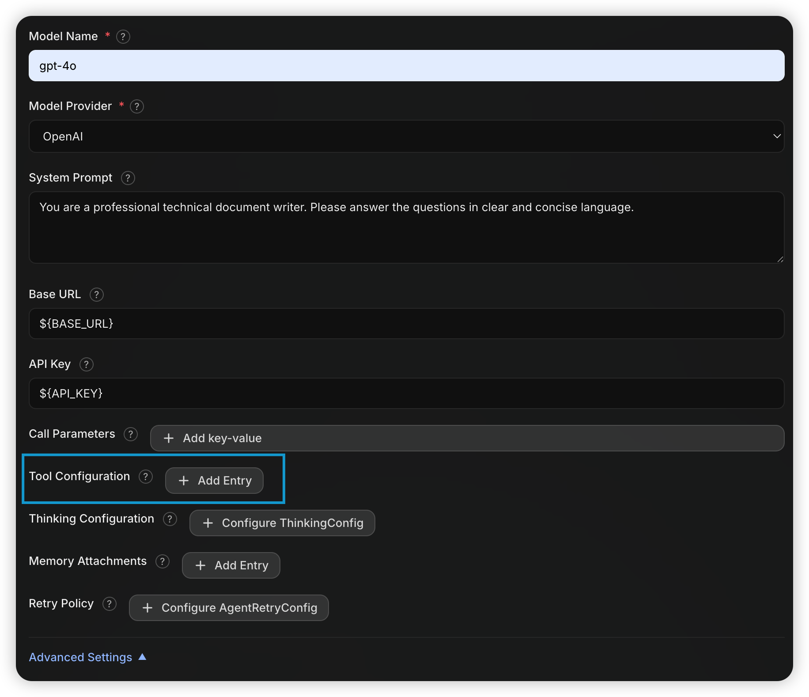

DevAll 支持两类工具：

#### 1. Function Tooling（本地函数）

调用仓库内的 Python 函数（位于 `functions/function_calling/` 目录）：

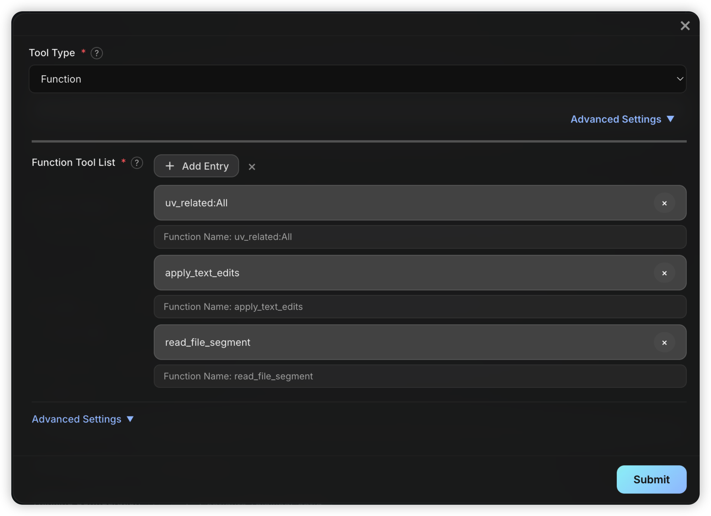

图中的 `uv_related:All` 意味着导入 `functions/function_calling/uv_related.py` 文件中的所有函数。其余的都是导入指定函数。

如需添加自定义函数，在 `functions/function_calling/` 目录下创建 Python 文件，使用类型注解定义参数：

```python
from typing import Annotated
from utils.function_catalog import ParamMeta

def my_tool(
    param1: Annotated[str, ParamMeta(description="参数描述")],
    *,
    _context: dict | None = None,  # 可选，用于访问上下文。系统会自动注入，不会暴露给模型。上下使用方法可参考 functions/function_calling/file.py
) -> str:
    """函数描述（会显示给 LLM）"""
    
    # 返回值可以是任意类型，系统会自动转换为字符串传递给模型。
    # 如果返回值是 MessageBlock、List[MessageBlock]，则可传递多模态信息给模型（参考 functions/function_calling/file.py 中的 load_file 方法）
    return "result"
```

添加完成后请重启后端服务器，即可在 Agent 节点中使用该函数。

#### 内置工具速览

系统内置了多类工具，可直接在 Agent 节点中使用：

| 模块 | 主要函数 | 说明 | 示例 |
|------|---------|------|------|
| **file.py** | `save_file`, `load_file`, `list_directory`, `search_in_files` 等 | 文件操作 | [ChatDev_v1](http://localhost:5173/workflows/ChatDev_v1) |
| **uv_related.py** | `install_python_packages`, `init_python_env`, `uv_run` | Python 环境管理 | [ChatDev_v1](http://localhost:5173/workflows/ChatDev_v1) |
| **deep_research.py** | `search_save_result`, `report_*` 系列 | 深度研究与报告生成 | [deep_research_v1](http://localhost:5173/workflows/deep_research_v1) |
| **web.py** | `web_search`, `read_webpage_content` | 网络搜索与内容获取 | [deep_research_v1](http://localhost:5173/workflows/deep_research_v1) |
| **video.py** | `render_manim`, `concat_videos` | Manim 视频渲染 | [teach_video](http://localhost:5173/workflows/teach_video) |
| **code_executor.py** | `execute_code` | 代码执行 | - |
| **user.py** | `call_user` | 与用户交互 | - |

> 完整工具文档请参阅 `docs/user_guide/zh/modules/tooling/function_catalog.md`

#### 2. MCP Tooling（外部服务）

连接符合 Model Context Protocol 的外部服务：

**Remote 模式**（连接已部署的 HTTP 服务）：
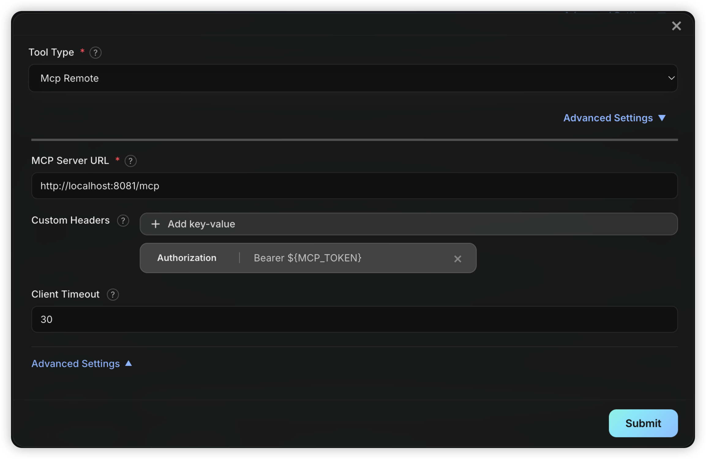
图片中的 Authorization 头为可选配置，按需填写。

**Local 模式**（启动本地进程）：
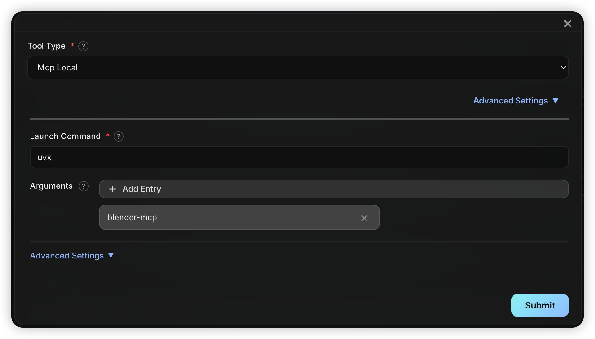

### Memory（记忆模块）

Memory 模块让 Agent 能够检索和存储信息，支持读写控制。

#### 配置步骤

1. 在 Graph 级别声明 Memory Store：

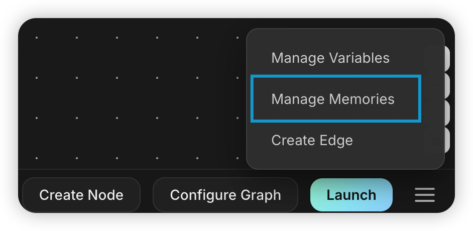

鼠标悬停在 Workflow 页面右下角的三横杠处，点击 Manage Memories，添加新的 Memory Store。此处我们添加一个 SimpleMemory Store，命名为 `Paper Gen Memory`，用于存储对话记忆。

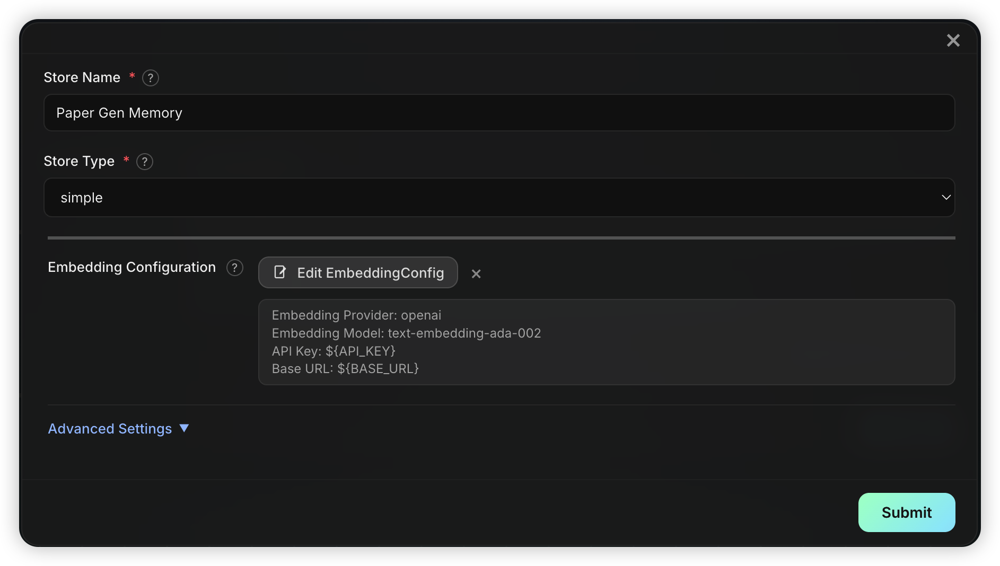

SimpleMemory 需要配置 Embedding，我们点击 Embedding Configuration，选择一个 Embedding Provider（目前仅支持 openai，用户可自己扩展），并指定模型（如 `text-embedding-3-small`）。

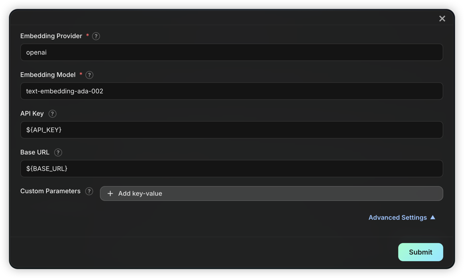

我们内置了共三种 Memory 类型，详情见下表：

| 类型           | 特点                 | 适用场景      | 是否需要 Embedding | 参考配置                                        |
|--------------|--------------------|-----------|----------------|---------------------------------------------|
| `simple`     | 向量搜索 + 语义重打分，支持读写  | 对话记忆、快速原型 | 是              | yaml_instance/demo_simple_memory.yaml       |
| `file`       | 将文件/目录切片为向量索引，只读   | 知识库、文档问答  | 是              | yaml_instance/demo_file_memory.yaml         |
| `blackboard` | 按时间/条数裁剪的简易日志，无需向量 | 广播板       | 否              | yaml_instance/subgraphs/reflexion_loop.yaml |

2. 在 Agent 节点中引用：
点击 Memory Attachments，选择刚创建的 Memory Store，并配置读写权限、检索阶段等。

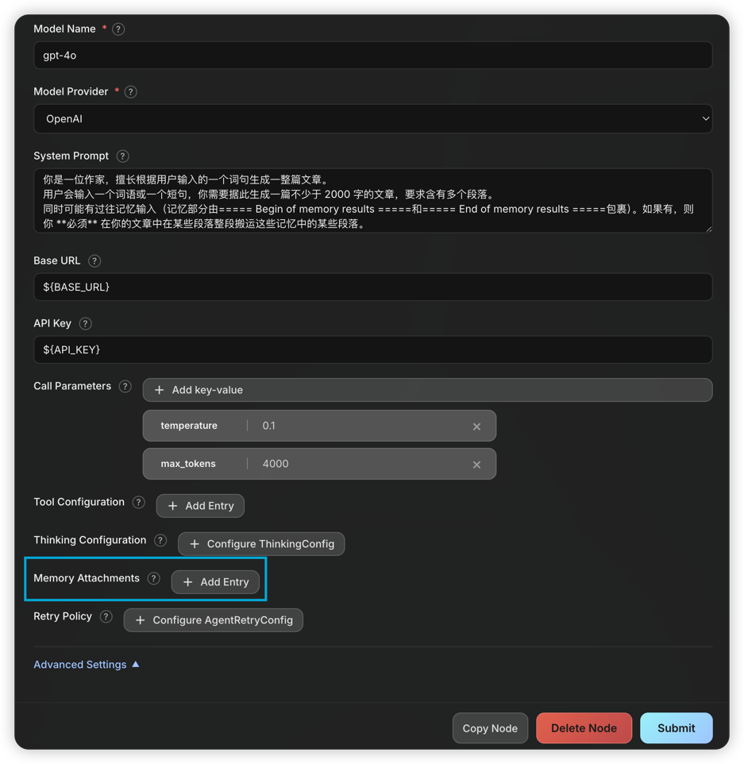

Top K 控制每次检索返回的条数；Read/Write 控制是否允许此节点读取和写入该 Memory；Retrieve Stage 控制在哪些执行阶段进行检索，可多选，其余几个 stage 都与 Thinking （目前完全无用的一个设计）有关，此处我们只选择 Gen Stage。

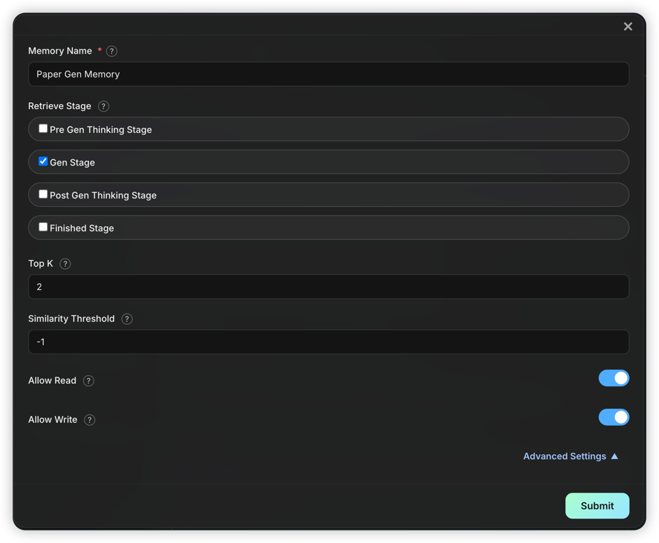

---

## Human 节点

Human 节点用于在工作流执行过程中引入人工交互。当执行到该节点时，工作流会暂停，等待用户提供输入。

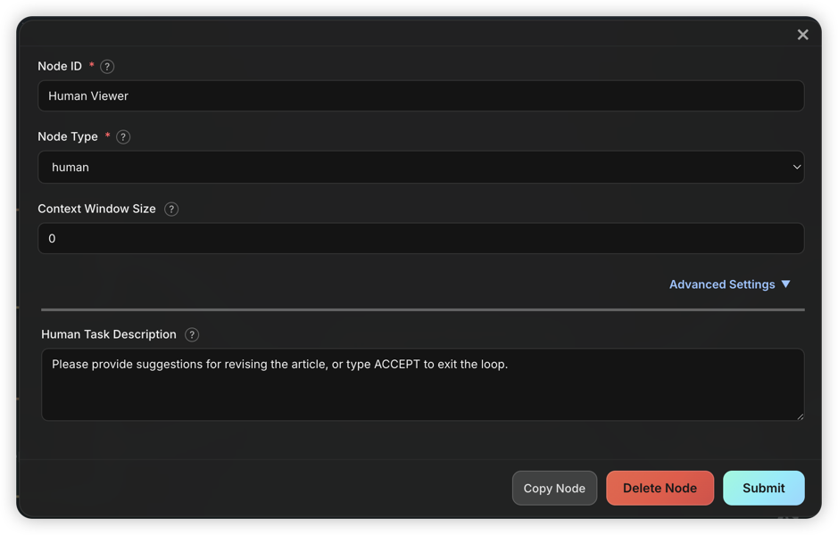

**典型用途**：
- 内容审核与确认
- 收集修改建议
- 关键决策点
- 数据补充

---

## Python 节点

Python 节点用于执行 Python 脚本。脚本将在 `code_workspace/` 目录中执行。一般用于执行 Agent 给出的代码；如果需要执行自定义代码，可以增加一个 Literal 节点，输出代码内容，连接到 Python 节点。

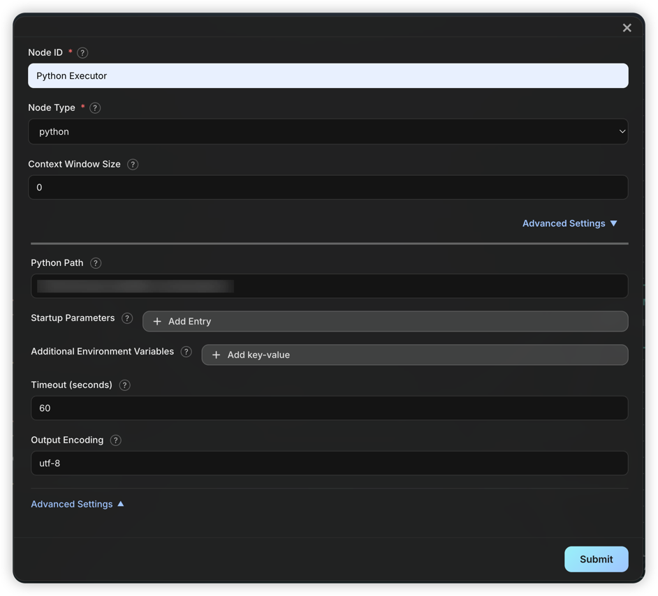

**执行机制**：
- 节点自动抽取输入中的 \`\`\`python ...\`\`\` 内容，若抽取失败则会将整个输入都当做脚本进行执行。
- 脚本的 stdout 输出将作为 Message 传递给下游节点。
- 用户可指定环境变量环境变量、启动参数以及执行超时时间。Python Path 一般无需修改，除非需要使用特定的 Python 版本或虚拟环境。
- 所有 Python 节点共享 `code_workspace/` 目录，且用户上传文件也会保存在此目录中的子目录中，便于脚本访问。

---

## Passthrough 节点

Passthrough 节点不执行任何操作，仅将消息传递给下游。**默认只传递最后一条消息**，可修改配置（`Only Last Message`）以传递所有消息。


**关键用途**：

1. **作为入口节点保留初始上下文**：配合边的 `Keep Message Input`，确保原始任务始终保留（e.g. `yaml_instance/ChatDev_v1.yaml`）
2. **过滤循环中的冗余输出**：可配置只传递最终结果，控制循环输出，避免上下文膨胀
3. **简化图结构**：作为逻辑占位符，便于图的组织和阅读（e.g. `yaml_instance/ChatDev_v1.yaml`）

---

## Literal 节点

Literal 节点输出固定的文本内容，忽略所有输入。用户可指定 Message Role 为 `user` 或 `assistant`。

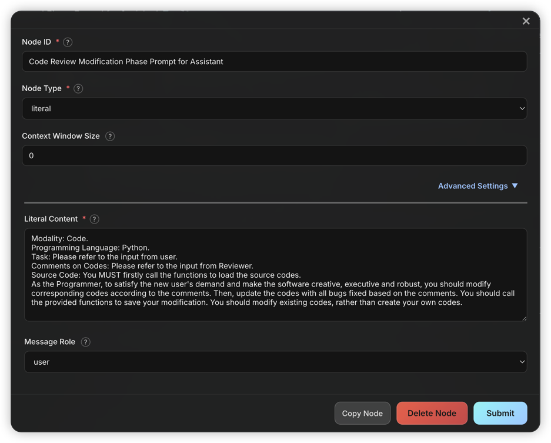

**典型用途**：
- 向流程注入固定指令或上下文（e.g. `yaml_instance/ChatDev_v1.yaml`）
- 测试下游节点（e.g. `yaml_instance/demo_dynamic.yaml`）
- 条件分支中的固定响应

---

## Loop Counter 节点

Loop Counter 节点用于限制环路的执行次数。它通过计数机制，在达到上限前抑制输出，达到上限后才触发出边终止循环。

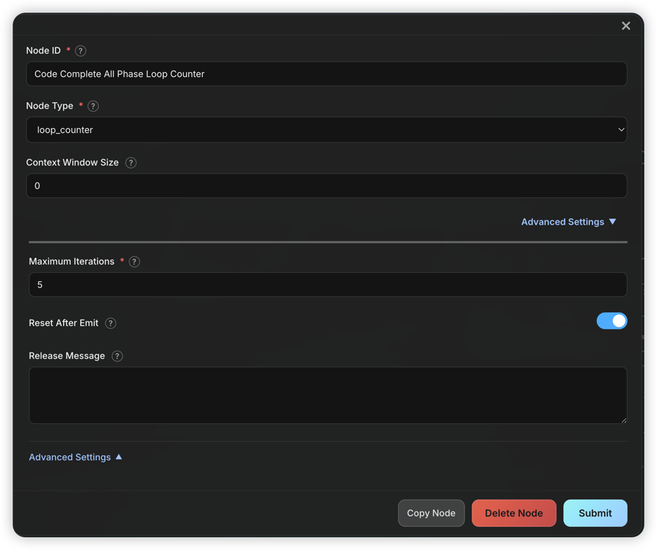

**工作原理**：
1. 每次被触发，计数器 +1
2. 计数器 < `max_iterations`：**不产生任何输出**，出边不触发
3. 计数器 = `max_iterations`：产生输出，触发出边

> **重要**：由于未达上限时不产生输出，Loop Counter 的出边必须同时连接环内节点（保持在环内，实际不会对下游节点产生影响）和环外节点（达到上限时退出）。

参考：`yaml_instance/ChatDev_v1.yaml`

---

## Subgraph 节点

Subgraph 节点允许将另一个工作流图嵌入到当前工作流中，实现流程复用和模块化设计。子图可以来自外部 YAML 文件，也可以直接在配置中内联定义。

### 核心配置

| 字段                     | 类型     | 说明                                        |
|------------------------|--------|-------------------------------------------|
| `Subgraph Source Type` | string | 子图来源类型：`file`（外部文件）或 `config`（内联定义）       |
| `Config`               | object | 根据 `Subgraph Source Type` 不同，包含不同的配置（见下表） |

**file 类型配置**：

| 字段 | 类型 | 必填 | 说明 |
|------|------|------|------|
| `Subgraph File Path` | string | 是 | 子图文件路径（相对于 `yaml_instance/` 或绝对路径） |

**config 类型配置**（内联定义完整子图）：

配置项与正常图一致。

### 典型用途

- **流程复用**：多个工作流共享相同的子流程（如"文章润色"模块）
- **模块化设计**：将复杂流程拆分为可管理的小单元
- **团队协作**：不同团队维护不同的子图模块

> **注意**：
> - 子图会继承父图的 `vars` 变量定义
> - 子图作为独立单元执行，拥有自己的节点命名空间
> - `start` 和 `end` 节点决定数据如何流入/流出子图：
>   - `start`：只需要在子图整个是环的时候指定。
>   - `end`：指定子图的出口节点列表。系统会按配置顺序逐个检查这些节点，返回第一个有输出的节点输出作为子图的返回结果。若所有配置的出口节点均无输出，或未配置 `end`，系统默认使用无后继节点的节点作为出口。

参考：`yaml_instance/MACNet_optimize_sub.yaml`，`yaml_instance/MACNet_Node_sub.yaml`，`yaml_instance/MACNet_v1.yaml`。

---

# 边（Edge）配置

边用于连接节点，完成控制流和数据流的操纵。每个节点可以有多个输出，所有输出都会经过所有边进行判定与处理。

## 核心配置项

在边的配置中，点击 Advanced Settings 可展开配置项：

| 字段                      | 默认值     | 说明                                                    |
|-------------------------|---------|-------------------------------------------------------|
| `Edge Condition`        | -       | 边的通断条件，默认边恒通                                          |
| `Can Trigger Successor` | `true`  | 是否可以触发目标节点执行。设为 `false` 时，不会触发目标节点                    |
| `Pass Data to Target`   | `true`  | 是否传递数据给目标节点。若为 `false`，不传递数据                          |
| `Keep Message Input`    | `false` | 通过此边传递的消息是否标记为 **"保留"**，不会被自动清除，也不会被 Clear Context 清除 |
| `Clear Context`         | `false` | 传递数据前，清除目标节点中 **未被标记为"保留"** 的所有历史消息                   |
| `Clear Kept Context`    | `false` | 传递数据前，清除目标节点中 **被标记为"保留"** 的所有历史消息                    |
| `Payload Processor`     | -       | Payload 处理器，用于对消息内容进行处理                               |
| `Dynamic Expansion`     | -       | 边级动态执行配置，详见 [Dynamic 执行模式](#dynamic-执行模式)             |

## 边条件（Condition）

条件决定边的通断，若条件为真，边"通"（数据可流动、可触发）；否则边"断"（对下游节点无任何影响）。

### 关键词条件（常用）
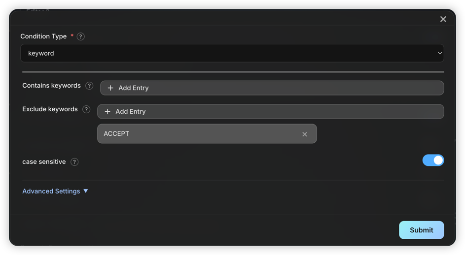

### 函数条件
我们内置了一些函数，例如 `true`（默认值，condition 恒真，边恒通），`code_pass`（代码执行成功），`code_fail`（代码执行失败），`always_false`（恒假，可用于测试）

用户可在 `functions/edge` 目录下添加自定义函数，添加后重启后端程序即可使用。

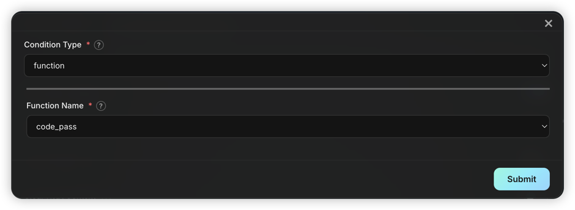

## Payload Processor（消息处理器）

Payload Processor 用于在消息通过边传递之前对其内容进行转换或处理。这对于从模型输出中提取特定信息、格式转换或执行自定义逻辑非常有用。

### 内置处理器类型

#### 1. regex_extract（正则提取）

使用 Python 正则表达式从消息中提取内容：

| 配置项 | 说明 |
|--------|------|
| `Regex Pattern` | 正则表达式模式（必填） |
| `Capture Group` | 捕获组名称或索引，默认匹配整个模式 |
| `Case Sensitive` | 是否区分大小写（默认 true） |
| `Multiline Flag` | 启用多行模式 `re.MULTILINE`（默认 false） |
| `Dotall Flag` | 启用 dotall 模式 `re.DOTALL`，使 `.` 匹配换行符（默认 false） |
| `Return Multiple Matches` | 是否返回所有匹配项（默认只返回第一个） |
| `Output Template` | 输出模板，使用 `{match}` 占位符引用匹配结果 |
| `No Match Behavior` | 无匹配时的行为：`pass`（保持原样）、`default`（使用默认值）、`drop`（丢弃消息） |
| `Default Value` | 当 `No Match Behavior=default` 时使用的默认值 |

**示例**：提取代码（可参考 `yaml_instance/demo_edge_transform.yaml`）

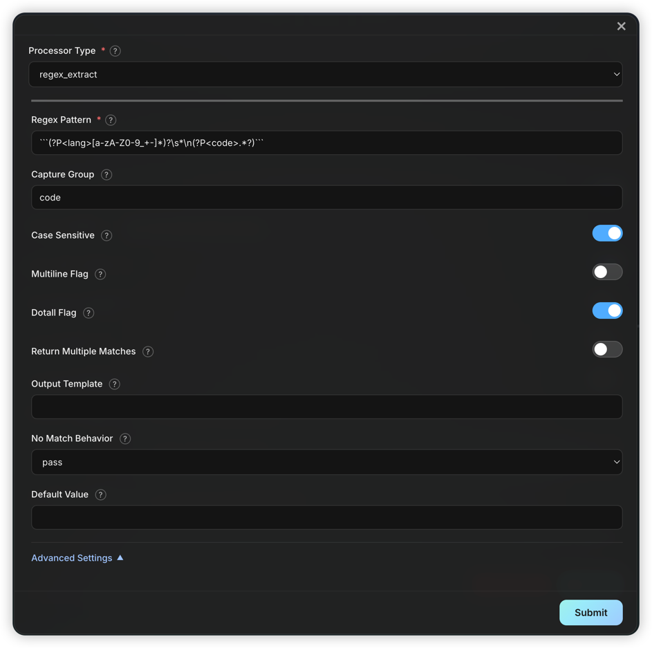

#### 2. function（函数处理器）

调用 `functions/edge_processor/` 目录下的 Python 函数进行自定义处理：

| 配置项    | 说明       |
|--------|----------|
| `name` | 函数名称（必填） |

**内置函数**：
- `uppercase_payload`：将消息内容转为大写
- `code_save_and_run`：保存代码到工作区并执行 `main.py` （可参考 `yaml_instance/MACNet_optimize_sub.yaml`）

### 自定义函数处理器

在 `functions/edge_processor/` 目录下创建 Python 文件，定义处理函数：

```python
from typing import Dict, Any

def my_processor(data: str, _context: Dict[str, Any]) -> str:
    """函数描述（会显示在配置界面）"""
    # data 是消息的文本内容
    # _context 包含执行上下文信息
    
    # 返回处理后的内容
    return processed_data
```

添加完成后重启后端服务器即可使用。

---

# 图的执行逻辑

## DAG 执行流程

对于不包含循环的工作流图，执行引擎采用标准的拓扑排序策略：

1. 构建前驱/后继关系
2. 计算每个节点的入度
3. 入度为 0 的节点进入第一层执行
4. 同层节点可以并行执行

## 循环图执行流程

当图中存在循环结构时，执行引擎使用 **Tarjan 强连通分量算法** 进行环路检测，并采用递归式执行策略处理任意复杂度的嵌套环路结构。

### 环路检测与超级节点构建

系统首先对整个图应用 Tarjan 算法，在单次遍历（O(|N|+|E|) 时间复杂度）内识别所有强连通分量（SCC）：

- **强连通分量**：图中任意两个节点之间都存在双向可达路径的最大节点集合
- **环路识别**：包含多于一个节点的 SCC 即为环路；单节点 SCC 且无自环边的为普通节点

检测完成后，系统将每个多节点环路抽象为一个 **超级节点（Super Node）**，构建超级节点依赖图。由于环路内部被封装，超级节点依赖图必然是一个有向无环图（DAG），可以应用标准拓扑排序算法进行调度。

### 递归式环路执行策略

对于环路超级节点，系统采用以下递归式执行策略：

#### Step 1：初始节点识别

分析环路边界，识别当前被**唯一触发**的入口节点作为"初始节点"（Initial Node）：
- 该节点需被环路外部的前驱节点通过满足条件的边触发
- 若无节点被触发，则跳过该环路执行
- 若多个节点被触发，则报告配置错误

#### Step 2：构建作用域子图

以当前环路的所有节点为作用域，构建子图时 **逻辑上移除初始节点的所有入边**。这一操作的目的是打破外层环的边界，使后续的环路检测仅针对环内部的嵌套结构进行。

#### Step 3：嵌套环路检测

对构建的子图再次应用 Tarjan 算法，检测作用域内的嵌套环路。由于初始节点的入边已被移除，算法检测到的强连通分量仅为真正的内层嵌套环。

#### Step 4：内层拓扑排序

- 若检测到嵌套环路：将每个内层环路抽象为超级节点，构建作用域内的超级节点依赖图并执行拓扑排序
- 若未检测到嵌套环路：直接对作用域子图进行 DAG 拓扑排序

#### Step 5：分层执行

按拓扑排序得到的执行层次依次执行：
- **普通节点**：检查触发状态后执行，首轮迭代时初始节点强制执行
- **内层环路超级节点**：**递归调用上述步骤**，形成嵌套执行结构

#### Step 6：退出条件检查

每完成一轮环内执行后，系统检查以下退出条件：
- **出口边触发**：若任一环内节点触发了环外节点的边（出口边条件满足），则退出环路
- **最大迭代次数**：若达到配置的 `max_iterations`（默认 100 次），强制终止环路
- **初始节点未被重触发**：若初始节点未被环内前驱节点重新触发，说明环路自然终止

若上述条件均不满足，则返回 Step 2 开始下一轮迭代。

> **递归处理能力**：上述步骤形成完整的递归结构，外层环路执行时检测到内层嵌套环，对内层环应用相同的策略，内层环内部若还有更深层次的嵌套环则继续递归。这一机制使系统能够理论上处理任意深度的嵌套环路结构。

### 执行流程图

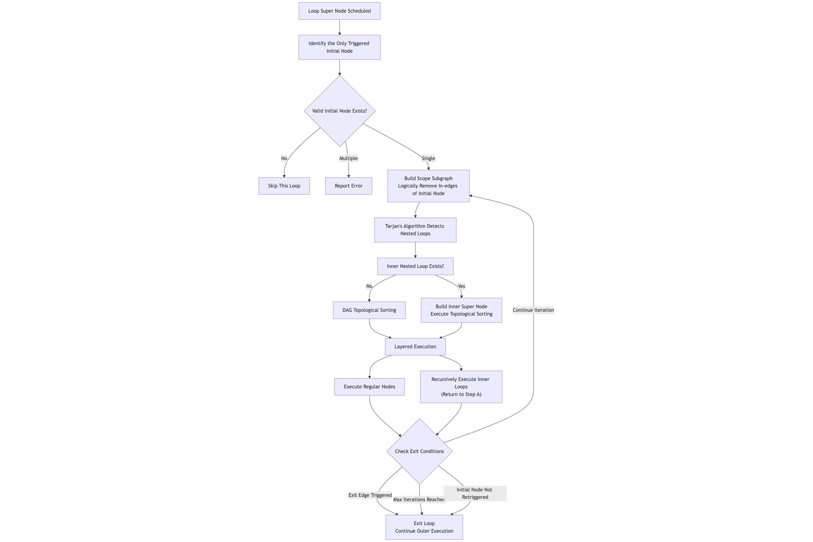

---

# Workspace 工作区

DevAll 使用分层的工作区结构管理文件：

## 目录结构

| 路径                                                | 用途                    |
|---------------------------------------------------|-----------------------|
| `WareHouse/`                                      | 所有 Session 的根目录       |
| `WareHouse/<session>/`                            | 单个 Session 的运行时数据目录   |
| `WareHouse/<session>/code_workspace/`             | Python 节点的代码执行目录      |
| `WareHouse/<session>/code_workspace/attachments/` | 用户上传文件的存储目录           |
| `WareHouse/<session>/execution_logs.json`         | 执行日志，记录节点执行过程；运行结束后生成 |
| `WareHouse/<session>/node_outputs.yaml`           | 节点输出记录；运行结束后生成        |
| `WareHouse/<session>/token_usage_<session>.json`  | Token 使用统计；运行结束后生成    |
| `WareHouse/<session>/workflow_summary.yaml`       | 工作流执行摘要；运行结束后生成       |

---

# Dynamic 执行模式

Dynamic 执行模式允许在边级别定义并行处理行为，支持 **Map**（扇出）和 **Tree**（归约）两种模式。

可参考 `yaml_instance/demo_dynamic.yaml`，`yaml_instance/MACNet_Node_sub.yaml` 示例。

## 模式对比

| 模式 | 描述        | 输出 | 适用场景 |
|------|-----------|------|----------|
| **Map** | 扇出执行，并行处理 | `List[Message]` | 批量处理、并行查询 |
| **Tree** | 归约，递归合并   | 单个 `Message` | 长文本摘要、层级聚合 |

## 配置示例

Dynamic 配置定义在**边**上，表示通过此边传递的信息需要 Dynamic 处理：

### Map 模式
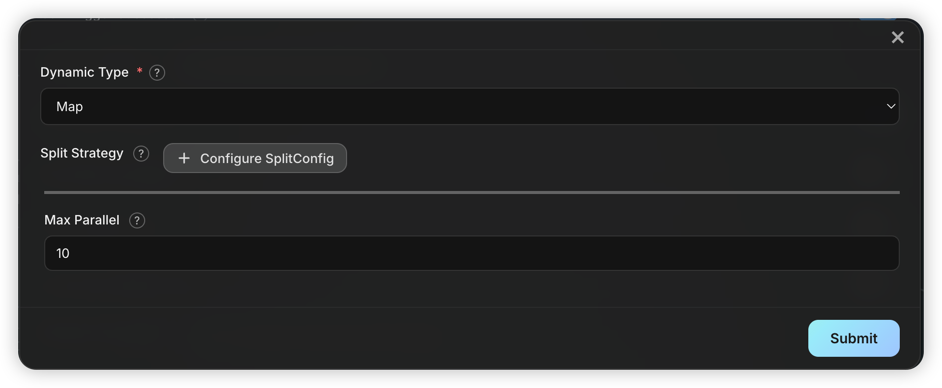

### Tree 模式

可用用途：（长文本摘要）
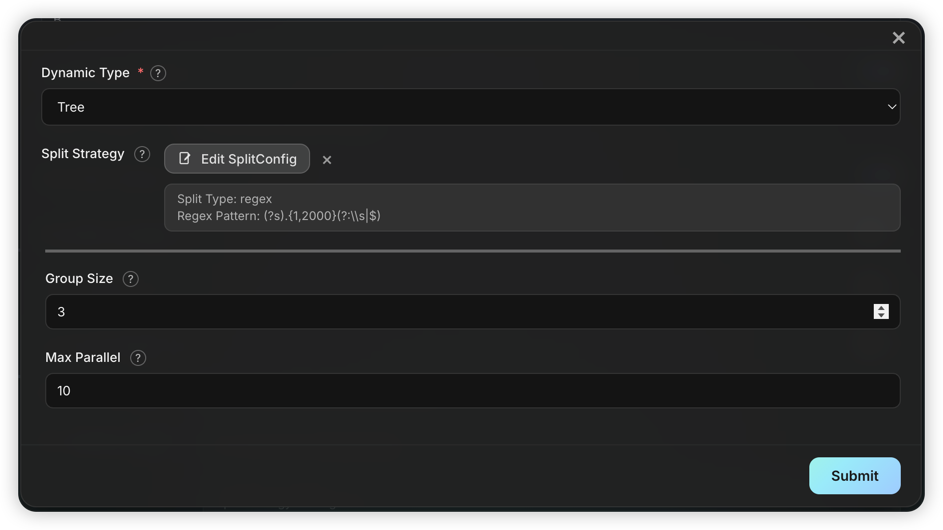

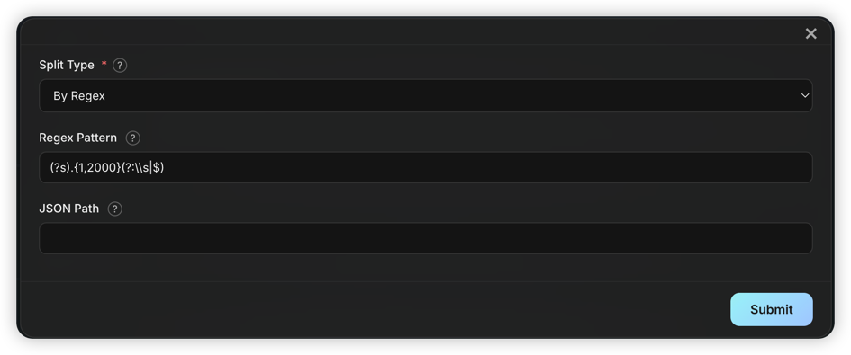

`(?s).{1,2000}(?:\\s|$)` 会将输入按每 2000 字符拆分为多段。

可参考 `yaml_instance/demo_dynamic_tree.yaml`。

## Split 拆分策略

| 类型 | 说明 |
|------|------|
| `message` | 每条消息作为独立执行单元（默认） |
| `regex` | 使用正则表达式切分文本 |
| `json_path` | 从 JSON 输出中按路径提取数组元素 |

## 静态边与动态边的配合

当目标节点同时有配置了 Dynamic 的入边和无 Dynamic 的入边时：
- **Dynamic 边消息**：按 split 策略拆分，执行多次
- **无 Dynamic 边消息**：**复制**到每个动态扩展实例
