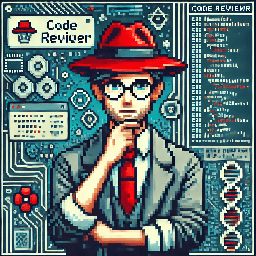

# Communicative Agents for Software Development

<p align="center">
  
</p>
<p align="center">
    【English   | <a href="readme/README-Chinese.md">Chinese</a> | <a href="readme/README-Japanese.md">Japanese</a> | <a href="readme/README-Korean.md">Korean</a> | <a href="readme/README-Filipino.md">Filipino</a> | <a href="readme/README-French.md">French</a> | <a href="readme/README-Slovak.md">Slovak</a> | <a href="readme/README-Portuguese.md">Portuguese</a> | <a href="readme/README-Spanish.md">Spanish</a> | <a href="readme/README-Dutch.md">Dutch</a> | <a href="readme/README-Turkish.md">Turkish</a> | <a href="readme/README-Hindi.md">Hindi</a> | <a href="readme/README-Bahasa-Indonesia.md">Bahasa Indonesia</a> | <a href="readme/README-Russian.md">Russian</a> | <a href="readme/README-Urdu.md">Urdu</a>】
</p>
<p align="center">
    【📚 <a href="../wiki.md">Wiki</a> | 🚀 <a href="../wiki.md#visualizer">Visualizer</a> | 👥 <a href="../Contribution.md">Community Built Software</a> | 🔧 <a href="../wiki.md#customization">Customization</a>】
</p>

## 📖 概述

- **ChatDev** 是一家**虚拟软件公司**，通过各种不同角色的**智能体**
  è¿è¥ï¼ŒåŒ…括执行官，产å“官，技术官，程åºå‘˜ ，审查员，测试员，设计师 等。这些智能体形成了一个多智能体组织结构，其使命是“通过编程改变数字世界”。ChatDev内的智能体通过参加专业的功能研讨会来
  **协作**，包括设计、编码、测试和文档编写等任务。
- ChatDev的主要目标是提供一个基于大型语言模型（LLM）的**易于使用**、**高度可定制**并且**可扩展**的框架，它是研究群体智能的理想场景。

## 📰 新闻
* **2024年1月25日: 已在 ChatDev 中更新了 "Experiential Co-Learning" 模块。尽请查阅 [Experiential Co-Learning 指南](../wiki.md#co-tracking)**。
* 2023年12月28日: 我们发布了新范式"**Experiential Co-Learning**"。在这个方法中，instructor和assistant两个智能体通过积累以捷径为导向的经验来有效解决新任务，减少重复性错误并提高效率。 如有兴趣可查看我们的[预印本论文](https://arxiv.org/abs/2312.17025), 相关技术我们也会尽快合并到ChatDev的开源版本，敬请期待。
  <p align="center">
  
  </p>
* 2023年11月15日: 我们基于ChatDev发布了SaaS零代码平台，使软件开发工作者和创新型企业家能以极低的成本和门槛，高效地制作软件。可在网页端注册体验： https://chatdev.modelbest.cn/
  <p align="center">
  
  </p>
- 2023年11月2号: 现已推出 **Incremental development**模式，允许ChatDev在已有代码的基础上进行增量开发。 可尝试 `--config "incremental" --path "[source_code_directory_path]"` 来驱动。
  <p align="center">
  
  </p>

- 2023年10月26日: ChatDev现在支持使用Docker来安全地执行程序 (感谢贡献者 [ManindraDeMel](https://github.com/ManindraDeMel))。 请参照 [Docker使用指南](../wiki.md#docker-start).
  <p align="center">
  
  </p>
- 2023年9月25日:  **Git** 模式现在已可用：使程序员 去使用Git进行版本控制。 想要尝试这个功能, 可简便地在``ChatChainConfig.json``中，将 ``"git_management"`` 的开关改为 ``"True"`` 。 具体可见 [指引](../wiki.md#git-mode).
  <p align="center">
  
  </p>
- 2023年9月20日：**Human-Agent-Interaction** 模式现在已可用! 您可以扮演审查员 的角色，参与到ChatDev智能体团队的工作流程中，给予程序员 建议；
  尝试 ``python3 run.py --task [description_of_your_idea] --config "Human"``. 具体见 [指引](../wiki.md#human-agent-interaction) 和 [示例](../WareHouse/Gomoku_HumanAgentInteraction_20230920135038)。
  <p align="center">
  
  </p>
- 2023年9月1日：**Art**模式现已可用！您可以驱动设计师 生成软件中所需的图像。可通过 `python3 run.py --config "Art"`尝试。**
  请参见此处的[示例](../WareHouse/gomokugameArtExample_THUNLP_20230831122822)。
- 2023年8月28日：系统已公开提供使用。
- 2023年8月17日：V1.0.0版本已准备好发布。
- 2023年7月30日：用户可以自定义ChatChain、Phase和Role设置。此外，现在支持在线Log模式和重放模式。
- 2023年7月16日：与该项目相关的[预印本论文](https://arxiv.org/abs/2307.07924)已发表。
- 2023年6月30日：发布了`ChatDev`仓库的初始版本。

## ❓ ChatDev能做什么？


https://github.com/OpenBMB/ChatDev/assets/11889052/80d01d2f-677b-4399-ad8b-f7af9bb62b72

## ⚡️ 快速开始

要开始使用，按照以下步骤操作：

1. **克隆GitHub存储库：** 首先，使用以下命令克隆存储库：

   ```
   git clone https://github.com/OpenBMB/ChatDev.git
   ```

2. **设置Python环境：** 确保您具有3.9或更高版本的Python环境。您可以使用以下命令创建并激活环境，可以将`ChatDev_conda_env`
   替换为您喜欢的环境名称：

   ```
   conda create -n ChatDev_conda_env python=3.9 -y
   conda activate ChatDev_conda_env
   ```

3. **安装依赖项：** 进入`ChatDev`目录并运行以下命令来安装必要的依赖项：

   ```
   cd ChatDev
   pip3 install -r requirements.txt
   ```

4. **设置OpenAI API密钥：** 将您的OpenAI API密钥导出为环境变量。将`"your_OpenAI_API_key"`
   替换为您的实际API密钥。请注意，此环境变量是特定于会话的，因此如果打开新的终端会话，您需要重新设置它。
   在Unix/Linux系统上：

   ```
   export OPENAI_API_KEY="your_OpenAI_API_key"
   ```

   在Windows系统上：

   ```
   $env:OPENAI_API_KEY="your_OpenAI_API_key"
   ```

5. **构建您的软件：** 使用以下命令启动生成您的软件，将`[description_of_your_idea]`替换为您的想法描述，将`[project_name]`
   替换为您想要的项目名称：
   在Unix/Linux系统上：

   ```
   python3 run.py --task "[description_of_your_idea]" --name "[project_name]"
   ```

   在Windows系统上：

   ```
   python run.py --task "[description_of_your_idea]" --name "[project_name]"
   ```
6. **运行您的软件：** 生成后，您可以在`WareHouse`
   目录下的特定项目文件夹中找到您的软件，例如`project_name_DefaultOrganization_timestamp`。在该目录中运行以下命令来运行您的软件：
   在Unix/Linux系统上：

   ```
   cd WareHouse/project_name_DefaultOrganization_timestamp
   python3 main.py
   ```

   在Windows系统上：

   ```
   cd WareHouse/project_name_DefaultOrganization_timestamp
   python main.py
   ```
   
## 🐳 通过Docker执行ChatDev

- 我们感谢 [ManindraDeMel](https://github.com/ManindraDeMel) 提供Docker的支持。具体请参照 [Docker指南](../wiki.md#docker-start) 使用。


## ✨️ 进阶技能

有关更详细的信息，请参阅我们的[Wiki](../wiki.md)，您可以在其中找到：

- 所有命令运行参数的介绍。
- 一个简单的设置本地Web演示的指南，其中包括增强可视化日志、重放演示和简单的ChatChain可视化工具。
- ChatDev框架的概述。
- ChatChain配置中的所有高级参数的全面介绍。
- 自定义ChatDev的指南，包括：
    - ChatChain：设计您自己的软件开发流程（或任何其他流程），例如`DemandAnalysis -> Coding -> Testing -> Manual`。
    - Phase：在ChatChain内部设计您自己的Phase，比如`DemandAnalysis`。
    - Role：定义您公司内的各种智能体，例如“首席执行官”。

## 🤗 分享您的软件！

**代码：** 我们对您参与我们的开源项目表示热情欢迎。如果您遇到任何问题，请不要犹豫报告它们。如果您准备与我们分享您的工作，随时创建pull
request！您的贡献非常宝贵。如果您需要帮助，请联系我们！

**公司：** 创建自己定制的“ChatDev公司”非常简单。此个性化设置涉及三个简单的配置JSON文件。请查看`CompanyConfig/Default`
目录中提供的示例。有关自定义的详细说明，请参阅我们的[Wiki](../wiki.md)。

**软件：** 每当您使用ChatDev开发软件时，都会生成一个包含所有必要信息的相应文件夹。与我们分享您的工作就像创建一个pull
request一样简单。这是一个示例：执行命令`python3 run.py --task "design a 2048 game" --name "2048" --org "THUNLP" --config "Default"`
。这将创建一个软件包并生成一个名为`/WareHouse/2048_THUNLP_timestamp`的文件夹。其中包括：

- 所有与2048游戏软件相关的文件和文档
- 负责此软件的公司的配置文件，包括`CompanyConfig/Default`中的三个JSON配置文件
- 描述软件构建过程的详细日志，可用于重播（`timestamp.log`）
- 用于创建此软件的初始提示（`2048.prompt`）

**参观社区制造分享的[软件](../Contribution.md)!**

## 👨‍💻‍ 软件贡献者

<a href="https://github.com/OpenBMB/ChatDev/graphs/contributors">
  
</a>

由 [contrib.rocks](https://contrib.rocks) 自动生成。


## 📑 引用

```
@misc{qian2023communicative,
      title={Communicative Agents for Software Development}, 
      author={Chen Qian and Xin Cong and Wei Liu and Cheng Yang and Weize Chen and Yusheng Su and Yufan Dang and Jiahao Li and Juyuan Xu and Dahai Li and Zhiyuan Liu and Maosong Sun},
      year={2023},
      eprint={2307.07924},
      archivePrefix={arXiv},
      primaryClass={cs.SE}
}

@misc{qian2023experiential,
      title={Experiential Co-Learning of Software-Developing Agents}, 
      author={Chen Qian and Yufan Dang and Jiahao Li and Wei Liu and Weize Chen and Cheng Yang and Zhiyuan Liu and Maosong Sun},
      year={2023},
      eprint={2312.17025},
      archivePrefix={arXiv},
      primaryClass={cs.CL}
}
```

## ⚖️ 许可证

- 源代码采用Apache 2.0许可证授权。
- 数据集采用CC BY NC 4.0许可证授权，仅允许非商业用途。请注意，使用这些数据集训练的任何模型不应用于研究以外的其他目的。

## 🤝 致谢

<a href="http://nlp.csai.tsinghua.edu.cn/"></a>&nbsp;&nbsp;
<a href="https://modelbest.cn/"></a>&nbsp;&nbsp;
<a href="https://github.com/OpenBMB/AgentVerse/"></a>&nbsp;&nbsp;
<a href="https://aibrb.com/introducing-herbie-your-super-employee-for-streamlined-productivity/"></a>


## 联系方式

如果您有任何问题、反馈意见或想要联系我们，欢迎随时通过电子邮件与我们联系： [qianc62@gmail.com](mailto:qianc62@gmail.com)
