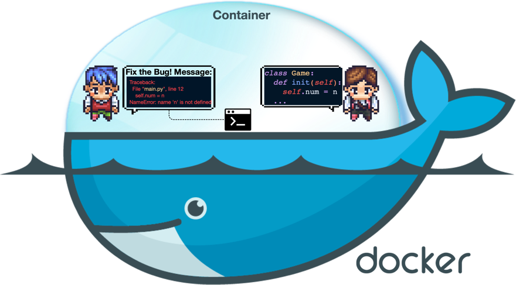
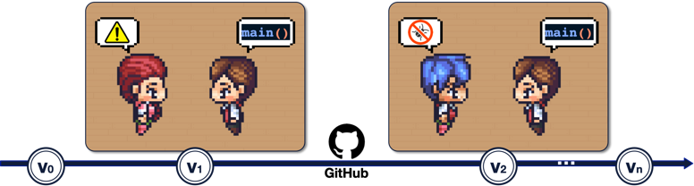

# Communicative Agents for Software Development

<p align="center">
  
</p>


<p align="center">
    【📚 <a href="../wiki.md">Wiki</a> | 🚀 <a href="../wiki.md#local-demo">ローカルデモ</a> | 👥 <a href="../Contribution.md">コミュニティにより作られたソフト</a> | 🔧 <a href="../wiki.md#customization">カスタマイズ</a>】
</p>

## 📖 概要

- **ChatDev** は、最高経営責任者 、
  最高製品責任者 、最高技術責任者 、プログラマー 、レビュアー 、テスター 、アートデザイナー  などさまざまな役割を持つさまざまな**インテリジェントエージェント**を擁する**バーチャルソフトウェア企業**である。これらのエージェントはマルチエージェントの組織構造を形成し、
  "プログラミングを通じてデジタル世界に革命を起こす"というミッションで
  結束しています。ChatDev 内のエージェントは、設計、コーディング、テスト、ドキュメント作成などのタスクを含む専門的な機能セミナーに参加することで、
  **共同作業** を行います。
- ChatDev の主な目的は、**使いやす**く**高度にカスタマイズ可能**で**拡張可能**なフレームワークを提供することであり、
  これは大規模言語モデル（LLM）に基づいており、集合知を研究するための理想的なシナリオとして機能します。
<p align="center">
  
</p>

## 🎉 ニュース

* **2023年11月2日: ChatDev がインクリメンタル開発に対応しました。** 起動するには、`--config "incremental" --path "Your folder path"` を試します。このモードでは、既存のコードをベースにしたコードレビューの段階から始まります。

* 2023年10月26日: ChatDev が安全な実行のために Docker に対応しました ([ManindraDeMel](https://github.com/ManindraDeMel) のコントリビュートに感謝します)。[Docker スタートガイド](../wiki.md#docker-start)を参照してください。
  <p align="center">
  
  </p>
* 2023年9月25日: **Git** 機能が利用可能になりました、プログラマー  がバージョン管理に GitHub を利用できるようになります。この機能を有効にするには、``ChatChainConfig.json`` で ``"git_management"`` を ``"True"`` に設定するだけです。
  <p align="center">
  
  </p>
* 2023年9月20日: **Human-Agent-Interaction** モードが利用可能になりました！レビュアー  になってプログラマー  に提案することで、ChatDev チームに参加することができます;
  ``python3 run.py --task [description_of_your_idea] --config "Human"`` を試してみてください。また、[ガイド](../wiki.md#human-agent-interaction)と[例](../WareHouse/Gomoku_HumanAgentInteraction_20230920135038)を参照してください。
  <p align="center">
  
  </p>
* 2023年9月1日: **Art** モードが利用可能になりました！デザイナーエージェント  を有効にすると、ソフトウェアで使用する画像を生成できます;
  ``python3 run.py --task [description_of_your_idea] --config "Art"`` を試してみてください。また、[ガイド](../wiki.md#art)と[例](../WareHouse/gomokugameArtExample_THUNLP_20230831122822)を参照してください。
* 2023年8月28日: システムが一般公開されました。
* 2023年8月17日: v1.0.0 のリリース準備が整いました。
* 2023年7月30日: ユーザーは、ChatChain、Phase、Role の設定をカスタマイズすることができます。さらに、オンラインログモードとリプレイモードの両方がサポートされました。
* 2023年7月16日: このプロジェクトに関連した[プレプリント論文](https://arxiv.org/abs/2307.07924)が発表されました。
* 2023年6月30日: ChatDev リポジトリの初期バージョンがリリースされました。

## ❓ ChatDev は何ができるのか？


https://github.com/OpenBMB/ChatDev/assets/11889052/80d01d2f-677b-4399-ad8b-f7af9bb62b72

## ⚡️ クイックスタート

### 🖥️ ターミナルでクイックスタート

開始するには、以下の手順に従ってください:

1. **GitHub リポジトリのクローン:** コマンドを使ってリポジトリのクローンを作成する:
   ```
   git clone https://github.com/OpenBMB/ChatDev.git
   ```
2. **Python 環境のセットアップ:** バージョン 3.9 以上の Python 環境があることを確認してください。`ChatDev_conda_env`
   をお好みの環境名に置き換え、以下のコマンドを使用してこの環境を作成し、有効化することができます:
   ```
   conda create -n ChatDev_conda_env python=3.9 -y
   conda activate ChatDev_conda_env
   ```
3. **依存関係のインストール:** `ChatDev` ディレクトリに移動し、以下のコマンドを実行して必要な依存関係をインストールする:
   ```
   cd ChatDev
   pip3 install -r requirements.txt
   ```
4. **OpenAI API キーの設定:** OpenAI API key を環境変数としてエクスポートします。`"your_OpenAI_API_key"` を実際の API
   キーに置き換えてください。この環境変数はセッション固有なので、新しいターミナルセッションを開くときに再度設定する必要があることを覚えておいてください。
   Unix/Linux 上では:
   ```
   export OPENAI_API_KEY="your_OpenAI_API_key"
   ```
   Windows 上では:
   ```
   $env:OPENAI_API_KEY="your_OpenAI_API_key"
   ```
5. **ソフトウェアの構築:** 次のコマンドを使用して、ソフトウェアのビルドを開始する。`[description_of_your_idea]`
   をあなたのアイデアの説明に、`[project_name]` を希望するプロジェクト名に置き換える:
   Unix/Linux 上では:
   ```
   python3 run.py --task "[description_of_your_idea]" --name "[project_name]"
   ```
   Windows 上では:
    ```
   python run.py --task "[description_of_your_idea]" --name "[project_name]"
   ```
6. **ソフトウェアの実行:** 生成されたソフトウェアは、`Project_name_DefaultOrganization_timestamp`
   のような特定のプロジェクトフォルダの下の `WareHouse`
   ディレクトリにあります。そのディレクトリで以下のコマンドを使ってソフトウェアを実行してください:
   Unix/Linux 上では:
   ```
   cd WareHouse/project_name_DefaultOrganization_timestamp
   python3 main.py
   ```
   Windows 上では:
   ```
   cd WareHouse/project_name_DefaultOrganization_timestamp
   python main.py
   ```

### 🐳 Docker のクイックスタート
- Docker のサポートを提供してくれた [ManindraDeMel](https://github.com/ManindraDeMel) に感謝します。[Docker スタートガイド](wiki.md#docker-start)を参照してください。

## ✨️ 高度なスキル

より詳細な情報については、私たちの [Wiki](../wiki.md) を参照してください:

- すべてのコマンド実行パラメータの紹介。
- 強化されたビジュアライズされたログ、リプレイデモ、シンプルな ChatChain ビジュアライザを含む、ローカルウェブデモをセットアップするための簡単なガイド。
- ChatDev フレームワークの概要
- ChatChain 設定の高度なパラメータの包括的な紹介。
- ChatDev をカスタマイズするためのガイドです:
    - ChatChain:
      独自のソフトウェア開発プロセス（または他のプロセス）を設計します。例えば ``DemandAnalysis -> Coding -> Testing -> Manual``
      などです。
    - Phase: ``DemandAnalysis``のように、ChatChain 内で独自のフェーズを設計する。
    - Role: 最高経営責任者 ``Chief Executive Officer`` のように、社内の様々なエージェントを定義する。

## 🤗 ソフトウェアをシェア！

**コード**:
私たちは、あなたが私たちのオープンソースプロジェクトに参加してくださることに熱意をもっています。もし何か問題があれば、遠慮なく報告してください。問い合わせがある場合、または私たちと仕事を共有する用意がある場合は、遠慮なくプルリクエストを作成してください！あなたのコントリビュートは高く評価されます。また、何かありましたらお知らせください！

**カンパニー**: カスタマイズした "ChatDev Company"
の作成は簡単です。このパーソナライズされたセットアップには、3つの簡単な設定JSONファイルが必要です。``CompanyConfig/Default``
ディレクトリで提供されている例をチェックしてください。カスタマイズの詳細については [Wiki](../wiki.md) を参照してください。

**ソフトウェア**: ChatDev
を使ってソフトウェアを開発すると、必要な情報を含むフォルダが作成されます。プルリクエストを行うだけで、あなたの作品を共有することができます。コマンド ``python3 run.py --task "design a 2048 game" --name "2048" --org "THUNLP" --config "Default"``
を実行してください。これでソフトウェアパッケージが作成され、``/WareHouse/2048_THUNLP_timestamp``
という名前のフォルダが生成されます。内部には:

- 2048 ゲームソフトウェアに関連するすべてのファイルとドキュメント
- ``CompanyConfig/Default`` にある 3 つの JSON 設定ファイルを含む、このソフトウェアを開発した会社の設定ファイル
- リプレイに使用できる、このソフトウェアのビルドプロセスの詳細なログ（``timestamp.log``）
- このソフトウェアを作成するために使用された最初のプロンプト (``2048.prompt``)

**コミュニティによって投稿されたソフトウェアは[こちら](../Contribution.md)を参照してください！**

### 👨‍💻 ソフトウェア共有者

<a href="https://github.com/OpenBMB/ChatDev/graphs/contributors">
  
</a>

[contrib.rocks](https://contrib.rocks) を使用して作成。
## 🔎 引用

```
@misc{qian2023communicative,
      title={Communicative Agents for Software Development},
      author={Chen Qian and Xin Cong and Wei Liu and Cheng Yang and Weize Chen and Yusheng Su and Yufan Dang and Jiahao Li and Juyuan Xu and Dahai Li and Zhiyuan Liu and Maosong Sun},
      year={2023},
      eprint={2307.07924},
      archivePrefix={arXiv},
      primaryClass={cs.SE}
}
```

## ⚖️ ライセンス

- ソースコードのライセンス 私たちのプロジェクトのソースコードは、Apache 2.0 License の下でライセンスされています。このライセンスは、Apache 2.0 ライセンスに概説されている特定の条件に従い、コードの使用、変更、配布を許可します。
- プロジェクトのオープンソース化状況: このプロジェクトは確かにオープンソースです; が、この指定は主に非商業的な目的を意図しています。私たちは、研究や非商業的なアプリケーションのためのコミュニティからの協力や貢献を奨励しますが、商業的な目的でプロジェクトのコンポーネントを利用する場合は、個別のライセンス契約が必要であることに注意することが重要です。
- データライセンス: このプロジェクトで利用された関連データは、CC BY-NC 4.0 でライセンスされており、このライセンスは、データの非商用利用を明確に許可しています。これらのデータセットを用いて学習されたモデルは、非商用利用の制限を厳守し、研究目的のみに使用されるべきであることを強調しておきます。

## Star History

[](https://star-history.com/#openbmb/chatdev&Date)


## 🤝 謝辞
<a href="http://nlp.csai.tsinghua.edu.cn/"></a>&nbsp;&nbsp;
<a href="https://modelbest.cn/"></a>&nbsp;&nbsp;
<a href="https://github.com/OpenBMB/AgentVerse/"></a>&nbsp;&nbsp;
<a href="https://aibrb.com/introducing-herbie-your-super-employee-for-streamlined-productivity/"></a>

## 📬 お問い合わせ

ご質問、フィードバック、またはお問い合わせがある場合は、[chatdev.openbmb@outlook.com](mailto:chatdev.openbmb@outlook.com) までお気軽にご連絡ください
