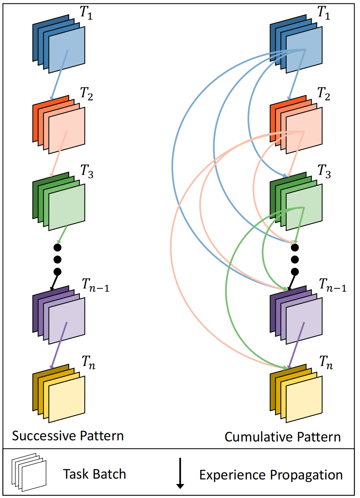
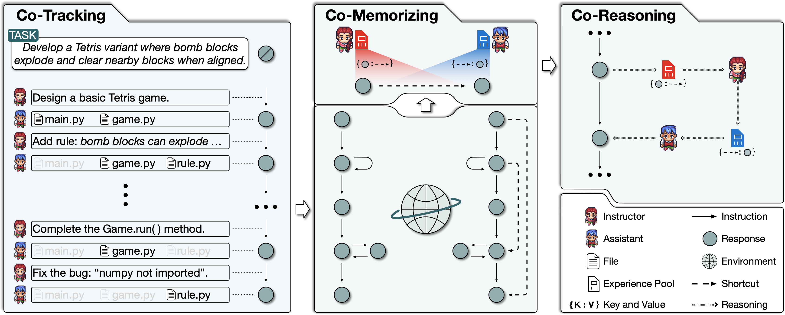

# Communicative Agents for Software Development

<p align="center">
  
</p>

<p align="center">
    【📚 <a href="../wiki.md">Wiki</a> | 🚀 <a href="../wiki.md#visualizer">Visualizer</a> | 👥 <a href="../Contribution.md">Community Built Software</a> | 🔧 <a href="../wiki.md#customization">Customization</a> | 👾 <a href="https://discord.gg/bn4t2Jy6TT")>Discord</a>】

</p>

## 📖 개요

- **ChatDev**는 다양한 최고 경영 책임자, 최고 생산 책임자, 최고 기술 책임자, 프로그래머, 리뷰어, 테스터, 아트 ë””ìì´ë„ˆì™€ 같은 다양한 역할을 수행하는 **지능형 에이전트**들을 통해 운영되는 **가상 소프트웨어 회사**입니다. 여럿이서 조직 구조를 형성하고 "프로그래밍을 통해 디지털 세상을 혁신한다"는 사명을 가지고 있습니다. ChatDev 내 에이전트들은 디자인, 코딩, 테스트, 문서화를 진행하는 전문 기능 세미나에 참여하여 **협업**합니다.
- ChatDev의 주요 목표는 **사용하기 쉽고**, **개조할 수 있으며**, **확장 가능한** 프레임워크를 제공하는 것입니다. 대규모 언어 모델(LLM)을 기반으로 하며 집단 지성을 연구하는 데 이상적인 시나리오를 제공합니다.

<p align="center">
  
</p>

## 📰 뉴스
* **2024년 6월 25일: 🎉ChatDev 팀은LLM 기반의 다중 에이전트 협업🤖🤖 및 관련 분야의 발전을 도모하기 위해, [오픈소스](https://github.com/OpenBMB/ChatDev/tree/main/MultiAgentEbook) 대화형 e-book📚 형식으로 제공되는 중요한 논문 모음📄을 선별했습니다. 이제 [Ebook 웹사이트](https://thinkwee.top/multiagent_ebook)에서 최신 발전 사항을 탐색하고 [논문 목록](https://github.com/OpenBMB/ChatDev/blob/main/MultiAgentEbook/papers.csv)을 다운로드할 수 있습니다.**
  <p align="center">
  
  </p>
* 2024년 6월 12일: We introduce Multi-Agent Collaboration Networks (MacNet) 🎉, which utilize directed acyclic graphs to facilitate effective task-oriented collaboration among agents through linguistic interactions 🤖🤖. MacNet supports cooperation across various topologies and among more than a thousand agents without exceeding context limits. More versatile and scalable, MacNet can be considered a more advanced version of ChatDev's chain-shaped topology. Our preprint paper is available at [https://arxiv.org/abs/2406.07155](https://arxiv.org/abs/2406.07155). This technique will soon be incorporated into this repository, enhancing support for diverse organizational structures and offering richer solutions beyond software development (e.g., logical reasoning, data analysis, story generation, and more).
  <p align="center">
  
  </p>

<details open>
<summary>오래된 뉴스</summary>

* May 07, 2024, we introduced "Iterative Experience Refinement" (IER), a novel method where instructor and assistant agents enhance shortcut-oriented experiences to efficiently adapt to new tasks. This approach encompasses experience acquisition, utilization, propagation, and elimination across a series of tasks. Our preprint paper is available at https://arxiv.org/abs/2405.04219, and this technique will soon be incorporated into ChatDev.
  <p align="center">
  
  </p>

* January 25, 2024: We have integrated Experiential Co-Learning Module into ChatDev. Please see the [Experiential Co-Learning Guide](../wiki.md#co-tracking).

* December 28, 2023: We present Experiential Co-Learning, an innovative approach where instructor and assistant agents accumulate shortcut-oriented experiences to effectively solve new tasks, reducing repetitive errors and enhancing efficiency.  Check out our preprint paper at https://arxiv.org/abs/2312.17025 and this technique will soon be integrated into ChatDev.
  <p align="center">
  
  </p>

* November 15, 2023: We launched ChatDev as a SaaS platform that enables software developers and innovative entrepreneurs to build software efficiently at a very low cost and barrier to entry. Try it out at https://chatdev.modelbest.cn/.
  <p align="center">
  
  </p>

* November 2, 2023: ChatDev is now supported with a new feature: incremental development, which allows agents to develop upon existing codes. Try `--config "incremental" --path "[source_code_directory_path]"` to start it.
  <p align="center">
  
  </p>

* 2023년 10월 26일: ChatDev is now supported with Docker for safe execution (thanks to contribution from [ManindraDeMel](https://github.com/ManindraDeMel)). Please see [Docker Start Guide](../wiki.md#docker-start).
  <p align="center">
  
  </p>
* 2023년 9월 25일: **Git** 모드가 출시되었으며, 프로그래머  가 Git 버전 제어를 사용할 수 있습니다. 이 기능을 사용하려면 ``ChatChainConfig.json`` 에서 ``"git_management"`` 를 ``"True"`` 로 설정해야 합니다 . [가이드](../wiki.md#git-mode)를 참조하세요.
  <p align="center">
  
  </p>
- 2023년 9월 20일: **Human-Agent-Interaction** 모드가 출시되었습니다! ê²€í† ì  역할을 수행하고 프로그ë˜ë¨¸ì—게 제안하여 ChatDev 팀에 참여할 수 있습니다;
  ``python3 run.py --task [description_of_your_idea] --config "Human"``. [가이드](../wiki.md#human-agent-interaction)와 [예제](../WareHouse/Gomoku_HumanAgentInteraction_20230920135038)를 참조하세요.
  <p align="center">
  
  </p>
- 2023년 9월 1일: **Art** 모드가 출시되었습니다! 디자이너  에이전트를 활성화하여  소프트웨어에서 사용되는 이미지를 생성해보세요;
  ``python3 run.py --task [description_of_your_idea] --config "Art"``. [가이드](../wiki.md#art)와 [예제](../WareHouse/gomokugameArtExample_THUNLP_20230831122822)를 참조하세요.
- 2023년 8월 28일: 시스템이 공개되었습니다.
- 2023년 8월 17일: V1.0.0 버전 출시 준비가 완료되었습니다.
- 2023년 7월 30일: 사용자가 ChatChain, Phase 및 Role을 설정할 수 있습니다. 또한, Online Log 모드와 Replay 모드가 지원됩니다.
- 2023년 7월 16일: 이 프로젝트와 관련된 [출판 전 논문](https://arxiv.org/abs/2307.07924)이 게시되었습니다.
- 2023년 6월 30일: `ChatDev` 리포지토리의 초기 버전이 공개되었습니다.
</details>

## ❓ ChatDev는 무엇을 할 수 있나요?


https://github.com/OpenBMB/ChatDev/assets/11889052/80d01d2f-677b-4399-ad8b-f7af9bb62b72

## ⚡️ 시작하기

### 💻️ 웹을 이용하여 시작하기

시각화와 구성을 위한 웹 페이지 접근: https://chatdev.modelbest.cn/

### 🖥️ 터미널을 이용하여 시작하기

시작하려면 다음 단계를 따르세요:

1. **GitHub 리포지터리 복제:** 다음 명령을 사용하여 리포지토리를 복제하세요:
   ```
   git clone https://github.com/OpenBMB/ChatDev.git
   ```
2. **Python 환경 설정하기:** Python 환경이 버전 3.9 이상인지 확인하세요. 그렇다면 가상 환경을 생성하고 활성화할 수 있으며, `ChatDev_conda_env`는 원하는 이름으로 대체해도 무방합니다:
   ```
   conda create -n ChatDev_conda_env python=3.9 -y
   conda activate ChatDev_conda_env
   ```
3. **종속성 설치**: `ChatDev` 디렉토리로 이동하여 필요한 종속성을 설치하세요:
   ```
   cd ChatDev
   pip3 install -r requirements.txt
   ```
4. **OpenAI API 키 설정:** OpenAI API 키를 환경 변수로 내보내세요. `"your_OpenAI_API_key"`를 실제 API 키로 바꿔야 합니다. 이 환경 변수는 세션별로 다르므로 새 터미널 세션을 열면 다시 설정해야 한다는 점을 기억하세요.
   유닉스/리눅스의 경우:
   ```
   export OPENAI_API_KEY="your_OpenAI_API_key"
   ```
   Windows의 경우:
   ```
   $env:OPENAI_API_KEY="your_OpenAI_API_key"
   ```
5. **소프트웨어 빌드하기:** 소프트웨어 빌드를 시작하기 위해 `[description_of_your_idea]`를 아이디어의 설명으로, `[project_name]`을 원하는 프로젝트 이름으로 바꾸세요:
   유닉스/리눅스의 경우:
   ```
   python3 run.py --task "[description_of_your_idea]" --name "[project_name]"
   ```
   Windows의 경우:
   ```
   python run.py --task "[description_of_your_idea]" --name "[project_name]"
   ```
6. **소프트웨어 실행하기:** `project_name_DefaultOrganization_timestamp`와 같은 특정 프로젝트 폴더 아래의 `WareHouse` 디렉토리에서 생성된 소프트웨어를 찾을 수 있습니다. 해당 디렉토리 내에서 다음과 같이 소프트웨어를 실행하세요:
   유닉스/리눅스의 경우:
   ```
   cd WareHouse/project_name_DefaultOrganization_timestamp
   python3 main.py
   ```
   Windows의 경우:
   ```
   cd WareHouse/project_name_DefaultOrganization_timestamp
   python main.py
   ```

### 🐳 도커를 이용하여 시작하기

- [ManindraDeMel](https://github.com/ManindraDeMel)의 도커 지원에 감사드립니다. [도커 시작 가이드](../wiki.md#docker-start)에서 확인 할 수 있습니다.

## ✨️ 심화 스킬

[위키](../wiki.md)에서 아래 더 자세한 정보를 확인할 수 있습니다:

- 모든 명령 실행 매개변수에 대한 소개
- 더 보기 좋게 시각화된 로그, 다시보기 데모, 간단한 ChatChain 시각화 도구가 포함된 로컬 웹 데모를 설정하는 방법에 대한 간단한 가이드
- ChatDev 프레임워크에 대한 개요
- ChatChain 구성의 모든 고급 매개변수에 대한 포괄적인 소개
- ChatDev 개조 가이드:
    - ChatChain: ``DemandAnalysis (수요분석) -> Coding (코딩) -> Testing (테스트) -> Manual (매뉴얼)``과 같은 소프트웨어 개발 프로세스(또는 다른 프로세스)를 직접 설계하세요.
    - Phase: ChatChain 내에서 ``수요분석``과 같은 자신만의 단계를 설계하세요.
    - Role: ``Chief Executive Officier (최고 경영자)``와 같이 회사 내 다양한 에이전트를 정의합니다.

## 🤗 소프트웨어를 공유하세요!

**코드**: 오픈소스 프로젝트에 관심을 가져주셔서 감사합니다. 문제가 발견되면 주저하지 마시고 신고해 주세요. 궁금한 점이 있거나 여러분의 작업을 공유할 준비가 되었다면 얼마든지 PR을 작성해 주세요! 여러분의 기여는 매우 소중합니다. 도움이 필요한 사항이 있으면 언제든지 알려주세요!

**회사**: 당신만의 맞춤형 "ChatDev 회사"를 쉽게 만들 수 있습니다. 이 맞춤형 설정에는 세 가지 간단한 구성 JSON 파일이 포함됩니다. ``CompanyConfig/Default`` 디렉토리에 제공된 예제를 확인하세요. 맞춤화에 대한 자세한 지침은 [위키](../wiki.md)를 참조하세요.

**소프트웨어**: ChatDev를 사용하여 소프트웨어를 개발할 때마다 모든 필수 정보가 포함된 해당 폴더가 생성됩니다. PR을 작성하는 것만큼이나 간단하게 작업을 공유할 수 있습니다. 예를 들어, ``python3 run.py --task "design a 2048 game" --name "2048" --org "THUNLP" --config "Default"``라는 명령을 실행합니다. 이렇게 하면 소프트웨어 패키지가 생성되고 ``/WareHouse/2048_THUNLP_timestamp``라는 폴더가 생성됩니다. 그 안에는 다음과 같은 파일들이 있습니다:

- 2048 게임 소프트웨어와 관련된 모든 파일 및 문서
- ``CompanyConfig/Default``에서 가져온 3개의 JSON을 포함한, 소프트웨어를 담당하는 이 회사의 구성 파일들
- 다시보기에서 소프트웨어의 빌드 프로세스를 자세히 설명하는 포괄적인 로그(``timestamp.log``)
- 이 소프트웨어를 만드는 데 사용된 초기 프롬프트(``2048.prompt``)

**커뮤니티에서 기여한 소프트웨어를 보려면 [여기](../Contribution.md)를 참조해주세요!**

## 👨‍💻‍ 기여자

<a href="https://github.com/OpenBMB/ChatDev/graphs/contributors">
  
</a>

Made with [contrib.rocks](https://contrib.rocks).

## 📑 인용 문구

```
@article{chatdev,
      title = {ChatDev: Communicative Agents for Software Development},
      author = {Chen Qian and Wei Liu and Hongzhang Liu and Nuo Chen and Yufan Dang and Jiahao Li and Cheng Yang and Weize Chen and Yusheng Su and Xin Cong and Juyuan Xu and Dahai Li and Zhiyuan Liu and Maosong Sun},
      journal = {arXiv preprint arXiv:2307.07924},
      url = {https://arxiv.org/abs/2307.07924},
      year = {2023}
}
```

## ⚖️ 라이선스

- 소스코드 라이선스: ChatDev의 소스코드는 아파치 2.0 라이선스가 부여되어 있습니다. 아파치 2.0 라이선스에 명시된 특정 조건에 따라 코드의 사용, 수정 및 배포를 허용합니다.
- 데이터 라이선스: ChatDev에 사용되는 관련 데이터는 CC BY-NC 4.0라이선스가 부여되어 있습니다. 이 라이선스는 데이터의 비상업적 사용을 명시적으로 허용합니다. 이러한 데이터 세트를 사용하여 훈련된 모든 모델은 비상업적 사용 제한을 철저히 준수해야 하며 연구 목적으로만 사용되어야 한다는 점을 강조하고 싶습니다.


## 🤝 Acknowledgments

<a href="http://nlp.csai.tsinghua.edu.cn/"></a>&nbsp;&nbsp;
<a href="https://modelbest.cn/"></a>&nbsp;&nbsp;
<a href="https://github.com/OpenBMB/AgentVerse/"></a>&nbsp;&nbsp;
<a href="https://github.com/OpenBMB/RepoAgent"></a>
<a href="https://aibrb.com/introducing-herbie-your-super-employee-for-streamlined-productivity/"></a>

## 연락처

질문, 피드백 또는 저희와 연락을 원하시면 언제든지 이메일로 연락 주십시오: [qianc62@gmail.com](mailto:qianc62@gmail.com)
