# Wiki

## Quick Start Step By Step

### 1. Install `ChatDev`:

- Visit the [quickstart section](README.md#%EF%B8%8F-quickstart) of readme for installation instructions.

### 2. Start building software in one command:

- **Build Your Software:** Use the following command to initiate the building of your software,
  replacing `[description_of_your_idea]` with your idea's description and `[project_name]` with your desired project
  name:
   ```
   python3 run.py --task "[description_of_your_idea]" --name "[project_name]"
   ```

- here is the full params of run.py

    ```commandline
    usage: run.py [-h] [--config CONFIG] [--org ORG] [--task TASK] [--name NAME] [--model MODEL]

    argparse

    optional arguments:
      -h, --help       show this help message and exit
      --config CONFIG  Name of config, which is used to load configuration under CompanyConfig/; Please see CompanyConfig Section below
      --org ORG        Name of organization, your software will be generated in WareHouse/name_org_timestamp
      --task TASK      Prompt of your idea
      --name NAME      Name of software, your software will be generated in WareHouse/name_org_timestamp
      --model MODEL    GPT Model, choose from {'GPT_3_5_TURBO','GPT_4','GPT_4_32K', 'OLLAMA', 'HUGGINGFACE'}
    ```

#### 2.1 To use Ollama(Local model):

- **choose local model** Use the following command to use ollama model
  replacing `[your_local_model]` with your local model (llama3.1:latest, etc.):
    `export MODEL_NAME=[your_local_model]`
  and run command:
    ```
    python3 run.py --task "[description of your idea]" --name "[project name]" --model "OLLAMA"
    ```

#### 2.2 To use Huggingface model:

- **choose huggingface model** Use the following command to use huggingface model
  replacing `[hf_model_id]` with huggingface model id:
    `export HF_MODEL_ID=[hf_model_id]`
  and run command:
    ```
    python3 run.py --task "[description of your idea]" --name "[project name]" --model "HUGGINGFACE"
    ```

### 3. Check your software

- the generated software is under ``WareHouse/NAME_ORG_timestamp``, including:
    - all the files and manuals of this software
    - config files of the company that made this software, including three config JSON files
    - full log of the software building process
    - prompt to make this software
- A case of todo software is just like below, which is located in ``/WareHouse/todo_THUNLP_20230822165503``
    ```
    .
    ├── 20230822165503.log # log file
    ├── ChatChainConfig.json # Configuration
    ├── PhaseConfig.json # Configuration
    ├── RoleConfig.json # Configuration
    ├── todo.prompt # User query prompt
    ├── meta.txt # Software building metainformation
    ├── main.py # Generated Software Files
    ├── manual.md # Generated Software Files
    ├── todo_app.py # Generated Software Files
    ├── task.py # Generated Software Files
    └── requirements.txt # Generated Software Files
    ```
- Usually, you just need to install requirements and run main.py to use your software
    ```commandline
    cd WareHouse/project_name_DefaultOrganization_timestamp
    pip3 install -r requirements.txt
    python3 main.py
    ```

## Visualizer

- you can start a Flask app to get a Visualizer, which is a local web demo for visualizing real-time logs, replayed logs, and ChatChain.
- the difference between real-time logs and replayed logs lies in that the former is mainly for debugging, which can print the agent's dialogue information, environment changes, and many additional system information in real-time during the process of software generation, such as file changes and Git information. The latter is used to replay the generated log and only prints the dialogue information of the agent.
- just run
```
python3 visualizer/app.py
```

then start building a software by ``python3 run.py`` and go to [Visualizer Website](http://127.0.0.1:8000/) to see an real-time visualized version of logs such as

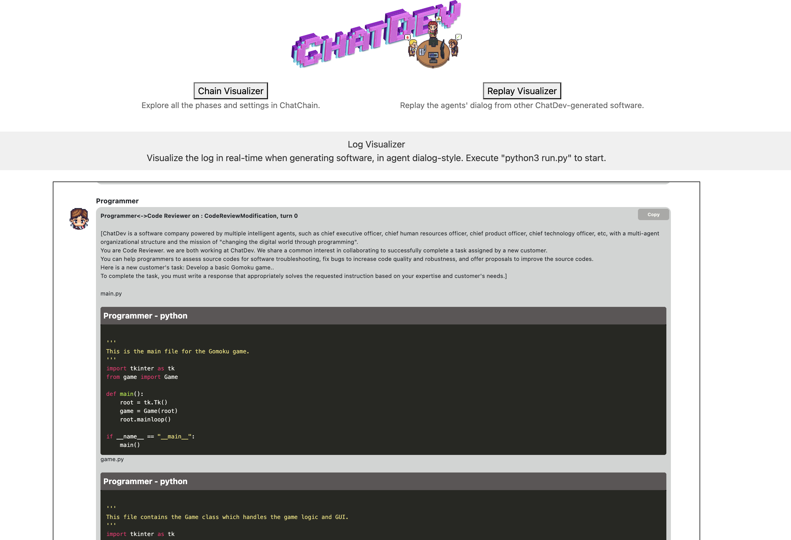

- You can also go to the [ChatChain Visualizer](http://127.0.0.1:8000/static/chain_visualizer.html) on this page and
  upload any ``ChatChainConfig.json`` under ``CompanyConfig/`` to get a visualization on this chain, such as:

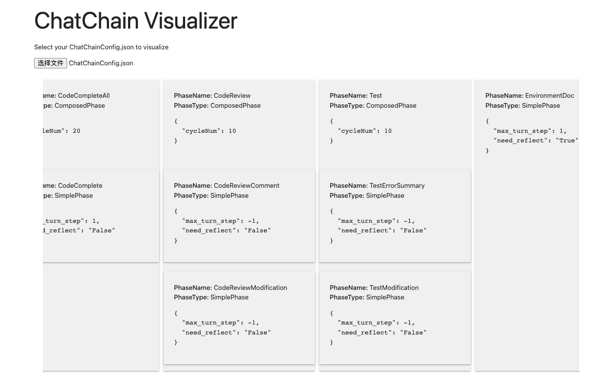

- You can also go to the [Chat Replay page](http://127.0.0.1:8000/static/replay.html) to replay the log file in the software folder
    - click the ``File Upload`` bottom to upload a log, then click ``Replay``
    - The replay only shows the dialogues in natural languages between agents, it will not contain debug logs.


## Docker Start
- You can use docker for a quick and safe use of ChatDev. You will need some extra steps to allow the execution of the GUI program in docker since ChatDev often creates software with GUI and executes it in the Test Phase.

### Install Docker
- Please refer to the [Docker Official Website](https://www.docker.com/get-started/) for installing Docker.

### Prepare GUI connection between Host and Docker
- Take macOS for example,
  - Install Socat and xquartz, you may need to restart the computer after installing the xquartz
  ```commandline
  brew install socat xquartz
  ```
  - Open Xquartz and go into the settings, allow connections from network clients
    - 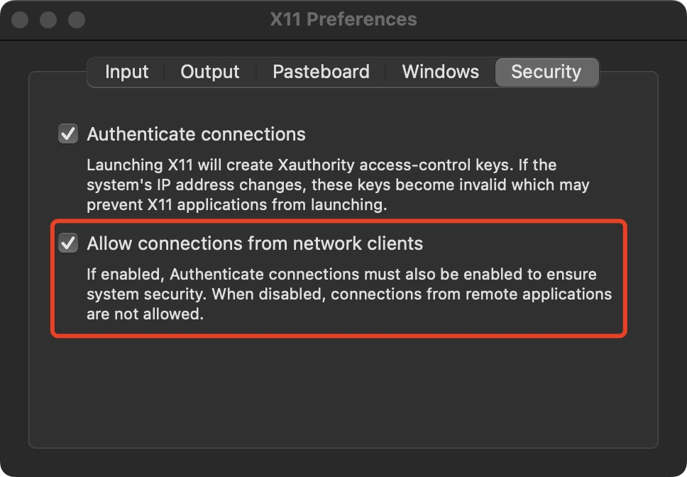
  - run the following command on the host computer and keep it.
  ```commandline
   socat TCP-LISTEN:6000,reuseaddr,fork UNIX-CLIENT:\"$DISPLAY\"
  ```
  - run the following command on the host computer to check your ip (the address of inet).
  ```commandline
  ifconfig en0
  ```

### Build Docker images
- under the ChatDev folder, run
    ```commandline
    docker build -t chatdev:latest .
    ```
  it will generate a 400MB+ docker image named chatdev.

### Run Docker
- run the following command to create and go into a container
    ```commandline
    docker run -it -p 8000:8000 -e OPENAI_API_KEY=YOUR_OPENAI_KEY -e DISPLAY=YOUR_IP:0 chatdev:latest
    ```
  ⚠️ You need to replace ``YOUR_OPENAI_KEY`` with your key and replace ``YOUR_IP`` with your inet address.
- Then you can just play with ChatDev running ``python3 run.py``.
- You can run ``python3 visualizer/app.py &`` first to start a background program so that you can use online log with a WebUI.

### Copy the generated software out of Docker
- run 
    ```commandline
    docker cp container_id:/path/in/container /path/on/host
    ```
### Official Docker Image
- in preparation

## Experiential Co-Learning Guide
### Co-Tracking

- **Start Co-Tracking**: Use the following command to initiate the building of software, replacing `[description_of_your_idea]` with task descirption and `[project_name]` with project name. This is the same as starting ChatDev.
   ```bash 
   python3 run.py --task "[description_of_your_idea]" --name "[project_name]"
   ```
  The software generated in co-tracking phase is ready for the agents' experience pool in the following steps.
### Co-Memorizing
- **Initiating Co-Memorizing**: To begin the memorization process for the generated software in a specified directory, run the `ecl.py` script using the following command:
  ```bash
    python3 ecl/ecl.py "<path>" "[options]"
  ```
  `<path>`: The path to the file or directory to process. 
  `[options]`: This can be set as `-d`. This flag indicates that the script should process all files in the given directory. If this flag is not set, the script will process the file specified in path.
After this process, the experiences have been extracted from the production of software and added to the agents' experience pool in `ecl/memory/MemoryCards.json`.
\
**For example:**
  If you want to memorize only one software, you can use:
  ```bash
    python3 ecl/ecl.py "<Software Path to file>"
  ```
  And the software path should be like `"WareHouse/project_name_DefaultOrganization_timestamp"`.
  \
  If you want to memorize all files in a directory, you can use:
  ```bash
    python3 ecl/ecl.py "<Software Path to Directory>" -d
  ```
  the software path should be like `"WareHouse"`.
- **Memory Filter**: To get a higher quality experience pool, it is suggested to use `ecl/post_process/memory_filter.py` to filter the `MemoryCards.json`. When running the `memory_filter.py` script, you need to specify three arguments: the filter threshold, the input directory, and the output directory.
  ```bash
    python3 ecl/post_process/memory_filter.py "<threshold>" "<directory>" "<filtered_directory>"
  ```
  - `<threshold>`: Require a value within the range of 0 to 1 (exclusive). It is used as the threshold to filter experiences by their 'valuegain'. Only experiences with a 'valuegain' that is equal to or greater than this threshold will be considered.
  - `<directory>`: The file path to the memory directory that you intend to process. 
  - `<filtered_directory>`: The file path to a directory where you want to store the processed data.

  \
  **For example:**
  ```bash
    python3 ecl/post_process/memory_filter.py 0.9 "ecl/memory/MemoryCards.json" "ecl/memory/MemoryCards_filtered.json"
  ```
> **Notice:** By default, the `MemoryCards.json` is set to be empty. You can customize your own experience pool for agents following steps above. And we have also provided our `MemoryCards.json` used in our experiment in [MemoryCards.json](https://drive.google.com/drive/folders/1czsR4swQyqpoN8zwN0-rSFcTVl68zTDY?usp=sharing). You can download the json file through the link and put it under `ecl/memory` folder. This allows you to directly proceed to the Co-Reasoning phase without needing to redo the Co-Tracking and Co-Memorizing steps.
### Co-Reasoning
- **Memory Usage Configuration**:
  In the `CompanyConfig/Default/ChatChainConfig.json` file, the `with_memory` option should be set **True**. \
  In the `ecl/config.yaml` file, you can adjust the settings for **top k** and **similarity threshold** for both code and text retrieval. 
  By default, `with_memory` is set as False and the system is configured to retrieve the top 1 result with a similarity threshold of zero for both code and text.
- **Start Co-Reasoning**: Once you have completed memory usage configuration, similar to the Co-Tracking phase, you can use the command below to start the software building process. Replace `[description_of_your_idea]` with the task description from the test set and `[project_name]` with the project name from the test set:
   ```
   python3 run.py --task "[description_of_your_idea]" --name "[project_name]"
   ```
   In this process of software development, the agents will engage their experience pool(`MemoryCards.json`) into software development!

Detailed descriptions and experiment results about this **Experiential Co-Learning** Module lies in our preprint paper at https://arxiv.org/abs/2312.17025.

## Experiential Co-Evolving Guide
- **Using Co-Evolving**: Use the following command to initiate the evolving of experiences, which uses the `ecl/ece.py` to eliminate `ecl/memory/UsedMemory.json` and `ecl/memory/NewMemory.json`. Then it combines the two parts of experiences to form a new experience pool in `ecl/memory/Evolved_directory.json`.

  ```bash
    python3 ecl/ece.py "<Path_directory>" "<UsedMemory_directory>" "<NewMemory_directory>" "<Evolved_directory>"
  ```
  `<Path_directory>`: The path to the directory of software , generated with the memory `UsedMemory_directory`. \
  `<UsedMemory_directory>`: The path to the directory of UsedMemory, which was used to generate the software in `Path_directory`. \
  `<NewMemory_directory>`: The path to the directory NewMemory, which acquires from the software in `Path_directory` using `ecl/ecl.py`. \
  `<Evolved_directory>`: The path to a directory where you want to store the evolved memory.
  \
  **For example:**
  ```bash
    python3 ecl/ece.py "WareHouse" "ecl/memory/UsedMemory.json" "ecl/memory/NewMemory.json" "ecl/memory/MemoryCards_Evolved.json"
  ```
> **Notice:** The software directory and memory directory must correspond. The software in the "<Path_directory>" is generated using "<UsedMemory_directory>", and the "<NewMemory_directory>" is acquired from the software in the  "<Path_directory>". That's because when we calculate the frequency distribution of the experience, we need to ensure that the software corresponds to the experiences, which to eliminate certain experiences to obtain a subset with relatively high retrieval probability.

Detailed descriptions and experiment results about this Experiential Co-Evolving Module lies in our preprint paper at https://arxiv.org/abs/2405.04219.

## Customization

- You can customize your company in three kinds of granularity:
    - Customize ChatChain
    - Customize Phase
    - Customize Role
- Here is the overview architecture of ChatDev, which illustrates the relationships among the above three classes:


- All the configuration content related to ChatDev (such as the background prompt of the agent employee, the work content of each Phase, and how the Phase is combined into a ChatChain), are called a **CompanyConfig** (because ChatDev is like a virtual software company). These CompanyConfigs are in the ChatDev project Under ``CompanyConfig/``. You can check this [directory](https://github.com/OpenBMB/ChatDev/tree/main/CompanyConfig). In this directory, you will see different CompanyConfig (such as Default, Art, Human). Generally speaking, each CompanyConfig will contain 3 configuration files.
  1. ChatChainConfig.json, which controls the overall development process of ChatDev, including which Phase each step is, how many times each Phase needs to be cycled, whether reflection is needed, etc.
  2. PhaseConfig.json, which controls each Phase, and corresponds to ``chatdev/phase.py`` or ``chatdev/composed_phase.py`` in the ChatDev project. The Python file realizes the specific working logic of each phase. The JSON file here contains the configuration of each phase, such as the background prompt, which employees are participating in the phase, etc.
  3. RoleConfig.json contains the configuration of each employee (agent). Currently, it only contains the background prompt of each employee, which is a bunch of text containing placeholders.
- If a CompanyConfig does not contain all three configuration files (such as Art and Human), it means that the configuration files missing from this CompanyConfig are set according to Default. The official CompanyConfigs currently provided include:
  1. Default, default configuration
  2. Art, allows ChatDev to create image files according to needs, automatically generate image description prompts and call the OpenAI API to generate images
  3. Human, allowing human users to participate in ChatDev’s code review process

### Customize ChatChain

- see ``CompanyConfig/Default/ChatChainConfig.json``
- You can easily pick and organize phases to formulate a ChatChain from all phases (from ``chatdev/phase.py``
  or ``chatdev/composed_phase.py``)
  by modifying the JSON file

### Customize Phase

- This is the only part that needs to modify the code, and it brings much flexibility for customization.
- you just need to
    - implement your phase class (in the simplest case, only one functions need to be modified) extending the ``Phase``
      class
    - config this phase in ``PhaseConfig.json``, including writing phase prompt and assigning roles for this phase
- Customize SimplePhase
    - see ``CompanyConfig/Default/PhaseConfig.json`` for configuration, see ``chatdev/phase.py`` for implementing your
      own phase
    - each phase contains three steps:
        - generate phase environment from the whole ChatChain environment
        - use phase environment to control the phase prompt and execute the chatting between roles in this phase (which
          usually does not need to be modified)
        - get a seminar conclusion from the chatting, and use it to update the whole ChatChain environment
    - below is a simple example phase of choosing the programming language of the software:
        - generate phase environment: we pick the task, modality, and ideas from the ChatChain environment
        - execute the phase: no need to implement, which is defined in the Phase class
        - update ChatChain environment: we get the seminar conclusion (which language) and update the 'language' key in the
          ChatChain environment
          ```python
          class LanguageChoose(Phase):
              def __init__(self, **kwargs):
                  super().__init__(**kwargs)

              def update_phase_env(self, chat_env):
                  self.phase_env.update({"task": chat_env.env_dict['task_prompt'],
                                         "modality": chat_env.env_dict['modality'],
                                         "ideas": chat_env.env_dict['ideas']})

              def update_chat_env(self, chat_env) -> ChatEnv:
                  if len(self.seminar_conclusion) > 0 and "<INFO>" in self.seminar_conclusion:
                      chat_env.env_dict['language'] = self.seminar_conclusion.split("<INFO>")[-1].lower().replace(".", "").strip()
                  elif len(self.seminar_conclusion) > 0:
                      chat_env.env_dict['language'] = self.seminar_conclusion
                  else:
                      chat_env.env_dict['language'] = "Python"
                  return chat_env
          ```
          The configuration of this phase is like:
          ```json
          "LanguageChoose": {
            "assistant_role_name": "Chief Technology Officer",
            "user_role_name": "Chief Executive Officer",
            "phase_prompt": [
              "According to the new user's task and some creative brainstorm ideas listed below: ",
              "Task: \"{task}\".",
              "Modality: \"{modality}\".",
              "Ideas: \"{ideas}\".",
              "We have decided to complete the task through an executable software implemented via a programming language. ",
              "As the {assistant_role}, to satisfy the new user's demand and make the software realizable, you should propose a concrete programming language. If python can complete this task via Python, please answer Python; otherwise, answer another programming language (e.g., Java, C++, etc,).",
              "Note that we must ONLY discuss the target programming language and do not discuss anything else! Once we all have expressed our opinion(s) and agree with the results of the discussion unanimously, any of us must actively terminate the discussion and conclude the best programming language we have discussed without any other words or reasons, using the format: \"<INFO> *\" where \"*\" represents a programming language."
            ]
          }
          ```
    - Customize ComposePhase
        - see ``CompanyConfig/Default/ChatChainConfig.json`` for configuration and see ``chatdev/composed_phase.py`` for
          implementation.
        - **⚠️ Attention** We do not support Nested Composition yet so do not put ComposePhase in ComposePhase.
        - ComposePhase contains multiple SimplePhase, and can be conducted in loop.
        - ComposePhase has no Phase json but in the chatchain json file you can define which SimplePhase is in this
          ComposePhase, such as:
      ```json
        {
          "phase": "CodeReview",
          "phaseType": "ComposedPhase",
          "cycleNum": 2,
          "Composition": [
            {
              "phase": "CodeReviewComment",
              "phaseType": "SimplePhase",
              "max_turn_step": -1,
              "need_reflect": "False"
            },
            {
              "phase": "CodeReviewModification",
              "phaseType": "SimplePhase",
              "max_turn_step": -1,
              "need_reflect": "False"
            }
          ]
        }
      ```
        - You also need to implement your own ComposePhase class, which you need to decide the phase_env update and
          chat_env update (the same as SimplePhase, but for the whole ComposePhase) and the condition for stopping the
          loop (optional):
      ```python
      class Test(ComposedPhase):
          def __init__(self, **kwargs):
              super().__init__(**kwargs)

          def update_phase_env(self, chat_env):
              self.phase_env = dict()

          def update_chat_env(self, chat_env):
              return chat_env

          def break_cycle(self, phase_env) -> bool:
              if not phase_env['exist_bugs_flag']:
                  log_visualize(f"**[Test Info]**\n\nAI User (Software Test Engineer):\nTest Pass!\n")
                  return True
              else:
                  return False
      ```

### Customize Role

- see ``CompanyConfig/Default/RoleConfig.json``
- you can use placeholders for using phase environment, which is the same as PhaseConfig.json
- **⚠️ Attention** You need to keep at least "Chief Executive Officer" and "Counselor" in your own ``RoleConfig.json``
  to make Reflection work.

## ChatChain Parameters

- *clear_structure*: Whether to clear non-software files in the WareHouse and cache files in the generated software path.
- *gui_design*: Encourage ChatDev to generate software with GUI.
- *git_management*: Whether to use git to manage the creation and changes of generated software.
- *incremental_develop*: Whether to use incremental development on an existing project.
- *self_improve*: flag for self-improvement on user input prompt. It is a special chat that LLM plays as a prompt engineer to improve the user input prompt. **⚠️ Attention** Model generated prompts contain uncertainty and there may
  be a deviation from the requirement meaning contained in the original prompt.
- *background_prompt*: background prompt that will be added to every inquiry to LLM
- *with_memory*: Whether to utilize the experience pool for agents. The experience pool actually lies in in `ecl/memory/MemoryCards.json`.
- params in SimplePhase:
    - *max_turn_step*: Max number of chatting turn. You can increase max_turn_step for better performance but it will
      take a longer time to finish the phase.
    - *need_reflect*: Flag for reflection. Reflection is a special phase that automatically executes after a phase. It
      will start a chat between the counselor and CEO to refine the conclusion of phase chatting.
- params in ComposedPhase
    - *cycleNum*: Number of cycles to execute SimplePhase in this ComposedPhase.

## Project Structure

```commandline
├── CompanyConfig # Configuration Files for ChatDev, including ChatChain, Phase and Role config json.
├── WareHouse # Folder for Generated Software
├── camel # Camel RolePlay Component
├── chatdev # ChatDev Core Code
├── ecl # Experiential Co-Learning Module
├── misc # Assets of Example and Demo
├── visualizer # Visualizer Folder
├── run.py # Entry of ChatDev
├── requirements.txt
├── README.md
└── wiki.md
```

## CompanyConfig

### Default
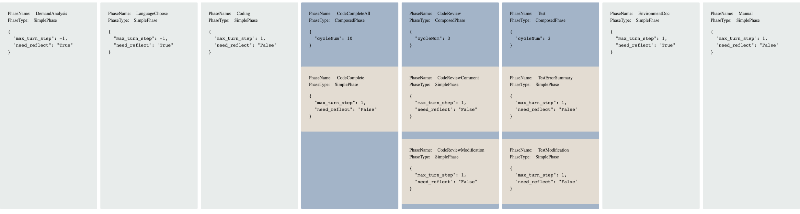
- As shown in the ChatChain visualization of the Default setting, ChatDev will produce software in the order of:
  - Demand Analysis: decide the modality of the software
  - Language Choose: decide the programming language
  - Coding: write the code
  - CodeCompleteAll: complete the missing function/class
  - CodeReview: review and modify the code
  - Test: run the software and modify the code based on the test report
  - EnvironmentDoc: write the environment doc
  - Manual: write the manual
- You can use default setting using ``python3 run.py --config "Default"``.

### Art
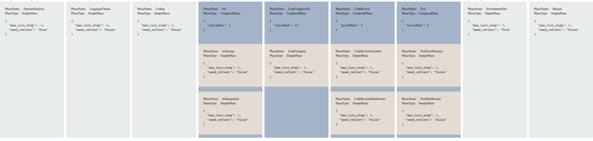
- Compared to Default, the Art setting adds a phase before CodeCompleteAll called Art
- The Art phase will first discuss the name and description of the images assets, then use ``openai.Image.create`` to generate the images based on the description.
- You can use default setting using ``python3 run.py --config "Art"`` or just ignore the config parameter.

### Human-Agent Interaction
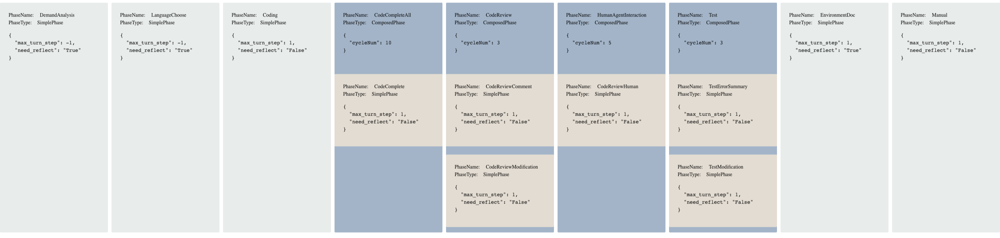
- Compared to Default, in ***Human-Agent-Interaction*** mode you can play as a reviewer and ask the programmer agent to modify the code based on your comments.
- It adds a Phase called HumanAgentInteraction after the  dCodeReview Phase.
- You can use ***Human-Agent-Interaction*** setting using ``python3 run.py --config "Human"``.
- When chatdev executes to this Phase, on the command interface you will see a hint that asks for input.
- You can run your software in the ``WareHouse/`` and see if it satisfies your needs. Then you can type anything you want (bug fix or new feature) in the command interface, then press Enter:
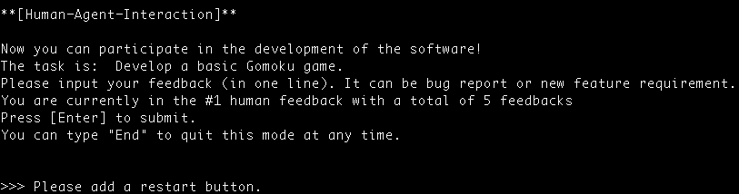
- For example
  - We first run the ChatDev with the task "design a gomoku game"
  - Then we type "Please add a restart button" in the HumanAgentInteraction Phase, adding the first feature
  - In the second loop of HumanAgentInteraction, we add another feature by typing "Please add a current status bar showing whose turn it is".
  - At last, we early exit this mode by typing "End".
  - Below are all three versions.
    - 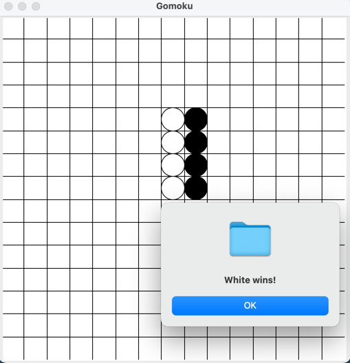&nbsp;&nbsp;&nbsp;&nbsp;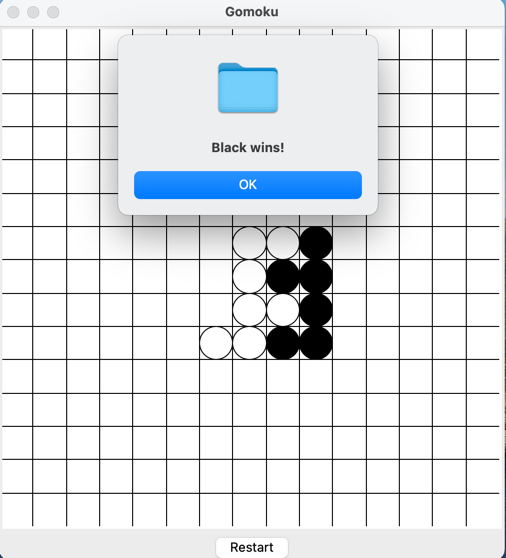&nbsp;&nbsp;&nbsp;&nbsp;

### Git Mode
- Simply set ``"git_management"`` to ``"True"`` in ``ChatChainConfig.json`` to open the Git Mode, in which ChatDev will make the generated software folder a git repository and automatically make all commits.
- Every change made on the code of generated software will create a commit, including:
  - The initial commit, created after the ``Coding`` phase completed, with a commit message ``Finish Coding``.
  - Complete ``ArtIntegration`` phase, with a commit message ``Finish Art Integration``.
  - Complete ``CodeComplete`` phase, with a commit message ``Code Complete #1/2/3 Finished``(if the CodeComplete is executed in three loops).
  - Complete ``CodeReviewModification`` phase, with a commit message ``Review #1/2/3 Finished``(if the CodeReviewModification is executed in three loops).
  - Complete ``CodeReviewHuman`` phase, with a commit message ``Human Review #1/2/3 Finished``(if the CodeReviewHuman is executed in three loops).
  - Complete ``TestModification`` phase, with a commit message ``Test #1/2/3 Finished``(if the TestModification is executed in three loops).
  - All phases completed, with a commit message ``Final Version``.
- On the terminal and online log UI you can see the git summary at the end of the process.
  -  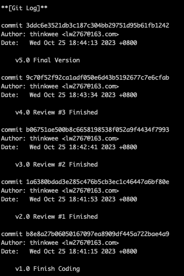&nbsp;&nbsp;&nbsp;&nbsp;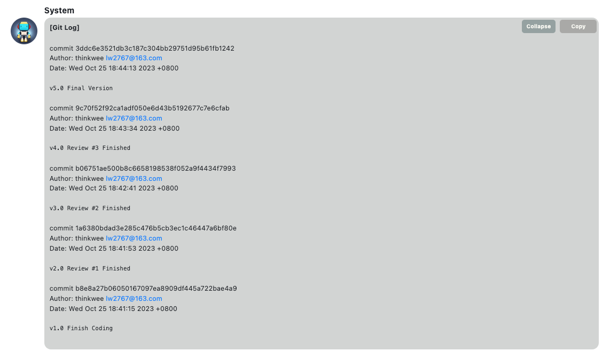
  - You can also search ``git Information`` in the log file to see when did commit happened.
- ⚠️ There are a few things worth noting about Git Mode:
  - ChatDev is a git project, and we need to create another git project in the generated software folder, so we use ``git submodule`` to make this "git over git" function. A ``.gitmodule`` file will be created.
    - under the software folder, you can add/commit/push/checkout the software project just like a normal git project, and your commits would not modify the ChatDev git history.
    - under the ChatDev folder, the new software has been added to the ChatDev as a whole folder.
  - The generated log file would not be added into the software git project, since the log is closed and moved to the software folder after the final commit. We have to do this because the log should record all the git commits, including the final one. So the git operations must be done before the log is finalized. You will always see a log file to be added and committed in the software folder, like:
    - 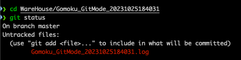
  - When you perform ``git add .`` under the ChatDev project, There will be information like (taking Gomoku for example):
    ```commandline
    Changes to be committed:
        (use "git restore --staged <file>..." to unstage)
            new file:   .gitmodules
            new file:   WareHouse/Gomoku_GitMode_20231025184031

    Changes not staged for commit:
        (use "git add <file>..." to update what will be committed)
        (use "git restore <file>..." to discard changes in working directory)
        (commit or discard the untracked or modified content in submodules)
            modified:   WareHouse/Gomoku_GitMode_20231025184031 (untracked content)
    ```
    If you add and commit the software log file under the software folder, there will be no ``Changes not staged for commit:``
  - Some phase executions may not change the code, and thereby there is no commit. For example, the software is tested without problems and there is no modification, so the test phase would leave no commit.
  
